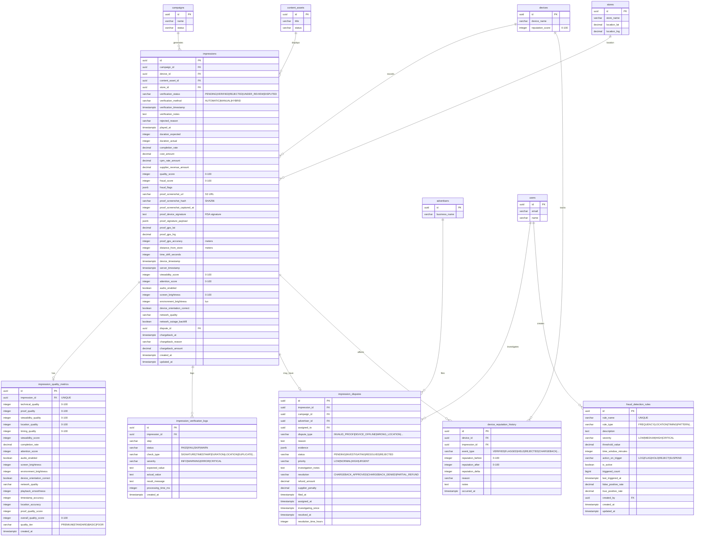

# Database ERD - Impression Recording Module

## Entity Relationship Diagram



## Table Relationships

### Core Relationships

1. **impressions → campaigns** (Many-to-One)
   - Each impression belongs to one campaign
   - One campaign generates many impressions (millions)
   - Constraint: `ON DELETE RESTRICT` (cannot delete campaign with impressions)
   - **Volume**: HIGH - Primary high-volume relationship

2. **impressions → devices** (Many-to-One)
   - Each impression recorded by one device
   - One device records many impressions
   - Constraint: `ON DELETE RESTRICT` (preserve impression history)
   - **Volume**: HIGH - Critical for device performance tracking

3. **impressions → content_assets** (Many-to-One)
   - Each impression displays one content asset
   - One content asset shown in many impressions
   - Constraint: `ON DELETE RESTRICT` (preserve impression history)
   - **Volume**: HIGH - Important for content performance

4. **impressions → stores** (Many-to-One)
   - Each impression occurs at one store location
   - One store generates many impressions
   - Constraint: `ON DELETE RESTRICT` (preserve location data)
   - **Volume**: HIGH - Used for location validation

5. **impressions → impression_quality_metrics** (One-to-One)
   - Each impression has exactly one quality metrics record
   - Constraint: `UNIQUE(impression_id)`
   - Cascade delete: Deleting impression removes quality metrics
   - **Volume**: HIGH - One record per impression

6. **impressions → impression_verification_logs** (One-to-Many)
   - Each impression has multiple verification log entries (~8 per impression)
   - Cascade delete: Deleting impression removes all logs
   - **Volume**: VERY HIGH - Multiple logs per impression

7. **impressions → impression_disputes** (One-to-One Optional)
   - Each impression may have one dispute
   - Constraint: `ON DELETE RESTRICT` (preserve dispute history)
   - **Volume**: LOW - Target <1% of impressions

8. **impressions → device_reputation_history** (One-to-Many Optional)
   - Some impressions trigger reputation changes (~20%)
   - Constraint: `ON DELETE SET NULL` (preserve history even if impression deleted)
   - **Volume**: MEDIUM - About 20% of impressions

9. **devices → device_reputation_history** (One-to-Many)
   - Each device has complete reputation change history
   - Cascade delete: Deleting device removes reputation history
   - **Volume**: MEDIUM - Multiple events per device

10. **impression_disputes → advertisers** (Many-to-One)
    - Each dispute filed by one advertiser
    - Constraint: `ON DELETE RESTRICT` (preserve dispute history)
    - **Volume**: LOW

11. **impression_disputes → users** (Many-to-One Optional)
    - Disputes may be assigned to admin users for investigation
    - Constraint: `ON DELETE SET NULL` (preserve dispute even if user deleted)
    - **Volume**: LOW

12. **fraud_detection_rules → users** (Many-to-One Optional)
    - Rules created by admin users
    - Constraint: `ON DELETE SET NULL` (preserve rule even if creator deleted)
    - **Volume**: VERY LOW - Tens of rules

### Foreign Key Constraints

| Table | Foreign Key | References | On Delete | Volume |
|-------|-------------|------------|-----------|--------|
| impressions | campaign_id | campaigns(id) | RESTRICT | HIGH |
| impressions | device_id | devices(id) | RESTRICT | HIGH |
| impressions | content_asset_id | content_assets(id) | RESTRICT | HIGH |
| impressions | store_id | stores(id) | RESTRICT | HIGH |
| impressions | dispute_id | impression_disputes(id) | SET NULL | LOW |
| impression_verification_logs | impression_id | impressions(id) | CASCADE | VERY HIGH |
| impression_quality_metrics | impression_id | impressions(id) | CASCADE | HIGH |
| impression_disputes | impression_id | impressions(id) | RESTRICT | LOW |
| impression_disputes | campaign_id | campaigns(id) | RESTRICT | LOW |
| impression_disputes | advertiser_id | advertisers(id) | RESTRICT | LOW |
| impression_disputes | assigned_to | users(id) | SET NULL | LOW |
| device_reputation_history | device_id | devices(id) | CASCADE | MEDIUM |
| device_reputation_history | impression_id | impressions(id) | SET NULL | MEDIUM |
| fraud_detection_rules | created_by | users(id) | SET NULL | VERY LOW |

## Indexes

### impressions (HIGH VOLUME - Critical for performance)

**Standard B-tree Indexes:**
- `idx_impressions_campaign_id` - Query impressions by campaign
- `idx_impressions_device_id` - Query impressions by device
- `idx_impressions_store_id` - Query impressions by store
- `idx_impressions_content_asset_id` - Query impressions by content
- `idx_impressions_verification_status` - Filter by verification status
- `idx_impressions_played_at` - Time-series queries (DESC for recent first)
- `idx_impressions_created_at` - Audit and monitoring queries (DESC)

**Composite Indexes (optimized for common queries):**
- `idx_impressions_campaign_played_at` - Campaign performance over time
- `idx_impressions_device_played_at` - Device activity timeline
- `idx_impressions_status_played_at` - Status-based reporting
- `idx_impressions_campaign_status` - Campaign status filtering

**Partial Indexes (reduces index size, faster queries):**
- `idx_impressions_disputed` - Only indexes rows WHERE dispute_id IS NOT NULL
- `idx_impressions_under_review` - Only indexes rows WHERE verification_status = 'UNDER_REVIEW'
- `idx_impressions_high_fraud` - Only indexes rows WHERE fraud_score >= 50
- `idx_impressions_low_quality` - Only indexes rows WHERE quality_score < 50

**GIN Index (for JSON queries):**
- `idx_impressions_fraud_flags` - Query fraud flags array

**Deduplication Index:**
- `idx_impressions_dedup` - Detect duplicates (campaign_id, device_id, played_at)

### impression_verification_logs (VERY HIGH VOLUME)

- `idx_verification_logs_impression_id` - Lookup logs for specific impression
- `idx_verification_logs_created_at` - Time-based queries (DESC)
- `idx_verification_logs_status` - Partial index for FAIL/WARN statuses
- `idx_verification_logs_check_type` - Filter by verification check type

### impression_quality_metrics (HIGH VOLUME)

- `idx_quality_metrics_impression_id` - Lookup quality for specific impression
- `idx_quality_metrics_quality_tier` - Filter by quality tier
- `idx_quality_metrics_overall_score` - Sort/filter by quality score

### impression_disputes (LOW VOLUME)

- `idx_disputes_impression_id` - Lookup dispute for impression
- `idx_disputes_campaign_id` - Campaign dispute analysis
- `idx_disputes_advertiser_id` - Advertiser dispute history
- `idx_disputes_status` - Filter by dispute status
- `idx_disputes_assigned_to` - Admin workload (partial index)
- `idx_disputes_filed_at` - Time-based queries (DESC)
- `idx_disputes_pending` - Partial index for pending disputes with priority
- `idx_disputes_unresolved` - Partial index for active disputes

### fraud_detection_rules (VERY LOW VOLUME)

- `idx_fraud_rules_rule_type` - Filter by rule type
- `idx_fraud_rules_active` - Partial index for active rules only
- `idx_fraud_rules_severity` - Filter by severity

### device_reputation_history (MEDIUM VOLUME)

- `idx_reputation_history_device_id` - Device reputation timeline (with occurred_at DESC)
- `idx_reputation_history_event_type` - Filter by event type
- `idx_reputation_history_occurred_at` - Time-based queries (DESC)

## Data Types

### Key Data Types Used

- **uuid**: Primary keys and foreign keys (128-bit universally unique identifier)
- **varchar(n)**: Variable-length strings with maximum length
- **text**: Unlimited length text
- **decimal(p,s)**: Exact numeric with precision and scale
- **bigint**: Large integer values (for counters like triggered_count)
- **integer**: Standard integer values
- **boolean**: True/false flags
- **timestamptz**: Timestamp with timezone (critical for accurate time tracking)
- **jsonb**: Binary JSON (efficient storage and indexing for fraud_flags, evidence, proof_signature_payload)

### Money Representation

All monetary values use **DECIMAL(10, 4)**:
- 10 digits total
- 4 decimal places (sub-cent precision for CPM calculations)
- Range: -999,999.9999 to 999,999.9999
- Sufficient for impression-level costs

**CPM Rate Example:**
- CPM: $5.50 per 1000 impressions
- Per impression: $5.50 / 1000 = $0.0055
- Stored as: 0.0055 (DECIMAL 10,4)

### GPS Coordinates

- **proof_gps_lat**: `DECIMAL(10, 8)` - Latitude range -90 to 90, precision ~1mm
- **proof_gps_lng**: `DECIMAL(11, 8)` - Longitude range -180 to 180, precision ~1mm

Example: Vietnam coordinates
- Latitude: 10.76262200 (Ho Chi Minh City)
- Longitude: 106.66017200

### JSONB Fields

**fraud_flags** (Array of fraud indicators):
```json
[
  {"type": "HIGH_FREQUENCY", "score": 30, "threshold": 14},
  {"type": "LOCATION_SUSPICIOUS", "distance_km": 2.5}
]
```

**proof_signature_payload** (Data that was signed):
```json
{
  "device_id": "uuid",
  "campaign_id": "uuid",
  "content_asset_id": "uuid",
  "played_at": "2026-01-23T14:30:00Z",
  "duration_actual": 28,
  "screenshot_hash": "sha256:abc123...",
  "location": {"lat": 10.762622, "lng": 106.660172}
}
```

**evidence** (Dispute evidence):
```json
[
  {
    "type": "screenshot_comparison",
    "url": "s3://bucket/evidence/comparison.jpg",
    "description": "Shows different content than approved"
  },
  {
    "type": "description",
    "text": "Device was offline at reported time according to store manager"
  }
]
```

## Cardinality

### One-to-One (1:1)
- impressions ↔ impression_quality_metrics (one impression, one quality record)

### One-to-Many (1:N)
- campaigns → impressions (one campaign, millions of impressions)
- devices → impressions (one device, thousands of impressions per day)
- content_assets → impressions (one content, many impressions)
- stores → impressions (one store, many impressions)
- impressions → impression_verification_logs (one impression, ~8 log entries)
- devices → device_reputation_history (one device, many reputation events)
- advertisers → impression_disputes (one advertiser, multiple disputes)
- users → impression_disputes (one admin, multiple assigned disputes)
- users → fraud_detection_rules (one admin, multiple rules created)

### One-to-One Optional (1:0..1)
- impressions ↔ impression_disputes (most impressions have no dispute)

### Many-to-One Optional (N:0..1)
- impressions → impression_disputes (multiple impressions may reference same dispute)
- device_reputation_history → impressions (not all reputation events linked to impressions)

## Verification Status State Machine

```
PENDING → VERIFIED (success)
       → REJECTED (failed validation)
       → UNDER_REVIEW (suspicious, needs manual review)

UNDER_REVIEW → VERIFIED (admin approved)
             → REJECTED (admin rejected)

VERIFIED → DISPUTED (advertiser challenges)

DISPUTED → VERIFIED (dispute denied, upheld impression)
        → REJECTED (dispute approved, chargeback issued)
```

## Quality Tiers

| Tier | Score Range | Description |
|------|-------------|-------------|
| PREMIUM | 90-100 | Excellent quality - high viewability, complete proof, accurate location |
| STANDARD | 70-89 | Good quality - acceptable on all metrics |
| BASIC | 50-69 | Acceptable quality - some quality issues but verified |
| POOR | 0-49 | Questionable quality - flagged for review |

## Fraud Score Thresholds

| Score Range | Classification | Action |
|-------------|----------------|--------|
| 0-29 | Clean | No action, process normally |
| 30-49 | Suspicious | FLAG but continue processing |
| 50-79 | Very Suspicious | HOLD for manual review |
| 80-100 | Likely Fraud | REJECT or SUSPEND device |

## Database Size Estimates (HIGH VOLUME)

### Assumptions
- **Impression Volume**: 1 million impressions per day
- **Verification Logs**: 8 logs per impression
- **Quality Metrics**: 1 record per impression
- **Dispute Rate**: 1% of verified impressions
- **Reputation Events**: 20% of impressions trigger reputation change

### Storage Per Day

#### impressions table
- Row size: ~1.5 KB (including JSONB fields)
- Daily volume: 1,000,000 impressions
- **Daily storage**: 1M × 1.5 KB = **1.5 GB**
- Indexes (30% of table): 450 MB
- **Total per day**: **1.95 GB**

#### impression_verification_logs
- Row size: ~400 bytes
- Logs per impression: 8
- Daily volume: 1,000,000 × 8 = 8,000,000 logs
- **Daily storage**: 8M × 400 bytes = **3.2 GB**
- Indexes (20% of table): 640 MB
- **Total per day**: **3.84 GB**

#### impression_quality_metrics
- Row size: ~600 bytes
- Daily volume: 1,000,000 records
- **Daily storage**: 1M × 600 bytes = **600 MB**
- Indexes (25% of table): 150 MB
- **Total per day**: **750 MB**

#### impression_disputes
- Row size: ~1 KB
- Daily volume: 10,000 disputes (1% of impressions)
- **Daily storage**: 10K × 1 KB = **10 MB**
- Indexes (30% of table): 3 MB
- **Total per day**: **13 MB**

#### device_reputation_history
- Row size: ~300 bytes
- Daily volume: 200,000 events (20% of impressions)
- **Daily storage**: 200K × 300 bytes = **60 MB**
- Indexes (25% of table): 15 MB
- **Total per day**: **75 MB**

### Total Daily Storage
- **Raw data per day**: ~5.6 GB
- **With indexes**: ~6.6 GB
- **Monthly (30 days)**: ~198 GB
- **Yearly (365 days)**: ~2.4 TB

### Projected Storage (1 year)

| Table | Rows/Year | Size/Year | With Indexes | Notes |
|-------|-----------|-----------|--------------|-------|
| impressions | 365M | 547 GB | 711 GB | Partition by month |
| impression_verification_logs | 2.9B | 1,168 GB | 1,402 GB | Archive after 90 days |
| impression_quality_metrics | 365M | 219 GB | 274 GB | Keep with impressions |
| impression_disputes | 3.7M | 3.6 GB | 4.7 GB | Keep for audit |
| device_reputation_history | 73M | 21.9 GB | 27.4 GB | Keep indefinitely |
| fraud_detection_rules | ~100 | <1 MB | <1 MB | Very low volume |
| **TOTAL (uncompressed)** | **3.6B+** | **~1.96 TB** | **~2.42 TB** | Before compression |

### With PostgreSQL Optimizations

**Compression (TOAST):**
- Text fields: 60-70% compression
- JSONB fields: 50-60% compression
- Overall compression: ~40-50%
- **Compressed storage**: ~1.2-1.5 TB/year

**Partitioning Strategy:**
- Partition impressions by month (12 partitions/year)
- Benefits:
  - Faster queries (partition pruning)
  - Easier archival (drop old partitions)
  - Better VACUUM performance
  - Smaller indexes per partition

**Archival Strategy:**
- Keep hot data: Last 3 months (full access)
- Warm data: 3-12 months (compressed, slower access)
- Cold data: >12 months (archive to S3, restore on demand)
- Archive verification logs after 90 days
- **Hot storage requirement**: ~600 GB (3 months)

### Storage Growth Rate

| Timeframe | Raw Data | With Indexes | Compressed | Archived |
|-----------|----------|--------------|------------|----------|
| 1 Day | 5.6 GB | 6.6 GB | 3.3 GB | - |
| 1 Week | 39.2 GB | 46.2 GB | 23.1 GB | - |
| 1 Month | 168 GB | 198 GB | 99 GB | - |
| 3 Months (Hot) | 504 GB | 594 GB | 297 GB | - |
| 6 Months | 1.01 TB | 1.19 TB | 595 GB | 297 GB archived |
| 1 Year | 2.02 TB | 2.38 TB | 1.19 TB | 595 GB archived |

### Performance Optimization Recommendations

1. **Table Partitioning** (Critical for HIGH VOLUME)
   - Partition impressions by month using RANGE partitioning
   - Automatic partition creation via cron job
   - Faster queries via partition pruning
   - Easy archival by dropping old partitions

2. **Index Optimization**
   - Use partial indexes for rare conditions (disputes, under_review)
   - Create covering indexes for hot queries
   - Regular index maintenance (REINDEX)
   - Monitor index bloat

3. **Query Optimization**
   - Use materialized views for dashboard metrics
   - Refresh materialized views hourly/daily
   - Avoid full table scans on impressions
   - Use index-only scans where possible

4. **Archival Strategy**
   - Archive verification logs after 90 days
   - Move old impressions to cold storage after 12 months
   - Keep aggregate metrics indefinitely
   - Restore archived data on demand

5. **Monitoring**
   - Track table size growth
   - Monitor query performance
   - Alert on slow queries (>500ms)
   - Track index usage (unused indexes waste space)

6. **Hardware Recommendations**
   - SSD storage (NVMe preferred)
   - 32-64 GB RAM (for working set)
   - Connection pooling (PgBouncer)
   - Read replicas for analytics
   - Consider TimescaleDB for time-series optimization

### Query Performance Targets

| Operation | Target Latency | Notes |
|-----------|----------------|-------|
| Insert impression | <50ms | Includes triggers |
| Verify impression | <500ms | All validation checks |
| Query impressions (1 day) | <200ms | Using partition pruning |
| Query impressions (1 month) | <1s | Aggregate queries |
| Dashboard metrics | <100ms | Use materialized views |
| Dispute lookup | <50ms | Low volume, fast lookup |
| Device metrics | <500ms | Aggregate historical data |

## Views Performance Notes

All views are designed for analytical queries and should be:
- Refreshed periodically (not real-time)
- Backed by proper indexes
- Materialized for dashboard queries
- Limited to recent data (last 30-90 days) for performance

For real-time metrics, query the base tables with appropriate WHERE clauses and indexes.

---

## Related Modules

This Impression Recording module integrates with:

1. **Campaign Module** - Campaign status, budget tracking, CPM rates
2. **Device Module** - Device status, heartbeat, reputation scoring
3. **Content Module** - Content assets, perceptual hashing for validation
4. **Store Module** - Store location, operating hours for validation
5. **Supplier Module** - Revenue calculation, chargeback handling
6. **Advertiser Module** - Billing, dispute filing
7. **User Module** - Admin assignment for manual review and disputes

---

*Last Updated: 2026-01-23*
*Database Schema Version: 1.0*
*Optimized for: 1M+ impressions/day*
