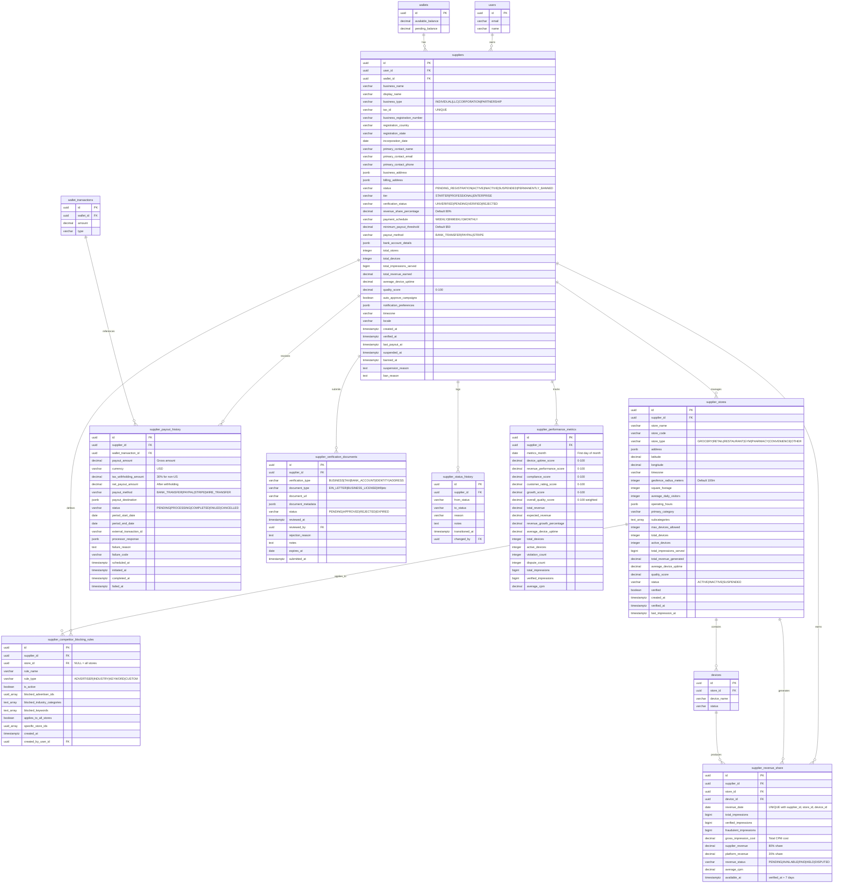

# Database ERD - Supplier Management Module

## Entity Relationship Diagram



## Table Relationships

### Core Relationships

1. **suppliers → users** (Many-to-One)
   - Each supplier belongs to one user account
   - One user can own one supplier account (business account)
   - Constraint: `ON DELETE RESTRICT` (cannot delete user with active supplier)

2. **suppliers → wallets** (One-to-One)
   - Each supplier has exactly one wallet for revenue
   - Wallet created automatically when supplier becomes ACTIVE
   - Constraint: `ON DELETE RESTRICT` (cannot delete wallet with supplier)

3. **suppliers → supplier_stores** (One-to-Many)
   - Each supplier can manage multiple store locations
   - Each store belongs to one supplier
   - Constraint: `UNIQUE(supplier_id, store_name)`
   - Cascade delete: Deleting supplier removes all stores

4. **supplier_stores → devices** (One-to-Many)
   - Each store can contain multiple devices
   - Each device belongs to one store
   - Device count enforced by `max_devices_allowed` (based on square footage and tier)

5. **suppliers → supplier_revenue_share** (One-to-Many)
   - Each supplier has daily revenue records
   - Tracks 80/20 split between supplier and platform
   - Constraint: `UNIQUE(supplier_id, revenue_date, store_id, device_id)`
   - Cascade delete: Deleting supplier removes revenue history

6. **suppliers → supplier_payout_history** (One-to-Many)
   - Complete audit trail of all payouts
   - References wallet_transactions for payment tracking
   - Constraint: `ON DELETE RESTRICT` (preserve payout history)

7. **suppliers → supplier_competitor_blocking_rules** (One-to-Many)
   - Supplier can define multiple blocking rules
   - Rules can apply to all stores or specific stores
   - Cascade delete: Deleting supplier removes blocking rules

8. **suppliers → supplier_verification_documents** (One-to-Many)
   - Track all submitted verification documents
   - Documents can expire and require renewal
   - Cascade delete: Deleting supplier removes documents

9. **suppliers → supplier_performance_metrics** (One-to-Many)
   - Monthly aggregated performance scores
   - Constraint: `UNIQUE(supplier_id, metrics_month)`
   - Cascade delete: Deleting supplier removes metrics

### Foreign Key Constraints

| Table | Foreign Key | References | On Delete |
|-------|-------------|------------|-----------|
| suppliers | user_id | users(id) | RESTRICT |
| suppliers | wallet_id | wallets(id) | RESTRICT |
| supplier_stores | supplier_id | suppliers(id) | CASCADE |
| supplier_revenue_share | supplier_id | suppliers(id) | CASCADE |
| supplier_revenue_share | store_id | supplier_stores(id) | SET NULL |
| supplier_revenue_share | device_id | devices(id) | SET NULL |
| supplier_payout_history | supplier_id | suppliers(id) | RESTRICT |
| supplier_payout_history | wallet_transaction_id | wallet_transactions(id) | SET NULL |
| supplier_competitor_blocking_rules | supplier_id | suppliers(id) | CASCADE |
| supplier_competitor_blocking_rules | store_id | supplier_stores(id) | CASCADE |
| supplier_verification_documents | supplier_id | suppliers(id) | CASCADE |
| supplier_verification_documents | reviewed_by | users(id) | SET NULL |
| supplier_status_history | supplier_id | suppliers(id) | CASCADE |
| supplier_status_history | changed_by | users(id) | SET NULL |
| supplier_performance_metrics | supplier_id | suppliers(id) | CASCADE |

## Indexes

### suppliers
- `idx_suppliers_user_id` - Query suppliers by user
- `idx_suppliers_status` - Filter by status (ACTIVE, SUSPENDED, etc.)
- `idx_suppliers_tier` - Filter by tier (STARTER, PROFESSIONAL, ENTERPRISE)
- `idx_suppliers_verification_status` - Find pending verifications
- `idx_suppliers_created_at` - Sort by registration date
- `idx_suppliers_quality_score` - Find top/bottom performers
- `idx_suppliers_status_tier` - Composite for tier-specific queries
- `idx_suppliers_tax_id` - Lookup by tax ID (UNIQUE constraint)

### supplier_stores
- `idx_supplier_stores_supplier_id` - Join optimization
- `idx_supplier_stores_status` - Filter active stores
- `idx_supplier_stores_verified` - Find unverified stores
- `idx_supplier_stores_location` - Geospatial queries (lat/lng)
- `idx_supplier_stores_supplier_status` - Composite for supplier queries
- `idx_supplier_stores_store_type` - Filter by store category

### supplier_revenue_share
- `idx_revenue_share_supplier_id` - Join optimization
- `idx_revenue_share_date` - Time-series queries
- `idx_revenue_share_supplier_date` - Composite for reporting
- `idx_revenue_share_status` - Filter by revenue status
- `idx_revenue_share_available_at` - Find revenue ready to move to available
- `idx_revenue_share_store_id` - Store-specific revenue queries
- `idx_revenue_share_device_id` - Device-specific revenue queries

### supplier_payout_history
- `idx_payout_history_supplier_id` - Payout history per supplier
- `idx_payout_history_status` - Filter by payout status
- `idx_payout_history_scheduled_at` - Find upcoming payouts
- `idx_payout_history_completed_at` - Sort by completion date
- `idx_payout_history_supplier_date` - Composite for timeline
- `idx_payout_history_period` - Query by payout period

### supplier_competitor_blocking_rules
- `idx_blocking_rules_supplier_id` - Rules per supplier
- `idx_blocking_rules_store_id` - Store-specific rules
- `idx_blocking_rules_active` - Partial index for active rules only
- `idx_blocking_rules_type` - Filter by rule type
- `idx_blocking_rules_supplier_active` - Composite for active rule queries

### supplier_verification_documents
- `idx_verification_docs_supplier_id` - Documents per supplier
- `idx_verification_docs_status` - Filter by verification status
- `idx_verification_docs_type` - Filter by document type
- `idx_verification_docs_expires_at` - Find expiring documents
- `idx_verification_docs_supplier_status` - Composite for pending reviews

### supplier_status_history
- `idx_supplier_status_history_supplier_id` - Status changes per supplier
- `idx_supplier_status_history_transitioned_at` - Time-based queries
- `idx_supplier_status_history_to_status` - Filter by target status
- `idx_supplier_status_history_supplier_date` - Composite for timeline

### supplier_performance_metrics
- `idx_performance_metrics_supplier_id` - Metrics per supplier
- `idx_performance_metrics_month` - Time-series queries
- `idx_performance_metrics_quality_score` - Find top/bottom performers
- `idx_performance_metrics_supplier_month` - Composite for reporting

## Data Types

### Key Data Types Used

- **uuid**: Primary keys and foreign keys (128-bit universally unique identifier)
- **varchar(n)**: Variable-length strings with maximum length
- **text**: Unlimited length text (for notes, reasons, descriptions)
- **decimal(p,s)**: Exact numeric with precision and scale
- **bigint**: Large integer values (for impression counters)
- **integer**: Standard integer values (for counts, metrics)
- **boolean**: True/false flags
- **timestamptz**: Timestamp with timezone (all dates/times use this)
- **date**: Date only (no time component)
- **text[]**: Array of text values (for categories, keywords)
- **uuid[]**: Array of UUID values (for blocked advertiser IDs)
- **jsonb**: Binary JSON (efficient storage and indexing)

### Money Representation

All monetary values use **DECIMAL(12, 2)**:
- 12 digits total
- 2 decimal places
- Range: -9,999,999,999.99 to 9,999,999,999.99
- Sufficient for revenue tracking up to $10 billion

Specific fields:
- **payout_amount**: DECIMAL(12, 2) - Gross payout amount
- **supplier_revenue**: DECIMAL(12, 2) - 80% share of impression cost
- **platform_revenue**: DECIMAL(12, 2) - 20% share of impression cost
- **minimum_payout_threshold**: DECIMAL(10, 2) - Default $50.00

### Percentage Representation

- **revenue_share_percentage**: DECIMAL(5, 2) - Range 0-100 (e.g., 80.00)
- **quality_score**: DECIMAL(5, 2) - Range 0-100
- **average_device_uptime**: DECIMAL(5, 2) - Percentage 0-100

### Array Types

Arrays are used for multi-value fields:
- **blocked_advertiser_ids**: `UUID[]` - List of blocked advertiser IDs
- **blocked_industry_categories**: `TEXT[]` - Industry categories to block
- **blocked_keywords**: `TEXT[]` - Keywords for blocking (case-insensitive)
- **specific_store_ids**: `UUID[]` - Stores where rule applies
- **subcategories**: `TEXT[]` - Store subcategories for targeting

### JSONB Type

Used for flexible schemas and structured data:

**business_address / billing_address**:
```json
{
  "line1": "123 Main Street",
  "line2": "Suite 100",
  "city": "Seattle",
  "state": "WA",
  "postal_code": "98101",
  "country": "US",
  "latitude": 47.6062,
  "longitude": -122.3321
}
```

**operating_hours**:
```json
[
  {
    "day_of_week": 0,
    "open_time": "09:00",
    "close_time": "21:00",
    "is_closed": false
  },
  {
    "day_of_week": 6,
    "open_time": "10:00",
    "close_time": "18:00",
    "is_closed": false
  }
]
```

**notification_preferences**:
```json
{
  "email_enabled": true,
  "sms_enabled": false,
  "push_enabled": true,
  "notify_on_payout": true,
  "notify_on_device_offline": true,
  "notify_on_campaign_approval_request": false,
  "notify_on_revenue_milestone": true
}
```

**bank_account_details** (encrypted in production):
```json
{
  "account_type": "checking",
  "routing_number": "XXXXXXX",
  "account_number": "XXXXX1234",
  "bank_name": "Chase Bank",
  "account_holder_name": "Business Name LLC"
}
```

## Cardinality

### One-to-One (1:1)
- suppliers ↔ wallets (one wallet per supplier)
- suppliers ↔ users (one supplier account per user)

### One-to-Many (1:N)
- suppliers → supplier_stores (one supplier, many stores)
- supplier_stores → devices (one store, many devices)
- suppliers → supplier_revenue_share (one supplier, many daily revenue records)
- suppliers → supplier_payout_history (one supplier, many payouts)
- suppliers → supplier_competitor_blocking_rules (one supplier, many rules)
- suppliers → supplier_verification_documents (one supplier, many documents)
- suppliers → supplier_status_history (one supplier, many status changes)
- suppliers → supplier_performance_metrics (one supplier, many monthly metrics)

### Many-to-Many (M:N)
- None directly - all relationships are normalized through junction tables

## Business Rules Enforced by Schema

### Revenue Share Split (80/20)

```sql
CONSTRAINT supplier_revenue_share_split_check CHECK (
    ABS(gross_impression_cost - (supplier_revenue + platform_revenue)) < 0.01
)
```

This ensures:
- `supplier_revenue` = `gross_impression_cost` × 0.80
- `platform_revenue` = `gross_impression_cost` × 0.20
- Sum always equals gross cost (within 1 cent for rounding)

### Payout Amount Validation

```sql
CONSTRAINT payout_history_amount_check CHECK (
    payout_amount = tax_withholding_amount + net_payout_amount
)
```

This ensures:
- Gross payout = Tax withholding + Net payout
- Accurate tracking of tax withholding (30% for non-US suppliers)

### Device Limits per Store

```sql
CONSTRAINT supplier_stores_device_limit CHECK (
    total_devices <= max_devices_allowed
)
```

Max devices calculated based on square footage:
- < 1,000 sq ft: 1 device
- 1,000-2,999 sq ft: 2 devices
- 3,000-4,999 sq ft: 3 devices
- 5,000-9,999 sq ft: 5 devices
- ≥ 10,000 sq ft: 10 devices

### Minimum Payout Threshold

Default: $50.00 (configurable per supplier)
- Reduces transaction fees for small amounts
- Balances supplier cash flow with platform efficiency

### Revenue Hold Period

7 days between impression verification and revenue availability:
- `available_at` = `verified_at` + 7 days
- Allows for disputes and chargebacks
- Automated job moves `PENDING` → `AVAILABLE` after hold period

## Database Size Estimates

### Per Supplier
- suppliers table: ~2 KB per row
- supplier_stores: ~1.5 KB per store (avg 3 stores = 4.5 KB)
- supplier_competitor_blocking_rules: ~800 bytes per rule (avg 3 rules = 2.4 KB)
- supplier_verification_documents: ~1 KB per document (avg 4 documents = 4 KB)
- **Subtotal**: ~13 KB per supplier

### Per Supplier Per Day (Active)
- supplier_revenue_share: ~400 bytes per day per device (avg 5 devices = 2 KB)
- **Subtotal**: ~2 KB per active supplier per day

### Per Supplier Per Month
- supplier_payout_history: ~600 bytes per payout (4 weekly payouts = 2.4 KB)
- supplier_performance_metrics: ~500 bytes per month
- supplier_status_history: ~200 bytes per status change (avg 1 per month = 200 bytes)
- **Subtotal**: ~3.1 KB per supplier per month

### Projected Storage (1 year, 1,000 active suppliers)

**Core supplier data**:
- 1,000 × 13 KB = **13 MB**

**Daily revenue records** (365 days):
- 1,000 × 365 × 2 KB = **730 MB**

**Monthly records** (12 months):
- 1,000 × 12 × 3.1 KB = **37 MB**

**Total (1 year)**: ~**780 MB** (uncompressed)

### Scaling Estimates

| Suppliers | Devices | Daily Revenue Data | Annual Storage |
|-----------|---------|-------------------|----------------|
| 1,000 | 5,000 | 730 MB/year | ~780 MB |
| 10,000 | 50,000 | 7.3 GB/year | ~7.8 GB |
| 100,000 | 500,000 | 73 GB/year | ~78 GB |

With PostgreSQL compression, partitioning, and archival strategies:
- Active data (last 90 days): ~20% of total
- Compressed historical data: ~40% reduction
- Actual storage: ~50-60% of uncompressed estimates

### Storage Optimization Strategies

1. **Table Partitioning**
   - Partition `supplier_revenue_share` by month (range partitioning on `revenue_date`)
   - Partition `supplier_payout_history` by year
   - Allows efficient archival and query performance

2. **Historical Data Archival**
   - Archive revenue data > 2 years to cold storage
   - Keep aggregated metrics in `supplier_performance_metrics`
   - Reduces active database size by 70-80%

3. **Index Management**
   - Partial indexes on active records only (e.g., `WHERE status = 'ACTIVE'`)
   - Drop indexes on archived partitions
   - Reduces index overhead by 40-50%

4. **JSONB Compression**
   - PostgreSQL automatically compresses JSONB fields
   - Address and settings data compress ~60%
   - Document metadata compresses ~50%

## Key Business Metrics Tracked

### Supplier Level
- **Total Revenue Earned**: Lifetime supplier revenue (80% share)
- **Quality Score**: 0-100 weighted score (uptime, revenue, compliance, rating, growth)
- **Average Device Uptime**: Percentage across all devices
- **Total Impressions Served**: Lifetime impression count
- **Payment Schedule**: WEEKLY, BIWEEKLY, or MONTHLY
- **Revenue Share**: 80% (standard) or 85% (Platinum tier)

### Store Level
- **Revenue per Store**: Daily/monthly revenue by store location
- **Device Utilization**: Active devices vs. max allowed
- **Store Quality Score**: Performance specific to store
- **Visitor Traffic**: Average daily visitors (estimated)

### Device Level
- **Revenue per Device**: Individual device earnings
- **Device Uptime**: Percentage online and operational
- **Impressions per Device**: Daily impression count

### Payout Metrics
- **Payout Frequency**: Weekly/biweekly/monthly schedule
- **Minimum Threshold**: $50 default (configurable)
- **Tax Withholding**: 30% for non-US suppliers (unless treaty)
- **Payout Success Rate**: Target 100% success rate

## Performance Considerations

### Query Optimization

**Hot Queries** (run frequently):
1. Active suppliers with wallet balance
2. Suppliers eligible for payout
3. Revenue by supplier for date range
4. Top/bottom performers by quality score
5. Stores needing device verification

**Indexes Designed For**:
- Fast supplier lookups by status/tier
- Time-series revenue queries
- Geospatial store queries (lat/lng)
- Active blocking rules matching
- Pending payout eligibility

### Caching Strategy

**Cache at Application Level**:
- Supplier status and tier (TTL: 5 minutes)
- Active blocking rules (TTL: 1 minute)
- Quality scores (TTL: 1 hour)
- Payout schedules (TTL: 1 day)

**Materialized Views** (refresh hourly):
- `v_active_suppliers` - Active suppliers with current metrics
- `v_supplier_revenue_summary` - Comprehensive revenue rollups
- `v_suppliers_pending_payout` - Payout eligibility

### Database Maintenance

**Daily Jobs**:
- Move revenue from PENDING → AVAILABLE (after 7-day hold)
- Update supplier quality scores
- Check for expiring verification documents

**Weekly Jobs**:
- Process scheduled payouts (WEEKLY schedule)
- Calculate weekly performance metrics
- Archive old status history records

**Monthly Jobs**:
- Generate supplier performance metrics
- Process monthly payouts
- Generate tax reports (if needed)
- Partition management (create next month's partition)

---

*Last Updated: 2026-01-23*
