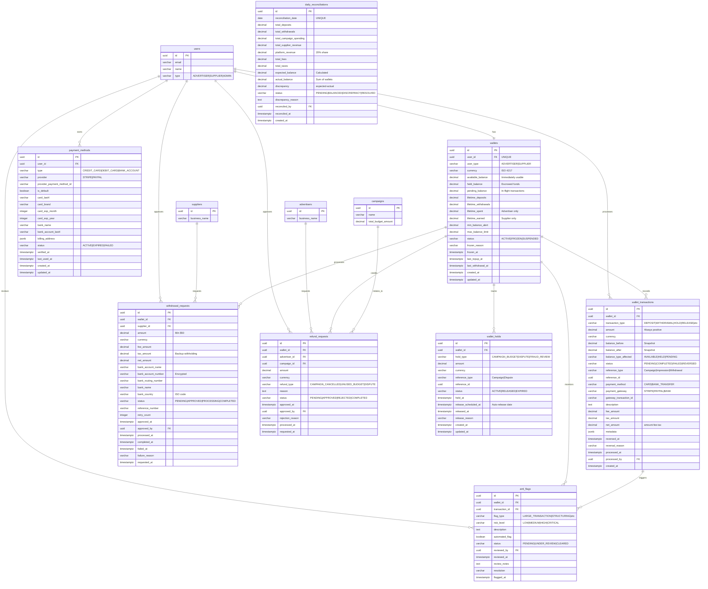

# Database ERD - Wallet & Payment Module

## Entity Relationship Diagram



## Table Relationships

### Core Relationships

1. **users → wallets** (One-to-One)
   - Each user has exactly one wallet
   - Constraint: `UNIQUE(user_id)` on wallets
   - One wallet per advertiser or supplier
   - Constraint: `ON DELETE RESTRICT` (cannot delete user with wallet balance)

2. **wallets → wallet_transactions** (One-to-Many)
   - Each wallet has many transactions
   - All balance changes recorded as immutable transactions
   - Cascade delete: No (transactions are permanent records)

3. **wallets → wallet_holds** (One-to-Many)
   - Each wallet can have multiple active holds
   - Tracks escrowed funds (campaign budgets, disputes, etc.)
   - Used to validate held_balance accuracy

4. **wallets → withdrawal_requests** (One-to-Many)
   - Supplier wallets have withdrawal requests
   - Each withdrawal locks funds in pending_balance
   - Cascade delete: No (withdrawal history preserved)

5. **wallets → refund_requests** (One-to-Many)
   - Advertiser wallets have refund requests
   - Refunds credit available_balance
   - Cascade delete: No (refund history preserved)

6. **wallets → aml_flags** (One-to-Many)
   - Wallets monitored for suspicious activity
   - AML flags require compliance review
   - Cascade delete: No (compliance records preserved)

7. **users → payment_methods** (One-to-Many)
   - Users can save multiple payment methods
   - One default payment method per user (enforced by trigger)
   - Cascade delete: Yes (payment methods belong to user)

8. **wallet_transactions → aml_flags** (One-to-Many)
   - Transactions can trigger AML flags
   - Large or suspicious transactions flagged automatically
   - Optional relationship (not all transactions flagged)

### Foreign Key Constraints

| Table | Foreign Key | References | On Delete |
|-------|-------------|------------|-----------|
| wallets | user_id | users(id) | RESTRICT |
| wallet_transactions | wallet_id | wallets(id) | RESTRICT |
| wallet_transactions | processed_by | users(id) | SET NULL |
| payment_methods | user_id | users(id) | CASCADE |
| withdrawal_requests | wallet_id | wallets(id) | RESTRICT |
| withdrawal_requests | supplier_id | suppliers(id) | RESTRICT |
| withdrawal_requests | approved_by | users(id) | SET NULL |
| refund_requests | wallet_id | wallets(id) | RESTRICT |
| refund_requests | advertiser_id | advertisers(id) | RESTRICT |
| refund_requests | campaign_id | campaigns(id) | SET NULL |
| refund_requests | approved_by | users(id) | SET NULL |
| wallet_holds | wallet_id | wallets(id) | RESTRICT |
| aml_flags | wallet_id | wallets(id) | RESTRICT |
| aml_flags | transaction_id | wallet_transactions(id) | SET NULL |
| aml_flags | reviewed_by | users(id) | SET NULL |
| daily_reconciliations | reconciled_by | users(id) | SET NULL |

## Indexes

### wallets
- `idx_wallets_user_id` - Join optimization with users
- `idx_wallets_user_type` - Filter by advertiser/supplier
- `idx_wallets_status` - Find frozen/suspended wallets
- `idx_wallets_currency` - Multi-currency queries
- `idx_wallets_created_at` - Sort by creation date

### wallet_transactions
- `idx_wallet_transactions_wallet_id` - Join optimization
- `idx_wallet_transactions_type` - Filter by transaction type
- `idx_wallet_transactions_status` - Find pending/failed transactions
- `idx_wallet_transactions_processed_at` - Time-series queries
- `idx_wallet_transactions_reference` - Lookup by campaign/impression
- `idx_wallet_transactions_wallet_date` - Composite for transaction history
- `idx_wallet_transactions_gateway` - Gateway reconciliation

### payment_methods
- `idx_payment_methods_user_id` - User's payment methods
- `idx_payment_methods_status` - Active methods only
- `idx_payment_methods_default` - Partial index for default method
- `idx_payment_methods_provider` - Gateway integration queries

### withdrawal_requests
- `idx_withdrawal_requests_wallet_id` - Wallet withdrawal history
- `idx_withdrawal_requests_supplier_id` - Supplier payout history
- `idx_withdrawal_requests_status` - Filter by status
- `idx_withdrawal_requests_requested_at` - Sort by request date
- `idx_withdrawal_requests_pending` - Partial index for admin queue

### refund_requests
- `idx_refund_requests_wallet_id` - Wallet refund history
- `idx_refund_requests_advertiser_id` - Advertiser refund history
- `idx_refund_requests_campaign_id` - Campaign-related refunds
- `idx_refund_requests_status` - Filter by status
- `idx_refund_requests_requested_at` - Sort by request date
- `idx_refund_requests_pending` - Partial index for admin queue

### wallet_holds
- `idx_wallet_holds_wallet_id` - Wallet hold history
- `idx_wallet_holds_status` - Active holds only
- `idx_wallet_holds_reference` - Lookup by campaign/dispute
- `idx_wallet_holds_release_scheduled` - Auto-release job
- `idx_wallet_holds_active` - Composite for active holds

### aml_flags
- `idx_aml_flags_wallet_id` - Wallet compliance history
- `idx_aml_flags_transaction_id` - Transaction review
- `idx_aml_flags_status` - Pending review queue
- `idx_aml_flags_risk_level` - Priority sorting
- `idx_aml_flags_pending` - Composite for review queue
- `idx_aml_flags_flagged_at` - Time-based queries

### daily_reconciliations
- `idx_daily_reconciliations_date` - Sort by date
- `idx_daily_reconciliations_status` - Filter by status
- `idx_daily_reconciliations_discrepancy` - Partial index for issues

## Data Types

### Key Data Types Used

- **uuid**: Primary keys and foreign keys (128-bit universally unique identifier)
- **varchar(n)**: Variable-length strings with maximum length
- **text**: Unlimited length text for descriptions
- **decimal(p,s)**: Exact numeric with precision and scale
- **integer**: Standard integer values (retry counts, months, years)
- **boolean**: True/false flags
- **timestamptz**: Timestamp with timezone (all timestamps use this)
- **date**: Date only (no time component) for reconciliation
- **jsonb**: Binary JSON for metadata and flexible schemas

### Money Representation

All monetary values use **DECIMAL(12, 2)**:
- 12 digits total
- 2 decimal places
- Range: -9,999,999,999.99 to 9,999,999,999.99
- Sufficient for balances up to $10 billion
- Exact arithmetic (no floating point errors)

### JSON Fields

**wallet_transactions.metadata**:
```json
{
  "original_amount": 100.00,
  "original_currency": "EUR",
  "exchange_rate": 1.08,
  "payment_intent_id": "pi_xxx",
  "customer_ip": "192.168.1.1"
}
```

**payment_methods.billing_address**:
```json
{
  "line1": "123 Main St",
  "line2": "Apt 4B",
  "city": "San Francisco",
  "state": "CA",
  "postal_code": "94102",
  "country": "US"
}
```

## Transaction Types

### Credit Transactions (Increase Balance)
- **DEPOSIT**: User adds funds via payment gateway
- **REFUND**: Campaign budget refunded to advertiser
- **REVENUE**: Supplier earnings from impressions
- **ADJUSTMENT_CREDIT**: Manual correction by admin
- **BONUS**: Platform incentive or promotion

### Debit Transactions (Decrease Balance)
- **CAMPAIGN_HOLD**: Budget escrowed for campaign
- **CAMPAIGN_CHARGE**: Impression cost billed
- **WITHDRAWAL**: Supplier payout to bank
- **FEE**: Platform or transaction fee
- **TAX_WITHHOLDING**: Tax deduction
- **ADJUSTMENT_DEBIT**: Manual correction by admin
- **CHARGEBACK**: Disputed impression reversed

### Hold/Release (Balance Type Transfer)
- **HOLD**: Move available → held
- **RELEASE**: Move held → available

### Pending (In-Flight)
- **PENDING_DEPOSIT**: Deposit processing
- **PENDING_WITHDRAWAL**: Withdrawal processing

## Balance State Transitions

### Advertiser Top-up Flow
```
1. User initiates top-up: $500
   available: $100 → $100
   pending: $0 → $500
   Transaction: PENDING_DEPOSIT

2. Payment clears (1-3 days)
   available: $100 → $600
   pending: $500 → $0
   Transaction: DEPOSIT
```

### Campaign Budget Flow
```
1. Campaign created: $500 budget
   available: $600 → $100
   held: $0 → $500
   Transaction: CAMPAIGN_HOLD

2. Impressions served: $300 spent
   held: $500 → $200
   Transaction: CAMPAIGN_CHARGE × N

3. Campaign completes: $200 unused
   held: $200 → $0
   available: $100 → $300
   Transaction: RELEASE
```

### Supplier Revenue Flow
```
1. Impression verified: $0.08 earned
   held: $0 → $0.08
   Transaction: REVENUE
   Hold record created (7-day hold)

2. After 7 days (no disputes)
   held: $0.08 → $0
   available: $0 → $0.08
   Transaction: RELEASE
   Hold record: ACTIVE → RELEASED
```

### Supplier Withdrawal Flow
```
1. Withdrawal requested: $1,000
   available: $1,000 → $0
   pending: $0 → $1,000
   Transaction: PENDING_WITHDRAWAL

2. Wire sent (3-5 days)
   pending: $1,000 → $0
   Transaction: WITHDRAWAL ($1,000)
   Transaction: FEE ($10)
   Transaction: TAX_WITHHOLDING ($240)
   Net bank transfer: $750
```

## Cardinality

### One-to-One (1:1)
- users ↔ wallets (one wallet per user)

### One-to-Many (1:N)
- wallets → wallet_transactions (one wallet, many transactions)
- wallets → wallet_holds (one wallet, many holds)
- wallets → withdrawal_requests (one wallet, many withdrawals)
- wallets → refund_requests (one wallet, many refunds)
- wallets → aml_flags (one wallet, many flags)
- users → payment_methods (one user, many payment methods)
- wallet_transactions → aml_flags (one transaction, many flags possible)

### Many-to-One (N:1)
- All foreign key relationships follow this pattern

## Business Rules Enforced by Schema

### Balance Integrity
1. **Non-negative balances** - CHECK constraints on all balance columns
2. **Total balance accuracy** - `available_balance + held_balance + pending_balance`
3. **Max balance limit** - CHECK constraint validates limit not exceeded
4. **Transaction net amount** - `net_amount = amount - fee_amount - tax_amount`

### Status Constraints
1. **Frozen wallet** - Must have frozen_reason and frozen_at
2. **Approved withdrawal** - Must have approved_at and approved_by
3. **Failed withdrawal** - Must have failed_at and failure_reason
4. **Released hold** - Must have released_at and release_reason
5. **Resolved reconciliation** - Must have reconciled_by, reconciled_at, and reason

### Payment Method Rules
1. **Card details** - Required for CREDIT_CARD and DEBIT_CARD types
2. **Bank details** - Required for BANK_ACCOUNT type
3. **One default** - Trigger ensures only one default per user
4. **Card expiration** - CHECK constraint validates future expiry

### Transaction Validation
1. **Positive amount** - CHECK constraint (amount >= 0)
2. **Minimum withdrawal** - CHECK constraint (amount >= 50.00)
3. **Balance snapshots** - Immutable record of before/after state

## Database Size Estimates

### Per Wallet
- wallets table: ~500 bytes per row
- payment_methods: ~300 bytes per method (avg 2 per user = 600 bytes)
- **Subtotal**: ~1.1 KB per user

### Per Transaction
- wallet_transactions: ~400 bytes per transaction
- With indexes: ~600 bytes per transaction

### Per Day (10,000 active wallets)

#### Advertiser Activity
- Top-ups: 500 transactions/day × 600 bytes = 300 KB
- Campaign holds: 200 transactions/day × 600 bytes = 120 KB
- Campaign charges: 50,000 transactions/day × 600 bytes = 30 MB

#### Supplier Activity
- Revenue accrual: 50,000 transactions/day × 600 bytes = 30 MB
- Revenue releases: 10,000 transactions/day × 600 bytes = 6 MB
- Withdrawals: 100 transactions/day × 600 bytes = 60 KB

#### Compliance
- AML flags: 50 flags/day × 400 bytes = 20 KB
- Daily reconciliation: 1 record/day × 500 bytes = 500 bytes

**Daily Total**: ~66 MB/day

### Projected Storage (1 year, 10,000 active wallets)

#### Core Data
- Wallets: 10,000 × 1.1 KB = **11 MB**
- Payment methods: 10,000 × 2 × 300 bytes = **6 MB**

#### Transactions (365 days)
- wallet_transactions: 365 × 66 MB = **24 GB**

#### Holds & Requests
- wallet_holds: 200/day × 365 × 400 bytes = **29 MB**
- withdrawal_requests: 100/day × 365 × 500 bytes = **18 MB**
- refund_requests: 50/day × 365 × 400 bytes = **7 MB**

#### Compliance & Reconciliation
- aml_flags: 50/day × 365 × 400 bytes = **7 MB**
- daily_reconciliations: 365 × 500 bytes = **183 KB**

**Total (1 year)**: ~**24.1 GB** (uncompressed)

### Storage Optimization

1. **Partitioning**: Partition wallet_transactions by month
   - Current month: Hot storage (SSD)
   - 1-12 months: Warm storage
   - 12+ months: Cold storage (archival)

2. **Indexing**: Partial indexes reduce storage
   - Only index active holds
   - Only index pending transactions
   - Only index recent transactions (< 90 days)

3. **Compression**: PostgreSQL TOAST compression
   - TEXT and JSONB columns compressed automatically
   - Expect 50-70% compression on transaction descriptions

4. **Archival Strategy**:
   - Archive transactions > 2 years to separate table
   - Keep aggregated metrics in summary tables
   - Expected reduction: 60-70% after archival

**Optimized Storage (1 year)**: ~**10 GB** with compression and optimization

## Reconciliation Process

### Daily Reconciliation Formula

```
expected_balance = (
  previous_day_balance +
  SUM(DEPOSIT) -
  SUM(WITHDRAWAL) +
  SUM(REVENUE) -
  SUM(CAMPAIGN_CHARGE) -
  SUM(FEE) -
  SUM(TAX_WITHHOLDING) +
  SUM(REFUND) +
  SUM(ADJUSTMENT_CREDIT) -
  SUM(ADJUSTMENT_DEBIT)
)

actual_balance = SUM(
  available_balance + held_balance + pending_balance
  FOR ALL wallets
)

discrepancy = expected_balance - actual_balance

status = CASE
  WHEN ABS(discrepancy) <= 0.01 THEN 'BALANCED'
  ELSE 'DISCREPANCY'
END
```

### Discrepancy Severity

| Discrepancy | Severity | Action |
|-------------|----------|--------|
| ≤ $0.01 | Acceptable | Auto-approve (rounding) |
| $0.01 - $10 | Minor | Investigation within 24h |
| $10 - $100 | Moderate | Investigation within 4h |
| > $100 | Critical | Immediate investigation + freeze |

## AML Monitoring Rules

### Automatic Flags

1. **Large Transaction**: Single deposit ≥ $10,000
2. **Structuring**: Multiple deposits totaling ≥ $10,000 in 24h, each < $5,000
3. **Rapid In-Out**: Deposit > $5,000 + withdrawal within 24h
4. **Unusual Pattern**: 10× typical transaction size
5. **High-Risk Jurisdiction**: User from FATF blacklist country

### Risk Levels

- **LOW**: Review within 7 days
- **MEDIUM**: Review within 48 hours
- **HIGH**: Review within 24 hours
- **CRITICAL**: Immediate review + account freeze

### KYC Verification Tiers

| Tier | Verification | Daily Limit | Requirements |
|------|--------------|-------------|--------------|
| Tier 1 | Email only | $500 | Email verified |
| Tier 2 | ID verified | $10,000 | Government ID + Selfie |
| Tier 3 | Business verified | Custom | Business registration + Tax ID |

## Tax Handling

### Advertiser Sales Tax
```
campaign_budget = $1,000
tax_rate = 8.25% (California)
tax_amount = $1,000 × 0.0825 = $82.50
total_charge = $1,082.50

Transaction: DEPOSIT $1,082.50
Transaction: TAX_WITHHOLDING $82.50
Available for campaign: $1,000
```

### Supplier Withholding Tax
```
US supplier without W-9: 24% backup withholding
withdrawal_amount = $1,000
withholding = $1,000 × 0.24 = $240
net_payout = $750

Transaction: WITHDRAWAL $1,000
Transaction: TAX_WITHHOLDING $240
Bank receives: $750
```

## Withdrawal Fee Schedule

| Withdrawal Amount | Fee |
|-------------------|-----|
| < $500 | $5 |
| $500 - $4,999.99 | $10 |
| ≥ $5,000 | $25 |

Calculated by function: `calculate_withdrawal_fee(amount)`

## Currency Support

### Supported Currencies
- USD (United States Dollar) - Default
- EUR (Euro)
- GBP (British Pound)
- VND (Vietnamese Dong)

### Multi-Currency Handling
- Each wallet has single currency (no multi-currency wallets)
- Conversions performed at transaction time
- Exchange rates cached for 1 hour
- Conversion rate stored in transaction metadata

---

*Last Updated: 2026-01-23*
