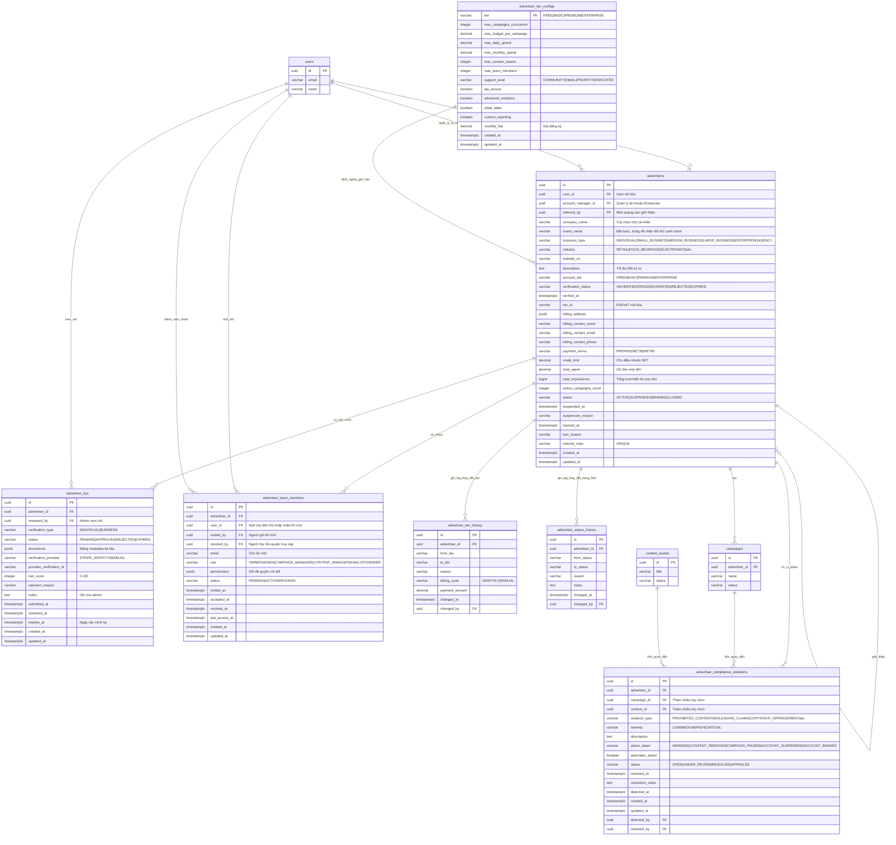

# ERD Cơ sở dữ liệu - Module Quản lý Nhà quảng cáo

## Sơ đồ quan hệ thực thể



## Quan hệ giữa các bảng

### Quan hệ cốt lõi

1. **advertisers → users** (Nhiều-một)
   - Mỗi nhà quảng cáo thuộc sở hữu của một user (user_id)
   - Một user có thể sở hữu nhiều tài khoản nhà quảng cáo
   - Ràng buộc: `ON DELETE RESTRICT` (không thể xóa user sở hữu nhà quảng cáo)

2. **advertisers → users (account_manager)** (Nhiều-một, Tùy chọn)
   - Nhà quảng cáo tier Enterprise có account manager riêng
   - Ràng buộc: `ON DELETE SET NULL`

3. **advertisers → advertisers (referral)** (Nhiều-một, Tùy chọn)
   - Nhà quảng cáo có thể giới thiệu nhà quảng cáo khác qua mã giới thiệu
   - Quan hệ tự tham chiếu
   - Ràng buộc: `ON DELETE SET NULL`

4. **advertisers → advertiser_kyc** (Một-nhiều)
   - Mỗi nhà quảng cáo có thể có nhiều lần thử xác minh KYC
   - Bản ghi APPROVED gần nhất là xác minh đang hoạt động
   - Ràng buộc: `ON DELETE CASCADE` (xóa bản ghi KYC cùng nhà quảng cáo)

5. **advertisers → advertiser_team_members** (Một-nhiều)
   - Mỗi nhà quảng cáo có các thành viên nhóm với vai trò khác nhau
   - Một OWNER (bắt buộc), nhiều vai trò khác được phép
   - Ràng buộc: `ON DELETE CASCADE` (xóa quyền truy cập nhóm cùng nhà quảng cáo)

6. **users → advertiser_team_members** (Một-nhiều)
   - Một user có thể là thành viên nhóm của nhiều nhà quảng cáo
   - user_id là NULL cho lời mời đang chờ
   - Ràng buộc: `ON DELETE SET NULL`

7. **advertisers → advertiser_tier_configs** (Nhiều-một)
   - Mỗi nhà quảng cáo thuộc về một tier
   - Tier định nghĩa tất cả giới hạn và tính năng
   - Không có foreign key (tier là enum)

8. **advertisers → advertiser_tier_history** (Một-nhiều)
   - Audit trail đầy đủ về thay đổi tier
   - Theo dõi nâng cấp, hạ cấp, thông tin thanh toán
   - Ràng buộc: `ON DELETE CASCADE`

9. **advertisers → advertiser_status_history** (Một-nhiều)
   - Audit trail đầy đủ về thay đổi trạng thái
   - Theo dõi tạm ngưng, cấm, kích hoạt lại
   - Ràng buộc: `ON DELETE CASCADE`

10. **advertisers → advertiser_compliance_violations** (Một-nhiều)
    - Theo dõi tất cả vi phạm tuân thủ và chính sách
    - Có thể tham chiếu campaign hoặc content cụ thể
    - Ràng buộc: `ON DELETE CASCADE`

11. **campaigns → advertiser_compliance_violations** (Một-nhiều, Tùy chọn)
    - Vi phạm có thể gắn với campaign cụ thể
    - Ràng buộc: `ON DELETE SET NULL`

12. **content_assets → advertiser_compliance_violations** (Một-nhiều, Tùy chọn)
    - Vi phạm có thể gắn với content cụ thể
    - Ràng buộc: `ON DELETE SET NULL`

### Ràng buộc khóa ngoại

| Bảng | Khóa ngoại | Tham chiếu | On Delete |
|-------|-------------|------------|-----------|
| advertisers | user_id | users(id) | RESTRICT |
| advertisers | account_manager_id | users(id) | SET NULL |
| advertisers | referred_by | advertisers(id) | SET NULL |
| advertiser_kyc | advertiser_id | advertisers(id) | CASCADE |
| advertiser_kyc | reviewed_by | users(id) | SET NULL |
| advertiser_team_members | advertiser_id | advertisers(id) | CASCADE |
| advertiser_team_members | user_id | users(id) | SET NULL |
| advertiser_team_members | invited_by | users(id) | SET NULL |
| advertiser_team_members | revoked_by | users(id) | SET NULL |
| advertiser_tier_history | advertiser_id | advertisers(id) | CASCADE |
| advertiser_tier_history | changed_by | users(id) | SET NULL |
| advertiser_status_history | advertiser_id | advertisers(id) | CASCADE |
| advertiser_status_history | changed_by | users(id) | SET NULL |
| advertiser_compliance_violations | advertiser_id | advertisers(id) | CASCADE |
| advertiser_compliance_violations | campaign_id | campaigns(id) | SET NULL |
| advertiser_compliance_violations | content_id | content_assets(id) | SET NULL |
| advertiser_compliance_violations | detected_by | users(id) | SET NULL |
| advertiser_compliance_violations | resolved_by | users(id) | SET NULL |

## Chỉ mục

### advertisers
- `idx_advertisers_user_id` - Truy vấn theo user sở hữu
- `idx_advertisers_status` - Lọc theo trạng thái tài khoản
- `idx_advertisers_account_tier` - Lọc theo tier
- `idx_advertisers_verification_status` - Lọc theo trạng thái KYC
- `idx_advertisers_industry` - Lọc theo ngành
- `idx_advertisers_referral_code` - Tra cứu theo mã giới thiệu (UNIQUE)
- `idx_advertisers_referred_by` - Tìm giới thiệu theo nhà quảng cáo
- `idx_advertisers_created_at` - Sắp xếp theo ngày đăng ký
- `idx_advertisers_status_tier` - Composite cho truy vấn trạng thái + tier
- `idx_advertisers_manager` - Partial index cho account manager (Enterprise)

### advertiser_kyc
- `idx_advertiser_kyc_advertiser_id` - Tối ưu hóa join
- `idx_advertiser_kyc_status` - Lọc theo trạng thái xác minh
- `idx_advertiser_kyc_submitted_at` - Sắp xếp theo ngày gửi
- `idx_advertiser_kyc_expires_at` - Tìm xác minh sắp hết hạn (partial)
- `idx_advertiser_kyc_provider` - Tra cứu theo nhà cung cấp bên ngoài
- `idx_advertiser_kyc_pending` - Partial index cho xem xét đang chờ (giám sát SLA)

### advertiser_team_members
- `idx_team_members_advertiser_id` - Tối ưu hóa join
- `idx_team_members_user_id` - Tra cứu ngược (nhóm của user)
- `idx_team_members_status` - Lọc theo trạng thái lời mời
- `idx_team_members_role` - Lọc theo vai trò
- `idx_team_members_advertiser_status` - Composite cho truy vấn nhóm
- `idx_team_members_email` - Partial index cho lời mời đang chờ
- `idx_team_members_last_access` - Partial index cho theo dõi thành viên hoạt động

### advertiser_tier_configs
- `idx_tier_configs_monthly_fee` - Sắp xếp theo giá

### advertiser_tier_history
- `idx_tier_history_advertiser_id` - Truy vấn audit trail
- `idx_tier_history_changed_at` - Truy vấn theo thời gian
- `idx_tier_history_to_tier` - Lọc theo tier đích

### advertiser_status_history
- `idx_status_history_advertiser_id` - Truy vấn audit trail
- `idx_status_history_changed_at` - Truy vấn theo thời gian
- `idx_status_history_to_status` - Lọc theo trạng thái đích
- `idx_status_history_advertiser_date` - Composite cho timeline

### advertiser_compliance_violations
- `idx_violations_advertiser_id` - Truy vấn lịch sử vi phạm
- `idx_violations_campaign_id` - Vi phạm theo campaign cụ thể
- `idx_violations_status` - Lọc theo trạng thái giải quyết
- `idx_violations_severity` - Lọc theo mức độ nghiêm trọng
- `idx_violations_type` - Lọc theo loại vi phạm
- `idx_violations_detected_at` - Truy vấn theo thời gian
- `idx_violations_open` - Partial index cho vi phạm chưa giải quyết

## Kiểu dữ liệu

### Các kiểu dữ liệu chính

- **uuid**: Khóa chính và khóa ngoại (định danh duy nhất toàn cầu 128-bit)
- **varchar(n)**: Chuỗi độ dài thay đổi với độ dài tối đa
- **text**: Văn bản độ dài không giới hạn
- **decimal(p,s)**: Số chính xác với độ chính xác và scale
- **bigint**: Giá trị số nguyên lớn (cho bộ đếm như impression)
- **integer**: Giá trị số nguyên chuẩn
- **boolean**: Cờ đúng/sai
- **timestamptz**: Timestamp với múi giờ
- **jsonb**: JSON nhị phân (lưu trữ và đánh chỉ mục hiệu quả)

### Biểu diễn tiền tệ

Tất cả giá trị tiền tệ sử dụng **DECIMAL(12, 2)** hoặc **DECIMAL(10, 2)**:
- Ngân sách campaign/chi tiêu: DECIMAL(12, 2)
  - Phạm vi: -9,999,999,999.99 đến 9,999,999,999.99
  - Đủ cho ngân sách enterprise lớn
- Phí hàng tháng: DECIMAL(10, 2)
  - Phạm vi: -99,999,999.99 đến 99,999,999.99
  - Đủ cho giá đăng ký

### Kiểu JSONB

Dùng cho schema linh hoạt:

**billing_address**:
```json
{
  "street": "123 Main St",
  "street2": "Suite 100",
  "city": "San Francisco",
  "state": "CA",
  "postal_code": "94102",
  "country": "US"
}
```

**documents** (trong advertiser_kyc):
```json
[
  {
    "type": "BUSINESS_REGISTRATION",
    "file_id": "uuid",
    "file_name": "business_cert.pdf",
    "issue_date": "2020-01-15",
    "expiry_date": null,
    "verified": true
  },
  {
    "type": "TAX_ID",
    "value": "12-3456789",
    "country": "US",
    "verified": true
  }
]
```

**permissions** (trong advertiser_team_members):
```json
{
  "campaigns": ["create", "read", "update", "delete"],
  "content": ["upload", "read", "update"],
  "wallet": ["view_balance"],
  "reports": ["view_all", "export"]
}
```

## Cardinality (Số lượng)

### Một-một (1:1)
Không có - Tất cả quan hệ đều là một-nhiều hoặc nhiều-một

### Một-nhiều (1:N)
- users → advertisers (một user có thể sở hữu nhiều tài khoản nhà quảng cáo)
- advertisers → advertiser_kyc (một nhà quảng cáo, nhiều lần thử xác minh)
- advertisers → advertiser_team_members (một nhà quảng cáo, nhiều thành viên nhóm)
- advertisers → advertiser_tier_history (một nhà quảng cáo, nhiều thay đổi tier)
- advertisers → advertiser_status_history (một nhà quảng cáo, nhiều thay đổi trạng thái)
- advertisers → advertiser_compliance_violations (một nhà quảng cáo, nhiều vi phạm)
- advertisers → campaigns (một nhà quảng cáo, nhiều campaign)
- users → advertiser_team_members (một user có thể là thành viên của nhiều nhóm)
- campaigns → advertiser_compliance_violations (một campaign, nhiều vi phạm)
- content_assets → advertiser_compliance_violations (một nội dung, nhiều vi phạm)

### Nhiều-nhiều (M:N)
- users ↔ advertisers (qua advertiser_team_members)
  - Một user có thể là thành viên nhóm của nhiều nhà quảng cáo
  - Một nhà quảng cáo có thể có nhiều user thành viên nhóm
  - Bảng trung gian: advertiser_team_members

## Quy tắc nghiệp vụ & Ràng buộc

### Hệ thống Tier tài khoản

| Tier | Tối đa Campaign | Ngân sách/Campaign | Chi tiêu hàng ngày | Chi tiêu hàng tháng | Nội dung | Thành viên | Phí tháng |
|------|-----------------|--------------------|--------------------|---------------------|----------|------------|-----------|
| FREE | 2 | $500 | $100 | $1,000 | 10 | 1 | $0 |
| BASIC | 5 | $2,000 | $500 | $5,000 | 50 | 3 | $99 |
| PREMIUM | 20 | $10,000 | $2,000 | $50,000 | 200 | 10 | $499 |
| ENTERPRISE | Không giới hạn | Tùy chỉnh | Tùy chỉnh | Tùy chỉnh | Không giới hạn | Không giới hạn | $2,000+ |

### Yêu cầu xác minh

**UNVERIFIED (mặc định)**:
- Có thể sử dụng tier FREE
- Giới hạn trong giới hạn tier FREE
- Không yêu cầu KYC ban đầu

**VERIFIED (sau khi phê duyệt KYC)**:
- Có thể nâng cấp lên bất kỳ tier nào
- Giới hạn chi tiêu cao hơn
- Điều khoản thanh toán NET khả dụng
- Yêu cầu xác minh lại mỗi 2 năm

### Vai trò & Quyền của thành viên nhóm

| Vai trò | Campaign | Nội dung | Ví | Thanh toán | Báo cáo | Cài đặt | Nhóm |
|---------|----------|----------|-----|------------|---------|---------|------|
| OWNER | Đầy đủ | Đầy đủ | Đầy đủ | Đầy đủ | Đầy đủ | Đầy đủ | Đầy đủ |
| ADMIN | Đầy đủ | Đầy đủ | Xem | Xem | Đầy đủ | Hồ sơ | Quản lý |
| CAMPAIGN_MANAGER | Tạo/Sửa | Upload/Sửa | Xem số dư | Không | Xem | Không | Không |
| CONTENT_MANAGER | Xem | Đầy đủ | Không | Không | Nội dung | Không | Không |
| ANALYST | Xem | Xem | Không | Không | Đầy đủ | Không | Không |
| VIEWER | Xem | Xem | Không | Không | Cơ bản | Không | Không |

**Ràng buộc**:
- Chỉ MỘT OWNER mỗi nhà quảng cáo (thực thi bởi trigger)
- Owner không thể bị xóa (phải chuyển quyền sở hữu trước)
- Lời mời hết hạn sau 7 ngày
- user_id là NULL cho đến khi chấp nhận lời mời

### Chuyển đổi trạng thái tài khoản

```
ACTIVE → SUSPENDED (thanh toán thất bại, vi phạm chính sách)
SUSPENDED → ACTIVE (vấn đề đã giải quyết)
SUSPENDED → BANNED (vi phạm lặp lại)
ACTIVE → BANNED (vi phạm nghiêm trọng)
ACTIVE → CLOSED (người dùng khởi xướng)
BANNED → ACTIVE (hiếm, kháng cáo được chấp thuận)
```

**Hiệu ứng trạng thái**:

- **ACTIVE**: Hoạt động bình thường, tất cả tính năng khả dụng
- **SUSPENDED**: Campaign tạm dừng, không campaign mới, truy cập chỉ đọc
- **BANNED**: Tất cả campaign kết thúc, nội dung bị xóa, đăng nhập bị vô hiệu hóa
- **CLOSED**: Đóng do người dùng khởi xướng, dữ liệu được bảo toàn 90 ngày

### Leo thang vi phạm tuân thủ

| Lần vi phạm | Hành động | Thời gian |
|-------------|-----------|-----------|
| Lần 1 | CẢNH BÁO | - |
| Lần 2 | TẠM NGƯNG | 7 ngày |
| Lần 3 | TẠM NGƯNG | 30 ngày |
| Lần 4+ | CẤM VĨNh VIỄN | - |

**Mức độ nghiêm trọng**:
- **LOW**: Thông báo cảnh báo
- **MEDIUM**: Yêu cầu xóa nội dung
- **HIGH**: Tạm dừng campaign + xem xét
- **CRITICAL**: Tạm ngưng ngay lập tức

## Ước lượng kích thước cơ sở dữ liệu

### Mỗi nhà quảng cáo
- Bảng advertisers: ~1.5 KB mỗi hàng
- advertiser_kyc: ~2 KB mỗi lần xác minh (trung bình 1-2 mỗi nhà quảng cáo)
- advertiser_team_members: ~400 bytes mỗi thành viên (trung bình 2 mỗi nhà quảng cáo = 800 bytes)
- advertiser_tier_configs: ~300 bytes tổng cộng (4 hàng)
- **Tổng phụ**: ~4.3 KB mỗi nhà quảng cáo

### Bảng Audit (Mỗi nhà quảng cáo mỗi năm)
- advertiser_tier_history: ~200 bytes mỗi thay đổi (trung bình 1/năm = 200 bytes)
- advertiser_status_history: ~250 bytes mỗi thay đổi (trung bình 2/năm = 500 bytes)
- advertiser_compliance_violations: ~500 bytes mỗi vi phạm (trung bình 5/năm = 2.5 KB)
- **Tổng phụ**: ~3.2 KB mỗi nhà quảng cáo mỗi năm

### Lưu trữ dự kiến (10,000 nhà quảng cáo)

**Ban đầu (Năm 1)**:
- Dữ liệu nhà quảng cáo cốt lõi: 10,000 × 4.3 KB = **43 MB**
- Dữ liệu audit/lịch sử: 10,000 × 3.2 KB = **32 MB**
- **Tổng (Năm 1)**: ~**75 MB**

**Tăng trưởng (Mỗi năm bổ sung)**:
- Tăng trưởng audit trail: 10,000 × 3.2 KB = **32 MB/năm**
- Nhà quảng cáo mới (tăng trưởng 20%): 2,000 × 4.3 KB = **8.6 MB**
- **Tăng trưởng hàng năm**: ~**40 MB/năm**

**Dự kiến 5 năm (10,000 → 20,000 nhà quảng cáo)**:
- Dữ liệu cốt lõi: 20,000 × 4.3 KB = **86 MB**
- Audit 5 năm: 20,000 × 3.2 KB × 5 = **320 MB**
- **Tổng (5 năm)**: ~**406 MB**

Với nén PostgreSQL và overhead đánh chỉ mục (hệ số 2x), dự kiến ~**800 MB** cho 5 năm với 20,000 nhà quảng cáo.

Điều này nhỏ hơn đáng kể so với các module khác (campaign, impression) vì:
- Dữ liệu nhà quảng cáo tương đối tĩnh
- Cập nhật ít thường xuyên hơn so với campaign/impression
- Audit trail nhẹ

## View

### v_active_advertisers
**Mục đích**: Nhà quảng cáo đang hoạt động với số liệu chính và đếm nhóm/vi phạm

**Cột**:
- id, brand_name, company_name
- business_type, industry, account_tier
- verification_status, status
- total_spent, total_impressions, active_campaigns_count
- team_members_count (chỉ đang hoạt động)
- open_violations_count
- created_at

**Trường hợp sử dụng**:
- Tổng quan dashboard
- Giám sát sức khỏe tài khoản
- Theo dõi thành công khách hàng

### v_advertiser_tier_compliance
**Mục đích**: Giám sát việc sử dụng của nhà quảng cáo so với giới hạn tier

**Cột**:
- id, brand_name, account_tier
- active_campaigns_count, max_campaigns_concurrent
- campaign_limit_status (WITHIN_LIMIT|NEAR_LIMIT|EXCEEDED)
- team_members_count, max_team_members
- team_limit_status (WITHIN_LIMIT|NEAR_LIMIT|EXCEEDED)

**Trường hợp sử dụng**:
- Xác định ứng viên nâng cấp
- Thực thi giới hạn tier
- Cơ hội bán thêm

### v_pending_kyc_verifications
**Mục đích**: Xác minh KYC đang chờ xem xét với theo dõi SLA

**Cột**:
- id, advertiser_id, brand_name, company_name
- verification_type, submitted_at, risk_score
- hours_pending (cho giám sát SLA)

**Trường hợp sử dụng**:
- Hàng đợi nhóm tuân thủ
- Giám sát SLA (mục tiêu: xem xét trong 48h)
- Gắn cờ rủi ro cao

## Trigger & Function

### Trigger

1. **trigger_advertisers_updated_at**
   - Cập nhật updated_at cho mỗi sửa đổi nhà quảng cáo
   - Đảm bảo timestamp audit chính xác

2. **trigger_generate_referral_code**
   - Tự động tạo mã giới thiệu duy nhất 10 ký tự
   - Chạy trên INSERT trước khi lưu

3. **trigger_validate_tier_limits**
   - Cảnh báo (không chặn) khi nhà quảng cáo vượt giới hạn tier
   - Cho phép grandfathering trong quá trình hạ cấp

4. **trigger_log_status_change**
   - Tự động ghi log thay đổi trạng thái vào advertiser_status_history
   - Capture lý do tạm ngưng/cấm

5. **trigger_log_tier_change**
   - Tự động ghi log thay đổi tier vào advertiser_tier_history
   - Theo dõi nâng cấp/hạ cấp

6. **trigger_validate_single_owner**
   - Thực thi ràng buộc MỘT OWNER mỗi nhà quảng cáo
   - Ngăn nhiều owner đang hoạt động

### Function

1. **generate_referral_code()**
   - Tạo mã giới thiệu duy nhất từ MD5 hash
   - Định dạng: 10 ký tự chữ hoa alphanumeric

2. **validate_advertiser_tier_limits()**
   - Kiểm tra nếu nhà quảng cáo vượt giới hạn tier
   - Phát ra CẢNH BÁO (không chặn) để hiển thị

3. **log_advertiser_status_change()**
   - Chèn bản ghi vào advertiser_status_history
   - Capture trạng thái cũ/mới và lý do

4. **log_advertiser_tier_change()**
   - Chèn bản ghi vào advertiser_tier_history
   - Theo dõi nâng cấp/hạ cấp tier

5. **validate_single_owner()**
   - Ngăn nhiều vai trò OWNER mỗi nhà quảng cáo
   - Raise exception nếu vi phạm

---

*Cập nhật lần cuối: 2026-01-23*
