# Database ERD - Module Xác thực & Phân quyền

## Sơ đồ Quan hệ Thực thể

```mermaid
erDiagram
    users ||--o{ user_roles : "có"
    users ||--o{ user_permissions : "có"
    users ||--o{ user_sessions : "tạo"
    users ||--o{ oauth_connections : "kết_nối"
    users ||--o{ email_verification_tokens : "xác_thực"
    users ||--o{ audit_logs : "thực_hiện"
    users ||--o{ security_events : "kích_hoạt"

    roles ||--o{ user_roles : "được_gán_cho"
    roles ||--o{ role_permissions : "có"
    roles ||--o| roles : "kế_thừa_từ"

    permissions ||--o{ role_permissions : "cấp_cho"
    permissions ||--o{ user_permissions : "gán_cho"

    user_sessions ||--o{ audit_logs : "theo_dõi"
    user_sessions ||--o{ security_events : "giám_sát"

    users {
        uuid id PK
        varchar email "UNIQUE, NOT NULL"
        boolean email_verified
        varchar password_hash "NULL cho OAuth-only"
        varchar first_name
        varchar last_name
        varchar full_name "GENERATED"
        varchar phone_number
        boolean phone_verified
        varchar user_type "ADMIN|ADVERTISER|SUPPLIER|CONTENT_MODERATOR"
        varchar status "PENDING_VERIFICATION|ACTIVE|SUSPENDED|BANNED"
        boolean mfa_enabled
        varchar mfa_secret
        text_array mfa_backup_codes
        varchar oauth_provider
        varchar oauth_provider_id
        timestamptz last_login_at
        inet last_login_ip
        integer failed_login_attempts
        timestamptz account_locked_until
        timestamptz created_at
        timestamptz updated_at
        timestamptz deleted_at
    }

    roles {
        uuid id PK
        varchar name "UNIQUE, NOT NULL"
        varchar display_name
        text description
        varchar role_type "SYSTEM|CUSTOM"
        uuid parent_role_id FK
        varchar scope "GLOBAL|ORGANIZATION|CAMPAIGN|CONTENT"
        boolean is_active
        boolean is_assignable
        timestamptz created_at
    }

    permissions {
        uuid id PK
        varchar name "UNIQUE, NOT NULL"
        varchar display_name
        varchar resource "CAMPAIGN|CONTENT|USER|WALLET"
        varchar action "CREATE|READ|UPDATE|DELETE|APPROVE"
        varchar scope "GLOBAL|ORGANIZATION|OWN|ASSIGNED"
        varchar category
        boolean is_active
        boolean is_system
        timestamptz created_at
    }

    role_permissions {
        uuid id PK
        uuid role_id FK
        uuid permission_id FK
        boolean is_granted "TRUE=cấp, FALSE=từ chối"
        jsonb conditions
        timestamptz assigned_at
        uuid assigned_by FK
    }

    user_roles {
        uuid id PK
        uuid user_id FK
        uuid role_id FK
        varchar assigned_scope "GLOBAL|ORGANIZATION|CAMPAIGN"
        uuid scope_resource_id
        timestamptz valid_from
        timestamptz valid_until
        boolean is_active
        timestamptz assigned_at
        timestamptz revoked_at
        uuid assigned_by FK
    }

    user_permissions {
        uuid id PK
        uuid user_id FK
        uuid permission_id FK
        boolean is_granted
        varchar assigned_scope
        uuid scope_resource_id
        jsonb conditions
        timestamptz valid_from
        timestamptz valid_until
        text reason "REQUIRED"
        timestamptz assigned_at
        uuid assigned_by FK
    }

    user_sessions {
        uuid id PK
        uuid user_id FK
        varchar access_token_jti "UNIQUE, JWT ID"
        varchar refresh_token_hash "UNIQUE, đã hash"
        timestamptz access_token_expires_at
        timestamptz refresh_token_expires_at
        varchar session_type "WEB|MOBILE|API|ADMIN"
        inet ip_address
        text user_agent
        varchar device_fingerprint
        varchar country_code
        varchar city
        boolean is_active
        timestamptz revoked_at
        timestamptz last_activity_at
        timestamptz created_at
    }

    oauth_connections {
        uuid id PK
        uuid user_id FK
        varchar provider "GOOGLE|FACEBOOK|MICROSOFT|APPLE"
        varchar provider_user_id
        varchar provider_email
        text access_token "mã hóa"
        text refresh_token "mã hóa"
        timestamptz token_expires_at
        jsonb provider_profile
        text_array scopes
        boolean is_primary
        boolean is_active
        timestamptz connected_at
        timestamptz last_synced_at
    }

    email_verification_tokens {
        uuid id PK
        uuid user_id FK
        varchar token "UNIQUE"
        varchar email
        timestamptz expires_at
        boolean verified
        timestamptz verified_at
        timestamptz created_at
    }

    audit_logs {
        uuid id PK
        uuid user_id FK
        uuid session_id FK
        uuid impersonator_id FK
        varchar action "USER_LOGIN|CAMPAIGN_CREATE|etc"
        varchar action_category "AUTHENTICATION|AUTHORIZATION|DATA_CHANGE"
        varchar action_status "SUCCESS|FAILURE|PARTIAL|PENDING"
        varchar resource_type
        uuid resource_id
        varchar resource_name
        jsonb old_values
        jsonb new_values
        text changes_summary
        inet ip_address
        text user_agent
        uuid request_id
        varchar api_endpoint
        boolean is_suspicious
        integer risk_score "0-100"
        boolean flagged_for_review
        timestamptz occurred_at
        jsonb metadata
    }

    security_events {
        uuid id PK
        uuid user_id FK
        uuid session_id FK
        varchar event_type "FAILED_LOGIN|ACCOUNT_LOCKED|SUSPICIOUS_ACTIVITY"
        varchar severity "INFO|LOW|MEDIUM|HIGH|CRITICAL"
        text description
        jsonb details
        inet ip_address
        text user_agent
        varchar action_taken
        boolean automated_response
        boolean investigated
        timestamptz investigated_at
        uuid investigated_by FK
        boolean false_positive
        timestamptz occurred_at
        jsonb metadata
    }
```



## Quan hệ giữa các Bảng

### Quan hệ Cốt lõi

1. **users → user_roles** (Một-nhiều)
   - Mỗi người dùng có thể có nhiều vai trò
   - Vai trò có thể được giới hạn phạm vi tài nguyên cụ thể (global, organization, campaign)
   - Hỗ trợ giới hạn thời gian (valid_from, valid_until)
   - Ràng buộc: `UNIQUE(user_id, role_id, assigned_scope, scope_resource_id)`

2. **users → user_permissions** (Một-nhiều)
   - Gán quyền trực tiếp bỏ qua vai trò
   - Dùng cho trường hợp ngoại lệ và cấp quyền tạm thời
   - Yêu cầu lý do (trường reason)
   - Hỗ trợ giới hạn thời gian và phạm vi

3. **users → user_sessions** (Một-nhiều)
   - Mỗi người dùng có thể có nhiều phiên hoạt động (web, mobile, API)
   - Theo dõi JWT token và thông tin thiết bị
   - Hỗ trợ hết hạn và thu hồi tự động

4. **roles → role_permissions** (Một-nhiều)
   - Ánh xạ quyền với vai trò (RBAC)
   - Hỗ trợ logic cấp/từ chối (cờ is_granted)
   - Điều kiện tùy chọn cho quyền có điều kiện

5. **roles → roles** (Tự tham chiếu, Một-nhiều)
   - Phân cấp vai trò thông qua parent_role_id
   - Hỗ trợ mẫu kế thừa vai trò
   - Dùng cho cấu trúc vai trò tổ chức

6. **users → oauth_connections** (Một-nhiều)
   - Nhiều nhà cung cấp OAuth cho mỗi người dùng (Google, Facebook, v.v.)
   - Lưu trữ token được mã hóa
   - Theo dõi nhà cung cấp OAuth chính

7. **users → audit_logs** (Một-nhiều)
   - Audit trail đầy đủ của tất cả hành động người dùng
   - Theo dõi thay đổi với trạng thái trước/sau
   - Hỗ trợ đánh dấu bảo mật và xem xét

8. **users → security_events** (Một-nhiều)
   - Sự cố và cảnh báo bảo mật cụ thể
   - Phân loại theo mức độ nghiêm trọng
   - Hỗ trợ quy trình điều tra

### Ràng buộc Khóa ngoại

| Table | Foreign Key | References | On Delete |
|-------|-------------|------------|-----------|
| users | created_by | users(id) | SET NULL |
| users | updated_by | users(id) | SET NULL |
| users | suspended_by | users(id) | SET NULL |
| users | deactivated_by | users(id) | SET NULL |
| users | banned_by | users(id) | SET NULL |
| roles | parent_role_id | roles(id) | SET NULL |
| roles | created_by | users(id) | SET NULL |
| roles | updated_by | users(id) | SET NULL |
| permissions | created_by | users(id) | SET NULL |
| role_permissions | role_id | roles(id) | CASCADE |
| role_permissions | permission_id | permissions(id) | CASCADE |
| role_permissions | assigned_by | users(id) | SET NULL |
| user_roles | user_id | users(id) | CASCADE |
| user_roles | role_id | roles(id) | CASCADE |
| user_roles | assigned_by | users(id) | SET NULL |
| user_roles | revoked_by | users(id) | SET NULL |
| user_permissions | user_id | users(id) | CASCADE |
| user_permissions | permission_id | permissions(id) | CASCADE |
| user_permissions | assigned_by | users(id) | SET NULL |
| user_permissions | revoked_by | users(id) | SET NULL |
| user_sessions | user_id | users(id) | CASCADE |
| oauth_connections | user_id | users(id) | CASCADE |
| email_verification_tokens | user_id | users(id) | CASCADE |
| audit_logs | user_id | users(id) | SET NULL |
| audit_logs | session_id | user_sessions(id) | SET NULL |
| audit_logs | impersonator_id | users(id) | SET NULL |
| security_events | user_id | users(id) | SET NULL |
| security_events | session_id | user_sessions(id) | SET NULL |
| security_events | investigated_by | users(id) | SET NULL |

## Chỉ mục

### users
- `idx_users_email` - Tra cứu email nhanh (đăng nhập duy nhất)
- `idx_users_status` - Lọc theo trạng thái tài khoản
- `idx_users_user_type` - Lọc theo loại người dùng (vai trò)
- `idx_users_created_at` - Sắp xếp theo ngày đăng ký
- `idx_users_last_login_at` - Sắp xếp theo lần đăng nhập cuối
- `idx_users_oauth_provider` - Tra cứu nhà cung cấp OAuth
- `idx_users_email_verified` - Chỉ mục bộ phận cho tài khoản chưa xác thực
- `idx_users_password_reset_token` - Xác thực token đặt lại mật khẩu nhanh

### roles
- `idx_roles_name` - Tra cứu tên vai trò nhanh
- `idx_roles_role_type` - Lọc vai trò hệ thống vs tùy chỉnh
- `idx_roles_is_active` - Chỉ mục bộ phận cho vai trò hoạt động
- `idx_roles_parent_role_id` - Truy vấn phân cấp vai trò
- `idx_roles_scope` - Lọc theo phạm vi vai trò

### permissions
- `idx_permissions_name` - Tra cứu quyền nhanh
- `idx_permissions_resource` - Lọc theo loại tài nguyên
- `idx_permissions_action` - Lọc theo loại hành động
- `idx_permissions_category` - Nhóm theo danh mục
- `idx_permissions_is_active` - Chỉ mục bộ phận cho quyền hoạt động
- `idx_permissions_resource_action` - Kết hợp cho kiểm tra quyền

### role_permissions
- `idx_role_permissions_role_id` - Tối ưu hóa join
- `idx_role_permissions_permission_id` - Tra cứu ngược
- `idx_role_permissions_granted` - Lọc đã cấp vs từ chối
- `idx_role_permissions_conditions` - Chỉ mục GIN cho điều kiện JSONB

### user_roles
- `idx_user_roles_user_id` - Tra cứu vai trò của người dùng
- `idx_user_roles_role_id` - Truy vấn thành viên vai trò
- `idx_user_roles_is_active` - Chỉ mục bộ phận cho gán hoạt động
- `idx_user_roles_scope` - Truy vấn vai trò theo phạm vi
- `idx_user_roles_validity` - Kiểm tra tính hợp lệ theo thời gian
- `idx_user_roles_user_active` - Kết hợp cho kiểm tra quyền

### user_permissions
- `idx_user_permissions_user_id` - Quyền trực tiếp của người dùng
- `idx_user_permissions_permission_id` - Theo dõi sử dụng quyền
- `idx_user_permissions_granted` - Lọc đã cấp vs từ chối
- `idx_user_permissions_validity` - Kiểm tra tính hợp lệ theo thời gian
- `idx_user_permissions_user_active` - Kết hợp cho quyền hoạt động

### user_sessions
- `idx_user_sessions_user_id` - Tra cứu phiên của người dùng
- `idx_user_sessions_access_token_jti` - Xác thực JWT
- `idx_user_sessions_refresh_token_hash` - Làm mới token
- `idx_user_sessions_is_active` - Chỉ mục bộ phận cho phiên hoạt động
- `idx_user_sessions_created_at` - Sắp xếp theo tạo phiên
- `idx_user_sessions_expires_at` - Dọn dẹp hết hạn
- `idx_user_sessions_user_active` - Kết hợp cho số phiên người dùng
- `idx_user_sessions_last_activity` - Truy vấn dựa trên hoạt động

### oauth_connections
- `idx_oauth_connections_user_id` - Tài khoản OAuth của người dùng
- `idx_oauth_connections_provider` - Truy vấn theo nhà cung cấp
- `idx_oauth_connections_provider_user_id` - Tra cứu nhà cung cấp OAuth
- `idx_oauth_connections_is_active` - Chỉ mục bộ phận cho kết nối hoạt động
- `idx_oauth_connections_is_primary` - Chỉ mục bộ phận cho nhà cung cấp chính

### email_verification_tokens
- `idx_email_verification_tokens_user_id` - Token của người dùng
- `idx_email_verification_tokens_token` - Chỉ mục bộ phận cho token chưa xác thực
- `idx_email_verification_tokens_expires_at` - Dọn dẹp hết hạn
- `idx_email_verification_tokens_verified` - Lọc token đã xác thực

### audit_logs
- `idx_audit_logs_user_id` - Lịch sử hoạt động người dùng
- `idx_audit_logs_session_id` - Audit trail theo phiên
- `idx_audit_logs_occurred_at` - Truy vấn chuỗi thời gian
- `idx_audit_logs_action` - Lọc theo loại hành động
- `idx_audit_logs_action_category` - Báo cáo theo danh mục
- `idx_audit_logs_action_status` - Lọc theo trạng thái
- `idx_audit_logs_resource` - Audit trail theo tài nguyên
- `idx_audit_logs_user_action` - Kết hợp cho hoạt động người dùng
- `idx_audit_logs_ip_address` - Truy vấn bảo mật theo IP
- `idx_audit_logs_suspicious` - Chỉ mục bộ phận cho hoạt động đáng ngờ
- `idx_audit_logs_flagged` - Chỉ mục bộ phận cho hàng đợi xem xét
- `idx_audit_logs_request_id` - Theo dõi request

### security_events
- `idx_security_events_user_id` - Sự cố bảo mật của người dùng
- `idx_security_events_occurred_at` - Truy vấn chuỗi thời gian
- `idx_security_events_event_type` - Lọc theo loại sự kiện
- `idx_security_events_severity` - Ưu tiên theo mức độ nghiêm trọng
- `idx_security_events_ip_address` - Phát hiện mối đe dọa theo IP
- `idx_security_events_investigated` - Chỉ mục bộ phận cho điều tra chưa xử lý
- `idx_security_events_false_positive` - Theo dõi false positive

## Kiểu Dữ liệu

### Các Kiểu Dữ liệu Chính

- **uuid**: Khóa chính và khóa ngoại (định danh duy nhất 128-bit)
- **varchar(n)**: Chuỗi độ dài biến đổi với độ dài tối đa
- **text**: Văn bản độ dài không giới hạn (mô tả, ghi chú, logs)
- **boolean**: Cờ true/false (trạng thái, feature toggle)
- **timestamptz**: Timestamp có múi giờ (tất cả dữ liệu thời gian)
- **inet**: Địa chỉ IP (IPv4 hoặc IPv6)
- **integer**: Giá trị số nguyên chuẩn (bộ đếm, điểm số)
- **text[]**: Mảng giá trị text (backup codes, scopes)
- **jsonb**: Binary JSON (metadata linh hoạt, điều kiện, dữ liệu hồ sơ)

### Kiểu Dữ liệu Bảo mật

- **password_hash**: `VARCHAR(255)` - Mật khẩu đã hash Bcrypt/Argon2
- **access_token_jti**: `VARCHAR(64)` - JWT ID cho thu hồi token
- **refresh_token_hash**: `VARCHAR(255)` - Refresh token đã hash
- **mfa_secret**: `VARCHAR(64)` - Khóa bí mật TOTP (mã hóa base32)
- **device_fingerprint**: `VARCHAR(255)` - Định danh thiết bị đã hash
- **ip_address**: `INET` - Kiểu địa chỉ IP native của PostgreSQL có hỗ trợ CIDR

### Sử dụng JSONB

Dùng cho schema linh hoạt và dữ liệu lồng nhau:

1. **role_permissions.conditions**: Quy tắc quyền có điều kiện
   ```json
   {
     "budget_limit": 10000,
     "max_campaigns": 5,
     "allowed_regions": ["US", "CA", "UK"]
   }
   ```

2. **oauth_connections.provider_profile**: Dữ liệu hồ sơ nhà cung cấp OAuth
   ```json
   {
     "name": "John Doe",
     "picture": "https://...",
     "email_verified": true,
     "locale": "en"
   }
   ```

3. **audit_logs.old_values / new_values**: Theo dõi thay đổi trạng thái
   ```json
   {
     "status": "ACTIVE",
     "email": "user@example.com",
     "roles": ["ADVERTISER_OWNER"]
   }
   ```

4. **security_events.details**: Metadata cụ thể cho sự kiện
   ```json
   {
     "failed_attempts": 5,
     "blocked_until": "2026-01-23T12:00:00Z",
     "detection_rules": ["brute_force", "geo_anomaly"]
   }
   ```

## Cardinality (Số lượng)

### Một-một (1:1)
- Không có trong module này (quan hệ wallet trong module wallet)

### Một-nhiều (1:N)
- users → user_roles (một người dùng, nhiều gán vai trò)
- users → user_permissions (một người dùng, nhiều quyền trực tiếp)
- users → user_sessions (một người dùng, nhiều phiên đồng thời)
- users → oauth_connections (một người dùng, nhiều nhà cung cấp OAuth)
- users → email_verification_tokens (một người dùng, nhiều token theo thời gian)
- users → audit_logs (một người dùng, nhiều hành động được ghi)
- users → security_events (một người dùng, nhiều sự cố bảo mật)
- roles → user_roles (một vai trò, nhiều gán cho người dùng)
- roles → role_permissions (một vai trò, nhiều quyền)
- permissions → role_permissions (một quyền, nhiều gán vai trò)
- permissions → user_permissions (một quyền, nhiều gán người dùng)

### Nhiều-nhiều (M:N)
- users ↔ roles (via user_roles)
  - Một người dùng có thể có nhiều vai trò
  - Một vai trò có thể được gán cho nhiều người dùng
  - Bao gồm phạm vi và tính hợp lệ theo thời gian

- roles ↔ permissions (via role_permissions)
  - Một vai trò có thể có nhiều quyền
  - Một quyền có thể được cấp cho nhiều vai trò
  - Hỗ trợ logic cấp/từ chối

- users ↔ permissions (via user_permissions)
  - Một người dùng có thể có nhiều quyền trực tiếp
  - Một quyền có thể được gán trực tiếp cho nhiều người dùng
  - Dùng cho ngoại lệ và ghi đè

### Tự tham chiếu (Phân cấp)
- roles → roles (parent_role_id)
  - Hỗ trợ phân cấp và kế thừa vai trò
  - Một vai trò có thể có một vai trò cha
  - Một vai trò cha có thể có nhiều vai trò con

## Ước tính Kích thước Cơ sở dữ liệu

### Mỗi Người dùng
- Bảng users: ~1.5 KB mỗi dòng (với dữ liệu hồ sơ)
- user_roles: ~200 bytes mỗi gán vai trò (trung bình 2 vai trò = 400 bytes)
- user_permissions: ~300 bytes mỗi quyền trực tiếp (trung bình 1 = 300 bytes)
- oauth_connections: ~2 KB mỗi kết nối OAuth (trung bình 1 = 2 KB)
- **Tổng phụ**: ~4.2 KB mỗi người dùng

### Mỗi Người dùng Hoạt động Mỗi Ngày
- user_sessions: ~800 bytes mỗi phiên (trung bình 1.5 phiên = 1.2 KB)
- audit_logs: ~1 KB mỗi hành động (trung bình 50 hành động/ngày = 50 KB)
- security_events: ~500 bytes mỗi sự kiện (trung bình 0.1 sự kiện/ngày = 50 bytes)
- **Tổng phụ**: ~51.25 KB mỗi người dùng hoạt động mỗi ngày

### Toàn hệ thống (Một lần)
- roles: ~500 bytes × 50 vai trò = **25 KB**
- permissions: ~300 bytes × 200 quyền = **60 KB**
- role_permissions: ~200 bytes × 500 ánh xạ = **100 KB**
- **Tổng phụ**: ~**185 KB** cho cấu hình RBAC

### Dung lượng Dự kiến (1 năm, 100,000 người dùng, 50% hoạt động hàng ngày)

#### Dữ liệu Người dùng Cốt lõi
- Tài khoản người dùng: 100,000 × 4.2 KB = **420 MB**
- Email verification tokens: 100,000 × 300 bytes = **30 MB**

#### Hoạt động Hàng ngày (50,000 người dùng hoạt động/ngày)
- Phiên (giữ 30 ngày): 50,000 × 1.2 KB × 30 = **1.8 GB**
- Audit logs (1 năm): 50,000 × 50 KB × 365 = **912.5 GB**
- Security events (1 năm): 50,000 × 50 bytes × 365 = **912.5 MB**

#### Tổng Dung lượng (1 năm)
- Dữ liệu cốt lõi: **450 MB**
- Phiên hoạt động: **1.8 GB**
- Audit trail: **913.4 GB**
- **Tổng**: ~**916 GB** (chưa nén)

### Chiến lược Tối ưu hóa

1. **Phân vùng Audit Log**
   - Phân vùng theo tháng/quý
   - Lưu trữ phân vùng cũ vào cold storage
   - Giảm kích thước dataset hoạt động 90%

2. **Dọn dẹp Phiên**
   - Tự động hết hạn phiên sau khi refresh token hết hạn
   - Dọn dẹp tích cực các phiên đã thu hồi
   - Giảm kích thước bảng phiên 70%

3. **Lưu trữ Security Event**
   - Chuyển sự kiện đã giải quyết sang bảng lưu trữ sau 90 ngày
   - Chỉ giữ sự kiện mức độ cao trong hot storage
   - Giảm dataset hoạt động 85%

4. **Tối ưu hóa Chỉ mục**
   - Chỉ mục bộ phận trên tập con thường truy vấn
   - Chỉ mục GIN cho cột JSONB và array
   - Chỉ mục covering cho truy vấn phổ biến

5. **Tính năng PostgreSQL**
   - Nén TOAST cho các trường text/jsonb lớn
   - Phân vùng bảng cho dữ liệu chuỗi thời gian
   - Materialized view cho tổng hợp tốn kém

### Dung lượng Nén Dự kiến (1 năm, 100,000 người dùng)
Với nén PostgreSQL và lưu trữ:
- **~180 GB** (giảm 80% thông qua nén và lưu trữ)

## Mô hình Phân quyền RBAC

### Quy ước Đặt tên Quyền

Định dạng: `{resource}:{action}:{scope}`

Ví dụ:
- `campaign:create:global` - Tạo chiến dịch cho bất kỳ nhà quảng cáo nào
- `campaign:create:own` - Tạo chiến dịch cho tài khoản riêng
- `content:approve:global` - Phê duyệt bất kỳ nội dung nào
- `user:read:own` - Đọc hồ sơ người dùng riêng

### Phân cấp Phạm vi

1. **GLOBAL**: Truy cập tất cả tài nguyên trên nền tảng
2. **ORGANIZATION**: Truy cập giới hạn tổ chức/tài khoản cụ thể
3. **OWN**: Chỉ truy cập tài nguyên thuộc sở hữu của người dùng
4. **ASSIGNED**: Truy cập tài nguyên được gán cụ thể

### Logic Giải quyết Quyền

```
Kiểm tra Quyền Người dùng:
1. Kiểm tra user_permissions (gán trực tiếp) - ƯU TIÊN CAO NHẤT
   - Nếu rõ ràng DENIED → trả về FALSE
   - Nếu rõ ràng GRANTED → trả về TRUE
2. Kiểm tra user_roles → role_permissions
   - Tổng hợp tất cả quyền từ vai trò hoạt động
   - Nếu có vai trò rõ ràng DENIES → trả về FALSE
   - Nếu có vai trò rõ ràng GRANTS → trả về TRUE
3. Mặc định → trả về FALSE (từ chối mặc định)
```

### Vai trò Hệ thống & Quyền Mặc định

#### SUPER_ADMIN
- **Tất cả Quyền**: `*:*:global`
- Quyền truy cập toàn bộ nền tảng, không thể bị hạn chế

#### ADMIN
- Quản lý người dùng: `user:*:global`
- Quản lý vai trò: `role:*:global`
- Truy cập audit: `audit:read:global`
- Giám sát bảo mật: `security:*:global`

#### ADVERTISER_OWNER
- Quản lý chiến dịch: `campaign:*:own`
- Quản lý nội dung: `content:*:own`
- Truy cập ví: `wallet:*:own`
- Phân tích: `analytics:*:own`

#### ADVERTISER_MANAGER
- CRUD chiến dịch: `campaign:create|read|update:own`
- CRUD nội dung: `content:create|read|update:own`
- Đọc phân tích: `analytics:read:own`

#### ADVERTISER_VIEWER
- Đọc chiến dịch: `campaign:read:own`
- Đọc nội dung: `content:read:own`
- Đọc phân tích: `analytics:read:own`

#### SUPPLIER_OWNER
- Quản lý thiết bị: `device:*:own`
- Quản lý tồn kho: `inventory:*:own`
- Truy cập ví: `wallet:*:own`
- Phân tích: `analytics:*:own`

#### SUPPLIER_MANAGER
- CRUD thiết bị: `device:create|read|update:own`
- Quản lý tồn kho: `inventory:*:own`

#### SUPPLIER_VIEWER
- Đọc thiết bị: `device:read:own`
- Đọc phân tích: `analytics:read:own`

#### CONTENT_MODERATOR
- Phê duyệt nội dung: `content:approve:global`
- Từ chối nội dung: `content:reject:global`
- Đọc nội dung: `content:read:global`

#### ANALYST
- Đọc phân tích: `analytics:read:global`
- Xuất báo cáo: `analytics:export:global`

#### SUPPORT_AGENT
- Đọc người dùng: `user:read:global`
- Audit logs: `audit:read:global`
- Truy cập khắc phục cơ bản

## Tính năng Bảo mật

### Xác thực
1. **Email/Mật khẩu**: Mật khẩu hash Bcrypt (hệ số chi phí 12)
2. **OAuth 2.0**: Google, Facebook, Microsoft, Apple
3. **Xác thực Đa yếu tố (MFA)**: Dựa trên TOTP (RFC 6238)
4. **Xác thực Email**: Yêu cầu để kích hoạt tài khoản
5. **Đặt lại Mật khẩu**: Dựa trên token có thời hạn

### Quản lý Phiên
1. **JWT Tokens**:
   - Access token: Ngắn hạn (15 phút)
   - Refresh token: Dài hạn (30 ngày)
   - JTI claim để thu hồi
2. **Device Fingerprinting**: Theo dõi thay đổi thiết bị đáng ngờ
3. **Theo dõi IP**: Định vị địa lý và phát hiện bất thường
4. **Phiên Đồng thời**: Hỗ trợ nhiều thiết bị với khả năng hiển thị
5. **Thu hồi Phiên**: Do người dùng hoặc admin thực hiện

### Phân quyền
1. **Kiểm soát Truy cập Dựa trên Vai trò (RBAC)**: Gán vai trò linh hoạt
2. **Kiểm soát Truy cập Dựa trên Thuộc tính (ABAC)**: Quyền có điều kiện
3. **Truy cập Dựa trên Phạm vi**: Global, tổ chức và cấp tài nguyên
4. **Quyền Thời gian**: Gán vai trò/quyền có giới hạn thời gian
5. **Kế thừa Quyền**: Cấu trúc vai trò phân cấp
6. **Từ chối Rõ ràng**: Quy tắc từ chối ghi đè cấp quyền

### Audit & Giám sát
1. **Audit Trail Toàn diện**: Tất cả hành động được ghi với trạng thái trước/sau
2. **Phát hiện Sự kiện Bảo mật**: Phát hiện mối đe dọa tự động
3. **Chấm điểm Rủi ro**: Phân tích hành vi (điểm 0-100)
4. **Đánh dấu Hoạt động Đáng ngờ**: Phát hiện dựa trên machine learning
5. **Quy trình Điều tra**: Theo dõi giải quyết sự cố bảo mật
6. **Theo dõi Request**: Theo dõi request đầu cuối

### Bảo vệ Tài khoản
1. **Hạn chế Đăng nhập Thất bại**: Tự động khóa sau 5 lần thất bại
2. **Khóa Tài khoản**: Thời gian chờ 30 phút
3. **Phát hiện Đăng nhập Đáng ngờ**: Phát hiện bất thường địa lý, thay đổi thiết bị
4. **Ngăn chặn Chiếm đoạt Phiên**: Ràng buộc token, xác thực IP
5. **Bảo vệ Brute Force**: Giới hạn tốc độ, tích hợp CAPTCHA
6. **Quản lý Trạng thái Tài khoản**: Tạm ngưng, cấm, vô hiệu hóa

### Bảo vệ Dữ liệu
1. **Soft Delete**: Tài khoản người dùng được giữ lại để tuân thủ audit
2. **Lịch sử Mật khẩu**: Ngăn tái sử dụng mật khẩu
3. **Hash Token**: Refresh token được lưu trữ đã hash
4. **Mã hóa Token OAuth**: Token bên thứ ba được mã hóa khi lưu trữ
5. **Giảm thiểu PII**: Chỉ thu thập dữ liệu thiết yếu
6. **Tuân thủ GDPR**: Quyền xóa, khả năng chuyển dữ liệu

## Mẫu Truy vấn

### Truy vấn Phổ biến

#### Kiểm tra Quyền Người dùng
```sql
SELECT check_user_permission(
    'user-uuid',
    'campaign:create:own',
    NULL
) AS has_permission;
```

#### Lấy Tất cả Quyền Người dùng
```sql
SELECT * FROM v_user_permissions
WHERE user_id = 'user-uuid'
    AND is_granted = TRUE
ORDER BY resource, action;
```

#### Lấy Người dùng Hoạt động với Vai trò
```sql
SELECT * FROM v_active_users_with_roles
WHERE email LIKE '%@example.com'
ORDER BY last_login_at DESC;
```

#### Xác thực Phiên
```sql
SELECT us.*, u.status AS user_status
FROM user_sessions us
JOIN users u ON us.user_id = u.id
WHERE us.access_token_jti = 'jwt-id'
    AND us.is_active = TRUE
    AND us.access_token_expires_at > CURRENT_TIMESTAMP
    AND u.status = 'ACTIVE';
```

#### Sự kiện Bảo mật Gần đây
```sql
SELECT * FROM security_events
WHERE severity IN ('HIGH', 'CRITICAL')
    AND investigated = FALSE
ORDER BY occurred_at DESC
LIMIT 50;
```

#### Audit Trail Người dùng
```sql
SELECT
    al.action,
    al.action_status,
    al.resource_type,
    al.resource_name,
    al.changes_summary,
    al.occurred_at
FROM audit_logs al
WHERE al.user_id = 'user-uuid'
    AND al.occurred_at >= CURRENT_TIMESTAMP - INTERVAL '30 days'
ORDER BY al.occurred_at DESC;
```

## Bảo trì

### Tác vụ Định kỳ

1. **Dọn dẹp Phiên** (mỗi 1 giờ)
   ```sql
   SELECT expire_old_sessions();
   ```

2. **Dọn dẹp Token** (hàng ngày lúc 2 giờ sáng)
   ```sql
   DELETE FROM email_verification_tokens
   WHERE expires_at < CURRENT_TIMESTAMP - INTERVAL '7 days';
   ```

3. **Lưu trữ Audit Log** (hàng tháng)
   ```sql
   -- Chuyển log cũ hơn 90 ngày sang bảng lưu trữ
   INSERT INTO audit_logs_archive
   SELECT * FROM audit_logs
   WHERE occurred_at < CURRENT_DATE - INTERVAL '90 days';

   DELETE FROM audit_logs
   WHERE occurred_at < CURRENT_DATE - INTERVAL '90 days';
   ```

4. **Xem xét Security Event** (hàng ngày)
   ```sql
   -- Đánh dấu sự kiện mức độ cao chưa điều tra
   UPDATE security_events
   SET flagged_for_review = TRUE
   WHERE severity IN ('HIGH', 'CRITICAL')
       AND investigated = FALSE
       AND occurred_at < CURRENT_TIMESTAMP - INTERVAL '24 hours';
   ```

5. **Dọn dẹp Phiên Không hoạt động** (hàng ngày)
   ```sql
   UPDATE user_sessions
   SET is_active = FALSE,
       revoked_at = CURRENT_TIMESTAMP,
       revocation_reason = 'INACTIVE'
   WHERE is_active = TRUE
       AND last_activity_at < CURRENT_TIMESTAMP - INTERVAL '30 days';
   ```

---

*Cập nhật lần cuối: 2026-01-23*
