# Database ERD - Module Quản lý Thiết bị

## Sơ đồ Quan hệ Thực thể

```mermaid
erDiagram
    stores ||--o{ devices : "chứa"
    suppliers ||--o{ devices : "sở_hữu"
    users ||--o{ devices : "quản_lý"

    devices ||--o{ device_heartbeats : "gửi"
    devices ||--o{ device_content_cache : "bộ_nhớ_đệm"
    devices ||--o{ device_content_sync : "đồng_bộ"
    devices ||--o{ device_health_logs : "theo_dõi"
    devices ||--o{ device_playlists : "phát"
    devices ||--o{ device_maintenance_logs : "bảo_trì"
    devices ||--|| device_activation_keys : "kích_hoạt_với"
    devices ||--o{ device_transfer_logs : "chuyển_giao"

    campaigns ||--o{ device_playlists : "lên_lịch_trên"
    content_assets ||--o{ device_playlists : "được_gán_cho"
    content_assets ||--o{ device_content_cache : "được_lưu_đệm_như"
    content_assets ||--o{ device_heartbeats : "đang_phát"
    campaigns ||--o{ device_heartbeats : "theo_dõi_phát"

    users ||--o{ device_maintenance_logs : "thực_hiện"
    users ||--o{ device_transfer_logs : "thực_thi"
    users ||--o{ device_activation_keys : "sử_dụng"

    devices {
        uuid id PK
        uuid store_id FK
        uuid supplier_id FK
        varchar device_code "UNIQUE, 16-char"
        varchar device_name
        varchar device_type "DISPLAY|VIDEO_WALL|KIOSK|etc"
        varchar status "REGISTERED|ACTIVE|OFFLINE|etc"
        integer screen_size_inches "32-100"
        varchar screen_resolution "1920x1080, etc"
        varchar screen_orientation "LANDSCAPE|PORTRAIT"
        varchar hardware_model
        varchar os_type "ANDROID|WINDOWS|LINUX|etc"
        varchar os_version
        varchar player_version
        varchar mac_address
        varchar ip_address
        text public_key
        jsonb location "GeoJSON Point"
        varchar timezone
        integer advertising_slots_per_hour "6-60"
        integer max_content_duration "10-300 sec"
        jsonb operating_hours
        integer heartbeat_interval "300 sec mặc định"
        timestamptz last_heartbeat_at
        timestamptz last_sync_at
        timestamptz last_impression_at
        bigint total_uptime_minutes
        bigint total_downtime_minutes
        decimal uptime_percentage
        bigint total_impressions
        decimal total_revenue_generated
        integer health_score "0-100"
        integer current_cpu_usage
        integer current_memory_usage
        integer current_disk_usage
        jsonb flags
        timestamptz registered_at
        timestamptz activated_at
        timestamptz decommissioned_at
    }

    device_heartbeats {
        uuid id PK
        uuid device_id FK
        timestamptz server_timestamp
        timestamptz device_timestamp
        integer time_skew_seconds
        varchar status "ONLINE|DEGRADED|ERROR"
        bigint sequence_number "UNIQUE với device_id"
        integer cpu_usage
        integer memory_usage
        integer disk_usage
        decimal disk_free_gb
        integer temperature_celsius
        integer network_latency_ms
        integer network_bandwidth_kbps
        varchar network_connection_type
        varchar ip_address
        boolean screen_on
        boolean content_playing
        uuid current_content_id FK
        uuid current_campaign_id FK
        uuid playlist_id
        integer error_count
        jsonb error_messages
        jsonb location
        text signature
        boolean signature_valid
    }

    device_content_cache {
        uuid id PK
        uuid device_id FK
        uuid content_id FK "UNIQUE với device_id"
        timestamptz cached_at
        timestamptz last_accessed_at
        bigint access_count
        bigint file_size_bytes
        varchar file_checksum "SHA256"
        text cdn_url
        varchar status "PENDING|DOWNLOADING|CACHED|etc"
        timestamptz checksum_verified_at
        integer verification_failures
        timestamptz expires_at
    }

    device_content_sync {
        uuid id PK
        uuid device_id FK
        varchar sync_type "FULL|INCREMENTAL|FORCED"
        varchar status "PENDING|IN_PROGRESS|COMPLETED|etc"
        integer total_files
        integer synced_files
        integer failed_files
        bigint total_bytes
        bigint synced_bytes
        integer bandwidth_kbps
        integer duration_seconds
        varchar from_manifest_version
        varchar to_manifest_version
        uuid_array added_content_ids
        uuid_array updated_content_ids
        uuid_array removed_content_ids
        text error_message
        integer retry_count
        timestamptz started_at
        timestamptz completed_at
        varchar initiated_by "DEVICE|SERVER|ADMIN"
    }

    device_health_logs {
        uuid id PK
        uuid device_id FK
        date log_date "UNIQUE với device_id, log_hour"
        integer log_hour "0-23"
        integer uptime_minutes
        integer downtime_minutes
        decimal uptime_percentage
        decimal avg_cpu_usage
        decimal avg_memory_usage
        decimal avg_disk_usage
        integer avg_network_latency_ms
        integer heartbeats_received
        integer heartbeats_expected
        decimal heartbeat_success_rate
        bigint impressions_served
        integer content_load_errors
        integer total_errors
        jsonb error_summary
        integer health_score
    }

    device_playlists {
        uuid id PK
        uuid device_id FK
        uuid campaign_id FK
        uuid content_asset_id FK
        integer priority "1-10"
        integer weight "1-100"
        timestamptz start_date
        timestamptz end_date
        jsonb time_restrictions
        bigint play_count
        timestamptz last_played_at
        varchar status "PENDING|ACTIVE|COMPLETED|etc"
    }

    device_maintenance_logs {
        uuid id PK
        uuid device_id FK
        uuid performed_by FK
        varchar maintenance_type "SCHEDULED|EMERGENCY|etc"
        varchar status "SCHEDULED|IN_PROGRESS|etc"
        text description
        text notes
        jsonb parts_replaced
        decimal cost_amount
        timestamptz scheduled_at
        timestamptz started_at
        timestamptz completed_at
        integer duration_minutes
    }

    device_activation_keys {
        uuid id PK
        varchar device_code FK "UNIQUE"
        varchar activation_key "UNIQUE"
        varchar status "UNUSED|USED|EXPIRED"
        timestamptz created_at
        timestamptz expires_at "30 ngày"
        timestamptz used_at
        uuid used_by FK
    }

    device_transfer_logs {
        uuid id PK
        uuid device_id FK
        uuid from_store_id FK
        uuid to_store_id FK
        uuid transferred_by FK
        text reason
        integer paused_campaigns_count
        uuid_array affected_campaign_ids
        timestamptz transferred_at
    }

    stores {
        uuid id PK
        varchar name
        uuid supplier_id FK
        varchar status
        jsonb location
    }

    suppliers {
        uuid id PK
        varchar business_name
        varchar status
    }

    users {
        uuid id PK
        varchar email
        varchar name
    }

    campaigns {
        uuid id PK
        varchar name
        varchar status
    }

    content_assets {
        uuid id PK
        varchar title
        varchar status
    }
```



## Quan hệ giữa các Bảng

### Quan hệ Cốt lõi

1. **devices → stores** (Nhiều-một)
   - Mỗi thiết bị được lắp đặt tại một cửa hàng
   - Một cửa hàng có thể có nhiều thiết bị
   - Ràng buộc: `ON DELETE RESTRICT` (không thể xóa cửa hàng có thiết bị hoạt động)

2. **devices → suppliers** (Nhiều-một)
   - Mỗi thiết bị thuộc về một nhà cung cấp (kế thừa từ cửa hàng)
   - Một nhà cung cấp có thể sở hữu nhiều thiết bị
   - Ràng buộc: `supplier_id` phải khớp `store.supplier_id`

3. **devices → device_heartbeats** (Một-nhiều)
   - Mỗi thiết bị gửi heartbeat định kỳ (mỗi 5 phút)
   - Một thiết bị có nhiều bản ghi heartbeat
   - Cascade delete: Xóa thiết bị sẽ xóa tất cả heartbeat

4. **devices → device_content_cache** (Một-nhiều)
   - Mỗi thiết bị lưu cache nhiều tệp nội dung cục bộ
   - Ràng buộc: `UNIQUE(device_id, content_id)` ngăn mục cache trùng lặp
   - Cascade delete: Xóa thiết bị sẽ xóa bản ghi cache

5. **devices → device_content_sync** (Một-nhiều)
   - Mỗi thiết bị có nhiều bản ghi đồng bộ (lịch sử đồng bộ hóa)
   - Theo dõi đồng bộ đầy đủ, tăng dần và bắt buộc
   - Cascade delete: Xóa thiết bị sẽ xóa lịch sử đồng bộ

6. **devices → device_health_logs** (Một-nhiều)
   - Mỗi thiết bị có tổng hợp số liệu sức khỏe theo giờ
   - Ràng buộc: `UNIQUE(device_id, log_date, log_hour)` một bản ghi mỗi giờ
   - Cascade delete: Xóa thiết bị sẽ xóa log sức khỏe

7. **devices → device_playlists** (Một-nhiều)
   - Mỗi thiết bị có nhiều mục playlist (hàng đợi nội dung)
   - Liên kết thiết bị với chiến dịch và nội dung
   - Cascade delete: Xóa thiết bị sẽ xóa playlist

8. **devices → device_maintenance_logs** (Một-nhiều)
   - Lịch sử bảo trì đầy đủ cho mỗi thiết bị
   - Theo dõi bảo trì định kỳ và khẩn cấp
   - Cascade delete: Xóa thiết bị sẽ xóa log bảo trì

9. **devices → device_activation_keys** (Một-một)
   - Mỗi thiết bị có một khóa kích hoạt cho thiết lập ban đầu
   - Khóa sử dụng một lần với thời hạn 30 ngày
   - Cascade delete: Xóa thiết bị sẽ xóa khóa kích hoạt

10. **devices → device_transfer_logs** (Một-nhiều)
    - Audit trail chuyển giao thiết bị giữa các cửa hàng
    - Theo dõi chiến dịch bị ảnh hưởng
    - Cascade delete: Xóa thiết bị sẽ xóa lịch sử chuyển giao

### Ràng buộc Khóa ngoại

| Table | Foreign Key | References | On Delete |
|-------|-------------|------------|-----------|
| devices | store_id | stores(id) | RESTRICT |
| devices | supplier_id | suppliers(id) | RESTRICT |
| devices | created_by | users(id) | SET NULL |
| devices | updated_by | users(id) | SET NULL |
| device_heartbeats | device_id | devices(id) | CASCADE |
| device_heartbeats | current_content_id | content_assets(id) | SET NULL |
| device_heartbeats | current_campaign_id | campaigns(id) | SET NULL |
| device_content_cache | device_id | devices(id) | CASCADE |
| device_content_cache | content_id | content_assets(id) | CASCADE |
| device_content_sync | device_id | devices(id) | CASCADE |
| device_health_logs | device_id | devices(id) | CASCADE |
| device_playlists | device_id | devices(id) | CASCADE |
| device_playlists | campaign_id | campaigns(id) | CASCADE |
| device_playlists | content_asset_id | content_assets(id) | CASCADE |
| device_maintenance_logs | device_id | devices(id) | CASCADE |
| device_maintenance_logs | performed_by | users(id) | RESTRICT |
| device_activation_keys | device_code | devices(device_code) | CASCADE |
| device_activation_keys | used_by | users(id) | SET NULL |
| device_transfer_logs | device_id | devices(id) | CASCADE |
| device_transfer_logs | from_store_id | stores(id) | RESTRICT |
| device_transfer_logs | to_store_id | stores(id) | RESTRICT |
| device_transfer_logs | transferred_by | users(id) | RESTRICT |

## Chỉ mục

### devices
- `idx_devices_store_id` - Truy vấn thiết bị theo cửa hàng
- `idx_devices_supplier_id` - Truy vấn thiết bị theo nhà cung cấp
- `idx_devices_device_code` - Tra cứu mã thiết bị duy nhất
- `idx_devices_status` - Lọc theo trạng thái (ACTIVE, OFFLINE, v.v.)
- `idx_devices_last_heartbeat_at` - Tìm thiết bị theo heartbeat cuối
- `idx_devices_health_score` - Truy vấn theo điểm sức khỏe
- `idx_devices_status_heartbeat` - Chỉ mục kết hợp cho truy vấn trạng thái + heartbeat
- `idx_devices_supplier_status` - Truy vấn trạng thái cụ thể nhà cung cấp
- `idx_devices_location` - Chỉ mục GIN cho truy vấn không gian địa lý

### device_heartbeats
- `idx_heartbeats_device_id` - Tối ưu hóa join
- `idx_heartbeats_server_timestamp` - Truy vấn chuỗi thời gian
- `idx_heartbeats_device_timestamp` - Timeline cụ thể thiết bị
- `idx_heartbeats_status` - Lọc theo trạng thái
- `idx_heartbeats_signature_valid` - Chỉ mục bộ phận cho xác thực thất bại

### device_content_cache
- `idx_content_cache_device_id` - Tối ưu hóa join
- `idx_content_cache_content_id` - Tra cứu ngược
- `idx_content_cache_status` - Lọc theo trạng thái cache
- `idx_content_cache_expires_at` - Tìm nội dung hết hạn
- `idx_content_cache_device_status` - Kết hợp cho truy vấn thiết bị

### device_content_sync
- `idx_content_sync_device_id` - Tối ưu hóa join
- `idx_content_sync_status` - Lọc theo trạng thái đồng bộ
- `idx_content_sync_started_at` - Truy vấn dựa trên thời gian
- `idx_content_sync_device_status` - Kết hợp cho truy vấn thiết bị

### device_health_logs
- `idx_health_logs_device_id` - Tối ưu hóa join
- `idx_health_logs_log_date` - Truy vấn chuỗi thời gian
- `idx_health_logs_device_date` - Timeline cụ thể thiết bị
- `idx_health_logs_health_score` - Truy vấn theo điểm sức khỏe

### device_playlists
- `idx_playlists_device_id` - Tối ưu hóa join
- `idx_playlists_campaign_id` - Tra cứu chiến dịch
- `idx_playlists_content_id` - Tra cứu nội dung
- `idx_playlists_status` - Lọc playlist hoạt động
- `idx_playlists_device_status` - Kết hợp cho truy vấn thiết bị
- `idx_playlists_date_range` - Truy vấn phạm vi ngày

### device_maintenance_logs
- `idx_maintenance_device_id` - Tối ưu hóa join
- `idx_maintenance_performed_by` - Tra cứu người dùng
- `idx_maintenance_status` - Lọc theo trạng thái
- `idx_maintenance_scheduled_at` - Truy vấn dựa trên thời gian
- `idx_maintenance_device_date` - Timeline cụ thể thiết bị

### device_activation_keys
- `idx_activation_keys_device_code` - Tra cứu thiết bị
- `idx_activation_keys_status` - Lọc theo trạng thái
- `idx_activation_keys_expires_at` - Tìm khóa hết hạn

### device_transfer_logs
- `idx_transfer_logs_device_id` - Lịch sử thiết bị
- `idx_transfer_logs_from_store` - Tra cứu cửa hàng nguồn
- `idx_transfer_logs_to_store` - Tra cứu cửa hàng đích
- `idx_transfer_logs_transferred_at` - Truy vấn dựa trên thời gian

## Kiểu Dữ liệu

### Các Kiểu Dữ liệu Chính

- **uuid**: Khóa chính và khóa ngoại (định danh duy nhất 128-bit)
- **varchar(n)**: Chuỗi độ dài biến đổi với độ dài tối đa
- **text**: Văn bản độ dài không giới hạn
- **decimal(p,s)**: Số chính xác với precision và scale
- **bigint**: Giá trị số nguyên lớn (cho bộ đếm, số sequence)
- **integer**: Giá trị số nguyên chuẩn
- **boolean**: Cờ true/false
- **timestamptz**: Timestamp có múi giờ
- **date**: Chỉ ngày (không có thành phần thời gian)
- **jsonb**: Binary JSON (lưu trữ và đánh chỉ mục hiệu quả)
- **uuid[]**: Mảng giá trị UUID

### Số liệu Phần cứng

Tất cả số liệu phần trăm sử dụng **INTEGER (0-100)**:
- cpu_usage
- memory_usage
- disk_usage
- uptime_percentage (lưu trữ dưới dạng DECIMAL(5,2) cho độ chính xác)

### Biểu diễn Tiền tệ

Tất cả giá trị tiền tệ sử dụng **DECIMAL(12, 2)**:
- 12 chữ số tổng
- 2 chữ số thập phân
- Phạm vi: -9,999,999,999.99 đến 9,999,999,999.99
- Dùng cho: total_revenue_generated, cost_amount

### Kiểu JSONB

Dùng cho schema linh hoạt:
- **location**: Định dạng GeoJSON Point
  ```json
  {
    "type": "Point",
    "coordinates": [106.660172, 10.762622]
  }
  ```

- **operating_hours**: Lịch hoạt động cửa hàng
  ```json
  {
    "monday": {"open": "08:00", "close": "22:00"},
    "tuesday": {"open": "08:00", "close": "22:00"},
    "holidays": {"open": "10:00", "close": "20:00"}
  }
  ```

- **time_restrictions**: Cấu hình day parting
  ```json
  {
    "days": [1, 2, 3, 4, 5],
    "hours": [{"start": "09:00", "end": "17:00"}]
  }
  ```

- **flags**: Cờ hệ thống
  ```json
  {
    "suspicious": false,
    "needs_maintenance": false,
    "high_resource_usage": false
  }
  ```

- **error_messages**: Mảng log lỗi
  ```json
  [
    {
      "timestamp": "2026-01-23T10:00:00Z",
      "level": "ERROR",
      "code": "CONTENT_LOAD_FAILED",
      "message": "Failed to load content"
    }
  ]
  ```

## Cardinality (Số lượng)

### Một-một (1:1)
- devices ↔ device_activation_keys (mỗi thiết bị có một khóa kích hoạt)

### Một-nhiều (1:N)
- stores → devices (một cửa hàng, nhiều thiết bị)
- suppliers → devices (một nhà cung cấp, nhiều thiết bị)
- devices → device_heartbeats (một thiết bị, nhiều heartbeat)
- devices → device_content_cache (một thiết bị, nhiều tệp đã cache)
- devices → device_content_sync (một thiết bị, nhiều bản ghi đồng bộ)
- devices → device_health_logs (một thiết bị, nhiều log theo giờ)
- devices → device_playlists (một thiết bị, nhiều mục playlist)
- devices → device_maintenance_logs (một thiết bị, nhiều bản ghi bảo trì)
- devices → device_transfer_logs (một thiết bị, nhiều chuyển giao)
- users → device_maintenance_logs (một người dùng thực hiện nhiều tác vụ bảo trì)

### Nhiều-nhiều (M:N)
- devices ↔ content_assets (via device_content_cache)
  - Một thiết bị lưu cache nhiều tài sản nội dung
  - Một tài sản nội dung được cache trên nhiều thiết bị

- devices ↔ campaigns (via device_playlists)
  - Một thiết bị phát nhiều chiến dịch
  - Một chiến dịch phát trên nhiều thiết bị

## Ước tính Kích thước Cơ sở dữ liệu

### Mỗi Thiết bị
- Bảng devices: ~3 KB mỗi dòng (với trường JSONB)
- device_activation_keys: ~200 bytes mỗi dòng
- **Tổng phụ**: ~3.2 KB mỗi thiết bị

### Mỗi Thiết bị Mỗi Giờ (Hoạt động)
- device_heartbeats: ~700 bytes mỗi heartbeat × 12/giờ = 8.4 KB/giờ
- device_health_logs: ~800 bytes mỗi giờ
- **Tổng phụ**: ~9.2 KB mỗi thiết bị hoạt động mỗi giờ

### Mỗi Thiết bị (Biến đổi)
- device_content_cache: ~500 bytes mỗi tệp đã cache × trung bình 20 tệp = 10 KB
- device_playlists: ~400 bytes mỗi mục × trung bình 10 mục = 4 KB
- device_content_sync: ~1 KB mỗi đồng bộ × trung bình 2/ngày = 2 KB/ngày
- device_maintenance_logs: ~800 bytes mỗi log × trung bình 1/tháng = tối thiểu
- **Tổng phụ**: ~14 KB cơ sở + 2 KB/ngày

### Dung lượng Dự kiến (1 năm, 5,000 thiết bị hoạt động)

#### Dữ liệu Thiết bị Cốt lõi
- devices: 5,000 × 3.2 KB = **16 MB**

#### Dữ liệu Heartbeat (khoảng thời gian 5 phút)
- Heartbeat mỗi ngày: 5,000 thiết bị × 12/giờ × 24 giờ = 1,440,000 heartbeat/ngày
- Hàng ngày: 1,440,000 × 700 bytes = **1 GB/ngày**
- Hàng năm: 365 GB (chưa nén)
- Với giữ lại 7 ngày: **7 GB** (dữ liệu cũ hơn được lưu trữ)

#### Log Sức khỏe (tổng hợp theo giờ)
- Log mỗi ngày: 5,000 thiết bị × 24 giờ = 120,000 log/ngày
- Hàng ngày: 120,000 × 800 bytes = **96 MB/ngày**
- Hàng năm: 35 GB (chưa nén)
- Với giữ lại 90 ngày: **8.6 GB** (dữ liệu cũ hơn trong cold storage)

#### Cache Nội dung & Playlist
- Cache nội dung: 5,000 × 10 KB = **50 MB**
- Playlist: 5,000 × 4 KB = **20 MB**
- **Tổng phụ**: 70 MB (tương đối tĩnh)

#### Log Đồng bộ & Bảo trì
- Log đồng bộ: 5,000 × 2 KB/ngày × 365 = **3.6 GB/năm**
- Log bảo trì: 5,000 × 1/tháng × 800 bytes = **48 MB/năm**
- Log chuyển giao: tối thiểu (sự kiện không thường xuyên)
- **Tổng phụ**: ~4 GB/năm

### Tổng Dung lượng (1 năm, 5,000 thiết bị)
- Dữ liệu cốt lõi: **16 MB**
- Heartbeat (giữ lại 7 ngày): **7 GB**
- Log sức khỏe (giữ lại 90 ngày): **8.6 GB**
- Nội dung & playlist: **70 MB**
- Đồng bộ & bảo trì: **4 GB**
- **Tổng (với chính sách giữ lại)**: ~**20 GB**

### Ước tính Mở rộng
- **10,000 thiết bị**: ~40 GB (với chính sách giữ lại)
- **50,000 thiết bị**: ~200 GB (với chính sách giữ lại)
- **100,000 thiết bị**: ~400 GB (với chính sách giữ lại)

### Chiến lược Tối ưu hóa
1. **Phân vùng**: Phân vùng `device_heartbeats` và `device_health_logs` theo ngày
2. **Lưu trữ**: Chuyển dữ liệu >90 ngày sang cold storage (S3, Glacier)
3. **Nén**: Nén native của PostgreSQL giảm dung lượng 60-70%
4. **Chính sách Giữ lại**:
   - Heartbeat: 7 ngày hot, 90 ngày warm, 1 năm cold
   - Log sức khỏe: 90 ngày hot, 1 năm warm, 3 năm cold
5. **Tổng hợp**: Tổng hợp trước dữ liệu theo giờ thành tóm tắt hàng ngày cho báo cáo

Với nén và lưu trữ phù hợp, yêu cầu dung lượng thực tế sẽ **ít hơn đáng kể** so với ước tính trên.

---

## Quy tắc Nghiệp vụ Được Phản ánh trong Schema

### 1. Trạng thái Vòng đời Thiết bị
- Chuyển đổi trạng thái: `REGISTERED → ACTIVE → OFFLINE → MAINTENANCE → DECOMMISSIONED`
- Được thực thi thông qua ràng buộc enum trạng thái
- Timestamp vòng đời được theo dõi: `registered_at`, `activated_at`, `decommissioned_at`

### 2. Giao thức Heartbeat
- Dự kiến mỗi 5 phút (có thể cấu hình qua `heartbeat_interval`)
- Thiết bị được đánh dấu offline sau 2 lần bỏ lỡ heartbeat (10 phút)
- Số sequence ngăn các cuộc tấn công replay
- Xác thực chữ ký bắt buộc để bảo mật

### 3. Tính toán Điểm Sức khỏe
- Lưu trữ dưới dạng integer 0-100 trong bảng devices
- Điểm sức khỏe theo giờ được theo dõi trong `device_health_logs`
- Thành phần: uptime (40%), hiệu suất (30%), độ tin cậy (20%), tuân thủ (10%)
- Tính toán dựa trên: Sử dụng CPU, sử dụng memory, độ trễ mạng, tỷ lệ uptime

### 4. Đồng bộ hóa Nội dung
- Ba loại đồng bộ: FULL, INCREMENTAL, FORCED
- Phiên bản manifest để theo dõi thay đổi
- Xác thực checksum (SHA256) để đảm bảo tính toàn vẹn
- Logic thử lại với backoff theo cấp số nhân (tối đa 3 lần thử lại)

### 5. Cấu hình Thiết bị
- `advertising_slots_per_hour`: 6-60 slot (mặc định: 12)
- `max_content_duration`: 10-300 giây (mặc định: 60)
- `operating_hours`: Lịch trình JSONB linh hoạt theo ngày trong tuần
- `screen_size_inches`: 32-100 inch (ảnh hưởng đến tỷ lệ CPM)

### 6. Biện pháp Bảo mật
- Khóa công khai RSA 2048-bit được lưu trữ mỗi thiết bị
- Mỗi heartbeat và API request phải được ký
- Xác thực chữ ký được theo dõi: `consecutive_signature_failures`
- 3 lần thất bại liên tiếp kích hoạt tạm ngưng thiết bị

### 7. Phát hiện Gian lận
- Theo dõi vị trí qua GPS (định dạng GeoJSON)
- Phát hiện impression quá mức qua giới hạn `advertising_slots_per_hour`
- Phát hiện độ lệch đồng hồ qua `time_skew_seconds` trong heartbeat
- Cờ hệ thống cho hoạt động đáng ngờ trong trường JSONB `flags`

### 8. SLA Uptime
- Mục tiêu: 95% uptime (tiêu chuẩn), 98% uptime (premium)
- Theo dõi qua: `total_uptime_minutes`, `total_downtime_minutes`
- Tính toán: `uptime_percentage` tự động qua trigger
- Cấu trúc phạt áp dụng nếu dưới 95%

### 9. Chuyển giao Thiết bị
- Audit trail trong `device_transfer_logs`
- Theo dõi: cửa hàng nguồn, cửa hàng đích, chiến dịch bị ảnh hưởng
- Chỉ được phép trong cùng nhà cung cấp
- Kích hoạt đồng bộ lại nội dung và tính toán lại chiến dịch

### 10. Cửa sổ Bảo trì
- Bảo trì định kỳ được theo dõi trong `device_maintenance_logs`
- Loại bảo trì: SCHEDULED, EMERGENCY, FIRMWARE_UPDATE, HARDWARE_REPAIR
- Thời gian ngừng hoạt động trong quá trình bảo trì được loại trừ khỏi SLA uptime
- Phụ tùng và chi phí được theo dõi cho kế toán

---

*Cập nhật lần cuối: 2026-01-23*
