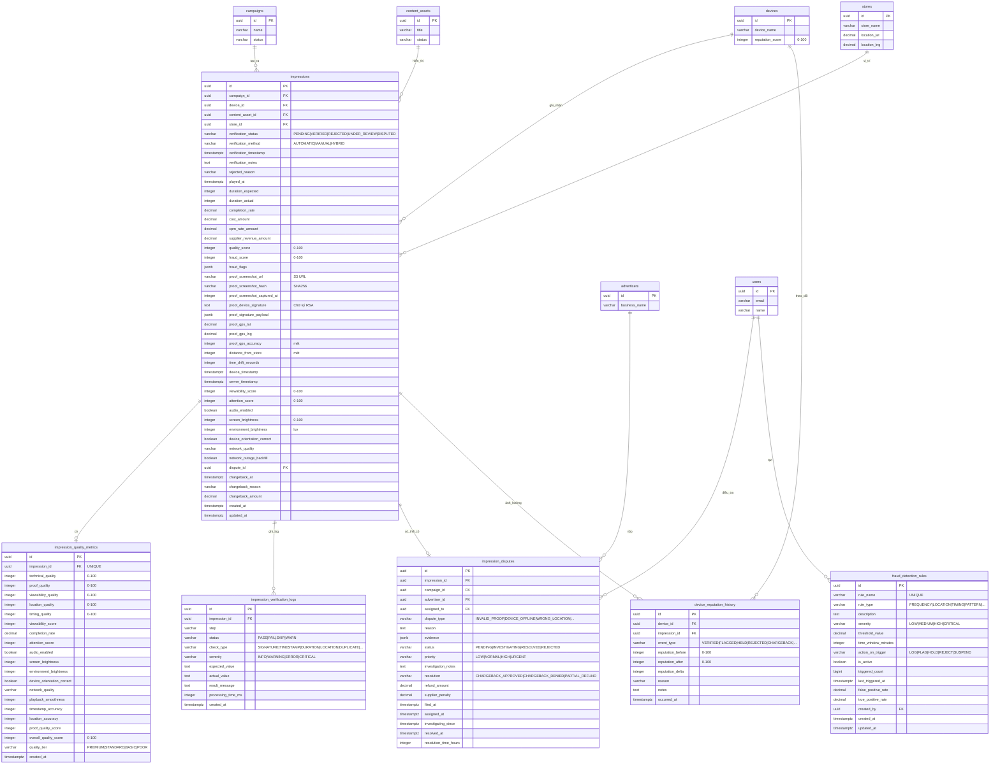

# Database ERD - Module Ghi nhận Impression

## Sơ đồ Quan hệ Thực thể



## Quan hệ giữa các Bảng

### Quan hệ Cốt lõi

1. **impressions → campaigns** (Nhiều-một)
   - Mỗi impression thuộc về một chiến dịch
   - Một chiến dịch tạo nhiều impression (hàng triệu)
   - Ràng buộc: `ON DELETE RESTRICT` (không thể xóa chiến dịch có impression)
   - **Khối lượng**: CAO - Quan hệ khối lượng cao chính

2. **impressions → devices** (Nhiều-một)
   - Mỗi impression được ghi nhận bởi một thiết bị
   - Một thiết bị ghi nhận nhiều impression
   - Ràng buộc: `ON DELETE RESTRICT` (bảo toàn lịch sử impression)
   - **Khối lượng**: CAO - Quan trọng cho theo dõi hiệu suất thiết bị

3. **impressions → content_assets** (Nhiều-một)
   - Mỗi impression hiển thị một tài sản nội dung
   - Một tài sản nội dung được hiển thị trong nhiều impression
   - Ràng buộc: `ON DELETE RESTRICT` (bảo toàn lịch sử impression)
   - **Khối lượng**: CAO - Quan trọng cho hiệu suất nội dung

4. **impressions → stores** (Nhiều-một)
   - Mỗi impression xảy ra tại một vị trí cửa hàng
   - Một cửa hàng tạo nhiều impression
   - Ràng buộc: `ON DELETE RESTRICT` (bảo toàn dữ liệu vị trí)
   - **Khối lượng**: CAO - Dùng để xác thực vị trí

5. **impressions → impression_quality_metrics** (Một-một)
   - Mỗi impression có chính xác một bản ghi số liệu chất lượng
   - Ràng buộc: `UNIQUE(impression_id)`
   - Cascade delete: Xóa impression sẽ xóa số liệu chất lượng
   - **Khối lượng**: CAO - Một bản ghi mỗi impression

6. **impressions → impression_verification_logs** (Một-nhiều)
   - Mỗi impression có nhiều mục log xác thực (~8 mỗi impression)
   - Cascade delete: Xóa impression sẽ xóa tất cả log
   - **Khối lượng**: RẤT CAO - Nhiều log mỗi impression

7. **impressions → impression_disputes** (Một-một Tùy chọn)
   - Mỗi impression có thể có một tranh chấp
   - Ràng buộc: `ON DELETE RESTRICT` (bảo toàn lịch sử tranh chấp)
   - **Khối lượng**: THẤP - Mục tiêu <1% impression

8. **impressions → device_reputation_history** (Một-nhiều Tùy chọn)
   - Một số impression kích hoạt thay đổi danh tiếng (~20%)
   - Ràng buộc: `ON DELETE SET NULL` (bảo toàn lịch sử ngay cả khi impression bị xóa)
   - **Khối lượng**: TRUNG BÌNH - Khoảng 20% impression

9. **devices → device_reputation_history** (Một-nhiều)
   - Mỗi thiết bị có lịch sử thay đổi danh tiếng đầy đủ
   - Cascade delete: Xóa thiết bị sẽ xóa lịch sử danh tiếng
   - **Khối lượng**: TRUNG BÌNH - Nhiều sự kiện mỗi thiết bị

10. **impression_disputes → advertisers** (Nhiều-một)
    - Mỗi tranh chấp được nộp bởi một nhà quảng cáo
    - Ràng buộc: `ON DELETE RESTRICT` (bảo toàn lịch sử tranh chấp)
    - **Khối lượng**: THẤP

11. **impression_disputes → users** (Nhiều-một Tùy chọn)
    - Tranh chấp có thể được gán cho admin để điều tra
    - Ràng buộc: `ON DELETE SET NULL` (bảo toàn tranh chấp ngay cả khi người dùng bị xóa)
    - **Khối lượng**: THẤP

12. **fraud_detection_rules → users** (Nhiều-một Tùy chọn)
    - Quy tắc được tạo bởi admin
    - Ràng buộc: `ON DELETE SET NULL` (bảo toàn quy tắc ngay cả khi người tạo bị xóa)
    - **Khối lượng**: RẤT THẤP - Hàng chục quy tắc

### Ràng buộc Khóa ngoại

| Table | Foreign Key | References | On Delete | Volume |
|-------|-------------|------------|-----------|--------|
| impressions | campaign_id | campaigns(id) | RESTRICT | HIGH |
| impressions | device_id | devices(id) | RESTRICT | HIGH |
| impressions | content_asset_id | content_assets(id) | RESTRICT | HIGH |
| impressions | store_id | stores(id) | RESTRICT | HIGH |
| impressions | dispute_id | impression_disputes(id) | SET NULL | LOW |
| impression_verification_logs | impression_id | impressions(id) | CASCADE | VERY HIGH |
| impression_quality_metrics | impression_id | impressions(id) | CASCADE | HIGH |
| impression_disputes | impression_id | impressions(id) | RESTRICT | LOW |
| impression_disputes | campaign_id | campaigns(id) | RESTRICT | LOW |
| impression_disputes | advertiser_id | advertisers(id) | RESTRICT | LOW |
| impression_disputes | assigned_to | users(id) | SET NULL | LOW |
| device_reputation_history | device_id | devices(id) | CASCADE | MEDIUM |
| device_reputation_history | impression_id | impressions(id) | SET NULL | MEDIUM |
| fraud_detection_rules | created_by | users(id) | SET NULL | VERY LOW |

## Chỉ mục

### impressions (KHỐI LƯỢNG CAO - Quan trọng cho hiệu suất)

**Chỉ mục B-tree Chuẩn:**
- `idx_impressions_campaign_id` - Truy vấn impression theo chiến dịch
- `idx_impressions_device_id` - Truy vấn impression theo thiết bị
- `idx_impressions_store_id` - Truy vấn impression theo cửa hàng
- `idx_impressions_content_asset_id` - Truy vấn impression theo nội dung
- `idx_impressions_verification_status` - Lọc theo trạng thái xác thực
- `idx_impressions_played_at` - Truy vấn chuỗi thời gian (DESC cho gần đây nhất)
- `idx_impressions_created_at` - Truy vấn audit và giám sát (DESC)

**Chỉ mục Kết hợp (tối ưu cho truy vấn phổ biến):**
- `idx_impressions_campaign_played_at` - Hiệu suất chiến dịch theo thời gian
- `idx_impressions_device_played_at` - Timeline hoạt động thiết bị
- `idx_impressions_status_played_at` - Báo cáo dựa trên trạng thái
- `idx_impressions_campaign_status` - Lọc trạng thái chiến dịch

**Chỉ mục Bộ phận (giảm kích thước chỉ mục, truy vấn nhanh hơn):**
- `idx_impressions_disputed` - Chỉ đánh chỉ mục dòng WHERE dispute_id IS NOT NULL
- `idx_impressions_under_review` - Chỉ đánh chỉ mục dòng WHERE verification_status = 'UNDER_REVIEW'
- `idx_impressions_high_fraud` - Chỉ đánh chỉ mục dòng WHERE fraud_score >= 50
- `idx_impressions_low_quality` - Chỉ đánh chỉ mục dòng WHERE quality_score < 50

**Chỉ mục GIN (cho truy vấn JSON):**
- `idx_impressions_fraud_flags` - Truy vấn mảng cờ gian lận

**Chỉ mục Khử trùng:**
- `idx_impressions_dedup` - Phát hiện trùng lặp (campaign_id, device_id, played_at)

### impression_verification_logs (KHỐI LƯỢNG RẤT CAO)

- `idx_verification_logs_impression_id` - Tra cứu log cho impression cụ thể
- `idx_verification_logs_created_at` - Truy vấn dựa trên thời gian (DESC)
- `idx_verification_logs_status` - Chỉ mục bộ phận cho trạng thái FAIL/WARN
- `idx_verification_logs_check_type` - Lọc theo loại kiểm tra xác thực

### impression_quality_metrics (KHỐI LƯỢNG CAO)

- `idx_quality_metrics_impression_id` - Tra cứu chất lượng cho impression cụ thể
- `idx_quality_metrics_quality_tier` - Lọc theo tier chất lượng
- `idx_quality_metrics_overall_score` - Sắp xếp/lọc theo điểm chất lượng

### impression_disputes (KHỐI LƯỢNG THẤP)

- `idx_disputes_impression_id` - Tra cứu tranh chấp cho impression
- `idx_disputes_campaign_id` - Phân tích tranh chấp chiến dịch
- `idx_disputes_advertiser_id` - Lịch sử tranh chấp nhà quảng cáo
- `idx_disputes_status` - Lọc theo trạng thái tranh chấp
- `idx_disputes_assigned_to` - Khối lượng công việc admin (chỉ mục bộ phận)
- `idx_disputes_filed_at` - Truy vấn dựa trên thời gian (DESC)
- `idx_disputes_pending` - Chỉ mục bộ phận cho tranh chấp đang chờ với độ ưu tiên
- `idx_disputes_unresolved` - Chỉ mục bộ phận cho tranh chấp đang hoạt động

### fraud_detection_rules (KHỐI LƯỢNG RẤT THẤP)

- `idx_fraud_rules_rule_type` - Lọc theo loại quy tắc
- `idx_fraud_rules_active` - Chỉ mục bộ phận chỉ cho quy tắc hoạt động
- `idx_fraud_rules_severity` - Lọc theo mức độ nghiêm trọng

### device_reputation_history (KHỐI LƯỢNG TRUNG BÌNH)

- `idx_reputation_history_device_id` - Timeline danh tiếng thiết bị (với occurred_at DESC)
- `idx_reputation_history_event_type` - Lọc theo loại sự kiện
- `idx_reputation_history_occurred_at` - Truy vấn dựa trên thời gian (DESC)

## Kiểu Dữ liệu

### Các Kiểu Dữ liệu Chính

- **uuid**: Khóa chính và khóa ngoại (định danh duy nhất 128-bit)
- **varchar(n)**: Chuỗi độ dài biến đổi với độ dài tối đa
- **text**: Văn bản độ dài không giới hạn
- **decimal(p,s)**: Số chính xác với precision và scale
- **bigint**: Giá trị số nguyên lớn (cho bộ đếm như triggered_count)
- **integer**: Giá trị số nguyên chuẩn
- **boolean**: Cờ true/false
- **timestamptz**: Timestamp có múi giờ (quan trọng cho theo dõi thời gian chính xác)
- **jsonb**: Binary JSON (lưu trữ và đánh chỉ mục hiệu quả cho fraud_flags, evidence, proof_signature_payload)

### Biểu diễn Tiền tệ

Tất cả giá trị tiền tệ sử dụng **DECIMAL(10, 4)**:
- 10 chữ số tổng
- 4 chữ số thập phân (độ chính xác dưới cent cho tính toán CPM)
- Phạm vi: -999,999.9999 đến 999,999.9999
- Đủ cho chi phí cấp impression

**Ví dụ Tỷ lệ CPM:**
- CPM: $5.50 mỗi 1000 impression
- Mỗi impression: $5.50 / 1000 = $0.0055
- Lưu trữ dưới dạng: 0.0055 (DECIMAL 10,4)

### Tọa độ GPS

- **proof_gps_lat**: `DECIMAL(10, 8)` - Phạm vi vĩ độ -90 đến 90, độ chính xác ~1mm
- **proof_gps_lng**: `DECIMAL(11, 8)` - Phạm vi kinh độ -180 đến 180, độ chính xác ~1mm

Ví dụ: Tọa độ Việt Nam
- Vĩ độ: 10.76262200 (Thành phố Hồ Chí Minh)
- Kinh độ: 106.66017200

### Trường JSONB

**fraud_flags** (Mảng chỉ báo gian lận):
```json
[
  {"type": "HIGH_FREQUENCY", "score": 30, "threshold": 14},
  {"type": "LOCATION_SUSPICIOUS", "distance_km": 2.5}
]
```

**proof_signature_payload** (Dữ liệu đã được ký):
```json
{
  "device_id": "uuid",
  "campaign_id": "uuid",
  "content_asset_id": "uuid",
  "played_at": "2026-01-23T14:30:00Z",
  "duration_actual": 28,
  "screenshot_hash": "sha256:abc123...",
  "location": {"lat": 10.762622, "lng": 106.660172}
}
```

**evidence** (Bằng chứng tranh chấp):
```json
[
  {
    "type": "screenshot_comparison",
    "url": "s3://bucket/evidence/comparison.jpg",
    "description": "Hiển thị nội dung khác với đã phê duyệt"
  },
  {
    "type": "description",
    "text": "Thiết bị offline vào thời điểm báo cáo theo quản lý cửa hàng"
  }
]
```

## Cardinality (Số lượng)

### Một-một (1:1)
- impressions ↔ impression_quality_metrics (một impression, một bản ghi chất lượng)

### Một-nhiều (1:N)
- campaigns → impressions (một chiến dịch, hàng triệu impression)
- devices → impressions (một thiết bị, hàng nghìn impression mỗi ngày)
- content_assets → impressions (một nội dung, nhiều impression)
- stores → impressions (một cửa hàng, nhiều impression)
- impressions → impression_verification_logs (một impression, ~8 mục log)
- devices → device_reputation_history (một thiết bị, nhiều sự kiện danh tiếng)
- advertisers → impression_disputes (một nhà quảng cáo, nhiều tranh chấp)
- users → impression_disputes (một admin, nhiều tranh chấp được gán)
- users → fraud_detection_rules (một admin, nhiều quy tắc được tạo)

### Một-một Tùy chọn (1:0..1)
- impressions ↔ impression_disputes (hầu hết impression không có tranh chấp)

### Nhiều-một Tùy chọn (N:0..1)
- impressions → impression_disputes (nhiều impression có thể tham chiếu cùng tranh chấp)
- device_reputation_history → impressions (không phải tất cả sự kiện danh tiếng liên kết với impression)

## Máy trạng thái Trạng thái Xác thực

```
PENDING → VERIFIED (thành công)
       → REJECTED (xác thực thất bại)
       → UNDER_REVIEW (đáng ngờ, cần xem xét thủ công)

UNDER_REVIEW → VERIFIED (admin phê duyệt)
             → REJECTED (admin từ chối)

VERIFIED → DISPUTED (nhà quảng cáo thách thức)

DISPUTED → VERIFIED (tranh chấp bị từ chối, duy trì impression)
        → REJECTED (tranh chấp được phê duyệt, chargeback được ban hành)
```

## Tier Chất lượng

| Tier | Phạm vi Điểm | Mô tả |
|------|-------------|-------------|
| PREMIUM | 90-100 | Chất lượng xuất sắc - khả năng hiển thị cao, bằng chứng đầy đủ, vị trí chính xác |
| STANDARD | 70-89 | Chất lượng tốt - chấp nhận được trên tất cả số liệu |
| BASIC | 50-69 | Chất lượng chấp nhận được - một số vấn đề chất lượng nhưng đã xác thực |
| POOR | 0-49 | Chất lượng đáng ngờ - được đánh dấu để xem xét |

## Ngưỡng Điểm Gian lận

| Phạm vi Điểm | Phân loại | Hành động |
|-------------|----------------|--------|
| 0-29 | Sạch | Không hành động, xử lý bình thường |
| 30-49 | Đáng ngờ | FLAG nhưng tiếp tục xử lý |
| 50-79 | Rất Đáng ngờ | HOLD để xem xét thủ công |
| 80-100 | Có khả năng Gian lận | REJECT hoặc SUSPEND thiết bị |

## Ước tính Kích thước Cơ sở dữ liệu (KHỐI LƯỢNG CAO)

### Giả định
- **Khối lượng Impression**: 1 triệu impression mỗi ngày
- **Log Xác thực**: 8 log mỗi impression
- **Số liệu Chất lượng**: 1 bản ghi mỗi impression
- **Tỷ lệ Tranh chấp**: 1% impression đã xác thực
- **Sự kiện Danh tiếng**: 20% impression kích hoạt thay đổi danh tiếng

### Dung lượng Mỗi Ngày

#### Bảng impressions
- Kích thước dòng: ~1.5 KB (bao gồm trường JSONB)
- Khối lượng hàng ngày: 1,000,000 impression
- **Dung lượng hàng ngày**: 1M × 1.5 KB = **1.5 GB**
- Chỉ mục (30% của bảng): 450 MB
- **Tổng mỗi ngày**: **1.95 GB**

#### impression_verification_logs
- Kích thước dòng: ~400 bytes
- Log mỗi impression: 8
- Khối lượng hàng ngày: 1,000,000 × 8 = 8,000,000 log
- **Dung lượng hàng ngày**: 8M × 400 bytes = **3.2 GB**
- Chỉ mục (20% của bảng): 640 MB
- **Tổng mỗi ngày**: **3.84 GB**

#### impression_quality_metrics
- Kích thước dòng: ~600 bytes
- Khối lượng hàng ngày: 1,000,000 bản ghi
- **Dung lượng hàng ngày**: 1M × 600 bytes = **600 MB**
- Chỉ mục (25% của bảng): 150 MB
- **Tổng mỗi ngày**: **750 MB**

#### impression_disputes
- Kích thước dòng: ~1 KB
- Khối lượng hàng ngày: 10,000 tranh chấp (1% impression)
- **Dung lượng hàng ngày**: 10K × 1 KB = **10 MB**
- Chỉ mục (30% của bảng): 3 MB
- **Tổng mỗi ngày**: **13 MB**

#### device_reputation_history
- Kích thước dòng: ~300 bytes
- Khối lượng hàng ngày: 200,000 sự kiện (20% impression)
- **Dung lượng hàng ngày**: 200K × 300 bytes = **60 MB**
- Chỉ mục (25% của bảng): 15 MB
- **Tổng mỗi ngày**: **75 MB**

### Tổng Dung lượng Hàng ngày
- **Dữ liệu thô mỗi ngày**: ~5.6 GB
- **Với chỉ mục**: ~6.6 GB
- **Hàng tháng (30 ngày)**: ~198 GB
- **Hàng năm (365 ngày)**: ~2.4 TB

### Dung lượng Dự kiến (1 năm)

| Table | Dòng/Năm | Kích thước/Năm | Với Chỉ mục | Ghi chú |
|-------|-----------|-----------|--------------|-------|
| impressions | 365M | 547 GB | 711 GB | Phân vùng theo tháng |
| impression_verification_logs | 2.9B | 1,168 GB | 1,402 GB | Lưu trữ sau 90 ngày |
| impression_quality_metrics | 365M | 219 GB | 274 GB | Giữ với impression |
| impression_disputes | 3.7M | 3.6 GB | 4.7 GB | Giữ để audit |
| device_reputation_history | 73M | 21.9 GB | 27.4 GB | Giữ vô thời hạn |
| fraud_detection_rules | ~100 | <1 MB | <1 MB | Khối lượng rất thấp |
| **TỔNG (chưa nén)** | **3.6B+** | **~1.96 TB** | **~2.42 TB** | Trước nén |

### Với Tối ưu hóa PostgreSQL

**Nén (TOAST):**
- Trường text: 60-70% nén
- Trường JSONB: 50-60% nén
- Nén tổng thể: ~40-50%
- **Dung lượng đã nén**: ~1.2-1.5 TB/năm

**Chiến lược Phân vùng:**
- Phân vùng impression theo tháng (12 phân vùng/năm)
- Lợi ích:
  - Truy vấn nhanh hơn (partition pruning)
  - Lưu trữ dễ dàng hơn (xóa phân vùng cũ)
  - Hiệu suất VACUUM tốt hơn
  - Chỉ mục nhỏ hơn mỗi phân vùng

**Chiến lược Lưu trữ:**
- Giữ dữ liệu hot: 3 tháng gần nhất (truy cập đầy đủ)
- Dữ liệu warm: 3-12 tháng (nén, truy cập chậm hơn)
- Dữ liệu cold: >12 tháng (lưu trữ vào S3, khôi phục theo yêu cầu)
- Lưu trữ log xác thực sau 90 ngày
- **Yêu cầu hot storage**: ~600 GB (3 tháng)

### Tốc độ Tăng trưởng Dung lượng

| Khoảng thời gian | Dữ liệu Thô | Với Chỉ mục | Đã Nén | Đã Lưu trữ |
|-----------|----------|--------------|------------|----------|
| 1 Ngày | 5.6 GB | 6.6 GB | 3.3 GB | - |
| 1 Tuần | 39.2 GB | 46.2 GB | 23.1 GB | - |
| 1 Tháng | 168 GB | 198 GB | 99 GB | - |
| 3 Tháng (Hot) | 504 GB | 594 GB | 297 GB | - |
| 6 Tháng | 1.01 TB | 1.19 TB | 595 GB | 297 GB đã lưu trữ |
| 1 Năm | 2.02 TB | 2.38 TB | 1.19 TB | 595 GB đã lưu trữ |

### Khuyến nghị Tối ưu hóa Hiệu suất

1. **Phân vùng Bảng** (Quan trọng cho KHỐI LƯỢNG CAO)
   - Phân vùng impression theo tháng sử dụng phân vùng RANGE
   - Tạo phân vùng tự động qua cron job
   - Truy vấn nhanh hơn qua partition pruning
   - Lưu trữ dễ dàng bằng cách xóa phân vùng cũ

2. **Tối ưu hóa Chỉ mục**
   - Sử dụng chỉ mục bộ phận cho điều kiện hiếm (tranh chấp, under_review)
   - Tạo chỉ mục covering cho truy vấn hot
   - Bảo trì chỉ mục thường xuyên (REINDEX)
   - Giám sát index bloat

3. **Tối ưu hóa Truy vấn**
   - Sử dụng materialized view cho số liệu dashboard
   - Làm mới materialized view theo giờ/ngày
   - Tránh full table scan trên impression
   - Sử dụng index-only scan khi có thể

4. **Chiến lược Lưu trữ**
   - Lưu trữ log xác thực sau 90 ngày
   - Chuyển impression cũ sang cold storage sau 12 tháng
   - Giữ số liệu tổng hợp vô thời hạn
   - Khôi phục dữ liệu đã lưu trữ theo yêu cầu

5. **Giám sát**
   - Theo dõi tăng trưởng kích thước bảng
   - Giám sát hiệu suất truy vấn
   - Cảnh báo truy vấn chậm (>500ms)
   - Theo dõi sử dụng chỉ mục (chỉ mục không dùng lãng phí không gian)

6. **Khuyến nghị Phần cứng**
   - Lưu trữ SSD (ưu tiên NVMe)
   - 32-64 GB RAM (cho working set)
   - Connection pooling (PgBouncer)
   - Read replica cho phân tích
   - Cân nhắc TimescaleDB để tối ưu hóa chuỗi thời gian

### Mục tiêu Hiệu suất Truy vấn

| Hoạt động | Độ trễ Mục tiêu | Ghi chú |
|-----------|----------------|-------|
| Insert impression | <50ms | Bao gồm trigger |
| Xác thực impression | <500ms | Tất cả kiểm tra xác thực |
| Truy vấn impression (1 ngày) | <200ms | Sử dụng partition pruning |
| Truy vấn impression (1 tháng) | <1s | Truy vấn tổng hợp |
| Số liệu dashboard | <100ms | Sử dụng materialized view |
| Tra cứu tranh chấp | <50ms | Khối lượng thấp, tra cứu nhanh |
| Số liệu thiết bị | <500ms | Tổng hợp dữ liệu lịch sử |

## Ghi chú Hiệu suất View

Tất cả view được thiết kế cho truy vấn phân tích và nên là:
- Làm mới định kỳ (không thời gian thực)
- Được hỗ trợ bởi chỉ mục phù hợp
- Materialized cho truy vấn dashboard
- Giới hạn dữ liệu gần đây (30-90 ngày gần nhất) để hiệu suất

Cho số liệu thời gian thực, truy vấn bảng cơ sở với mệnh đề WHERE phù hợp và chỉ mục.

---

## Module Liên quan

Module Ghi nhận Impression này tích hợp với:

1. **Campaign Module** - Trạng thái chiến dịch, theo dõi ngân sách, tỷ lệ CPM
2. **Device Module** - Trạng thái thiết bị, heartbeat, chấm điểm danh tiếng
3. **Content Module** - Tài sản nội dung, perceptual hashing để xác thực
4. **Store Module** - Vị trí cửa hàng, giờ hoạt động để xác thực
5. **Supplier Module** - Tính toán doanh thu, xử lý chargeback
6. **Advertiser Module** - Thanh toán, nộp tranh chấp
7. **User Module** - Gán admin để xem xét thủ công và tranh chấp

---

*Cập nhật lần cuối: 2026-01-23*
*Phiên bản Schema Cơ sở dữ liệu: 1.0*
*Tối ưu cho: 1M+ impression/ngày*
