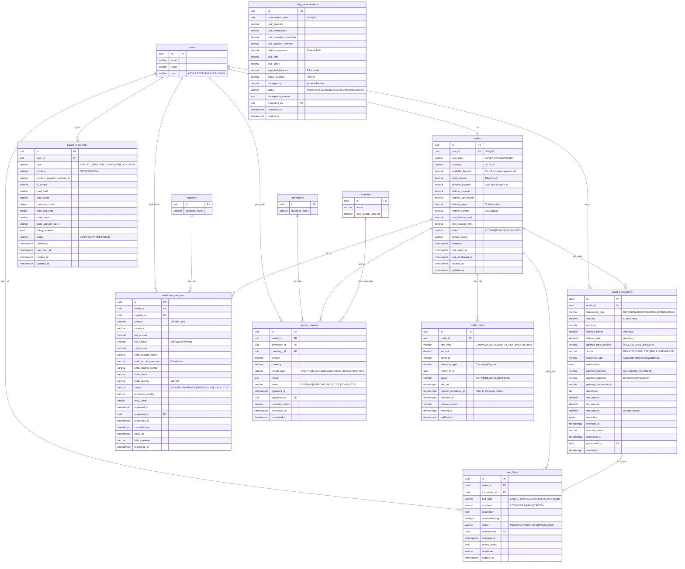

# Database ERD - Module Ví & Thanh toán

## Sơ đồ Quan hệ Thực thể



## Quan hệ giữa các Bảng

### Quan hệ Cốt lõi

1. **users → wallets** (Một-một)
   - Mỗi người dùng có chính xác một ví
   - Ràng buộc: `UNIQUE(user_id)` trên wallets
   - Một ví mỗi nhà quảng cáo hoặc nhà cung cấp
   - Ràng buộc: `ON DELETE RESTRICT` (không thể xóa người dùng có số dư ví)

2. **wallets → wallet_transactions** (Một-nhiều)
   - Mỗi ví có nhiều giao dịch
   - Tất cả thay đổi số dư được ghi nhận như giao dịch bất biến
   - Cascade delete: Không (giao dịch là bản ghi vĩnh viễn)

3. **wallets → wallet_holds** (Một-nhiều)
   - Mỗi ví có thể có nhiều hold hoạt động
   - Theo dõi tiền ký quỹ (ngân sách chiến dịch, tranh chấp, v.v.)
   - Dùng để xác thực độ chính xác held_balance

4. **wallets → withdrawal_requests** (Một-nhiều)
   - Ví nhà cung cấp có yêu cầu rút tiền
   - Mỗi lần rút khóa tiền trong pending_balance
   - Cascade delete: Không (lịch sử rút tiền được bảo toàn)

5. **wallets → refund_requests** (Một-nhiều)
   - Ví nhà quảng cáo có yêu cầu hoàn tiền
   - Hoàn tiền ghi có vào available_balance
   - Cascade delete: Không (lịch sử hoàn tiền được bảo toàn)

6. **wallets → aml_flags** (Một-nhiều)
   - Ví được giám sát hoạt động đáng ngờ
   - Cờ AML yêu cầu xem xét tuân thủ
   - Cascade delete: Không (bản ghi tuân thủ được bảo toàn)

7. **users → payment_methods** (Một-nhiều)
   - Người dùng có thể lưu nhiều phương thức thanh toán
   - Một phương thức thanh toán mặc định mỗi người dùng (được thực thi bởi trigger)
   - Cascade delete: Có (phương thức thanh toán thuộc về người dùng)

8. **wallet_transactions → aml_flags** (Một-nhiều)
   - Giao dịch có thể kích hoạt cờ AML
   - Giao dịch lớn hoặc đáng ngờ được đánh dấu tự động
   - Quan hệ tùy chọn (không phải tất cả giao dịch được đánh dấu)

### Ràng buộc Khóa ngoại

| Table | Foreign Key | References | On Delete |
|-------|-------------|------------|-----------|
| wallets | user_id | users(id) | RESTRICT |
| wallet_transactions | wallet_id | wallets(id) | RESTRICT |
| wallet_transactions | processed_by | users(id) | SET NULL |
| payment_methods | user_id | users(id) | CASCADE |
| withdrawal_requests | wallet_id | wallets(id) | RESTRICT |
| withdrawal_requests | supplier_id | suppliers(id) | RESTRICT |
| withdrawal_requests | approved_by | users(id) | SET NULL |
| refund_requests | wallet_id | wallets(id) | RESTRICT |
| refund_requests | advertiser_id | advertisers(id) | RESTRICT |
| refund_requests | campaign_id | campaigns(id) | SET NULL |
| refund_requests | approved_by | users(id) | SET NULL |
| wallet_holds | wallet_id | wallets(id) | RESTRICT |
| aml_flags | wallet_id | wallets(id) | RESTRICT |
| aml_flags | transaction_id | wallet_transactions(id) | SET NULL |
| aml_flags | reviewed_by | users(id) | SET NULL |
| daily_reconciliations | reconciled_by | users(id) | SET NULL |

## Chỉ mục

### wallets
- `idx_wallets_user_id` - Tối ưu hóa join với users
- `idx_wallets_user_type` - Lọc theo advertiser/supplier
- `idx_wallets_status` - Tìm ví bị đóng băng/tạm ngưng
- `idx_wallets_currency` - Truy vấn đa tiền tệ
- `idx_wallets_created_at` - Sắp xếp theo ngày tạo

### wallet_transactions
- `idx_wallet_transactions_wallet_id` - Tối ưu hóa join
- `idx_wallet_transactions_type` - Lọc theo loại giao dịch
- `idx_wallet_transactions_status` - Tìm giao dịch đang chờ/thất bại
- `idx_wallet_transactions_processed_at` - Truy vấn chuỗi thời gian
- `idx_wallet_transactions_reference` - Tra cứu theo campaign/impression
- `idx_wallet_transactions_wallet_date` - Kết hợp cho lịch sử giao dịch
- `idx_wallet_transactions_gateway` - Đối soát gateway

### payment_methods
- `idx_payment_methods_user_id` - Phương thức thanh toán của người dùng
- `idx_payment_methods_status` - Chỉ phương thức hoạt động
- `idx_payment_methods_default` - Chỉ mục bộ phận cho phương thức mặc định
- `idx_payment_methods_provider` - Truy vấn tích hợp gateway

### withdrawal_requests
- `idx_withdrawal_requests_wallet_id` - Lịch sử rút tiền ví
- `idx_withdrawal_requests_supplier_id` - Lịch sử thanh toán nhà cung cấp
- `idx_withdrawal_requests_status` - Lọc theo trạng thái
- `idx_withdrawal_requests_requested_at` - Sắp xếp theo ngày yêu cầu
- `idx_withdrawal_requests_pending` - Chỉ mục bộ phận cho hàng đợi admin

### refund_requests
- `idx_refund_requests_wallet_id` - Lịch sử hoàn tiền ví
- `idx_refund_requests_advertiser_id` - Lịch sử hoàn tiền nhà quảng cáo
- `idx_refund_requests_campaign_id` - Hoàn tiền liên quan chiến dịch
- `idx_refund_requests_status` - Lọc theo trạng thái
- `idx_refund_requests_requested_at` - Sắp xếp theo ngày yêu cầu
- `idx_refund_requests_pending` - Chỉ mục bộ phận cho hàng đợi admin

### wallet_holds
- `idx_wallet_holds_wallet_id` - Lịch sử hold ví
- `idx_wallet_holds_status` - Chỉ hold hoạt động
- `idx_wallet_holds_reference` - Tra cứu theo campaign/dispute
- `idx_wallet_holds_release_scheduled` - Tác vụ tự động giải phóng
- `idx_wallet_holds_active` - Kết hợp cho hold hoạt động

### aml_flags
- `idx_aml_flags_wallet_id` - Lịch sử tuân thủ ví
- `idx_aml_flags_transaction_id` - Xem xét giao dịch
- `idx_aml_flags_status` - Hàng đợi xem xét đang chờ
- `idx_aml_flags_risk_level` - Sắp xếp ưu tiên
- `idx_aml_flags_pending` - Kết hợp cho hàng đợi xem xét
- `idx_aml_flags_flagged_at` - Truy vấn dựa trên thời gian

### daily_reconciliations
- `idx_daily_reconciliations_date` - Sắp xếp theo ngày
- `idx_daily_reconciliations_status` - Lọc theo trạng thái
- `idx_daily_reconciliations_discrepancy` - Chỉ mục bộ phận cho vấn đề

## Kiểu Dữ liệu

### Các Kiểu Dữ liệu Chính

- **uuid**: Khóa chính và khóa ngoại (định danh duy nhất 128-bit)
- **varchar(n)**: Chuỗi độ dài biến đổi với độ dài tối đa
- **text**: Văn bản độ dài không giới hạn cho mô tả
- **decimal(p,s)**: Số chính xác với precision và scale
- **integer**: Giá trị số nguyên chuẩn (số lần thử lại, tháng, năm)
- **boolean**: Cờ true/false
- **timestamptz**: Timestamp có múi giờ (tất cả timestamp sử dụng kiểu này)
- **date**: Chỉ ngày (không có thành phần thời gian) cho đối soát
- **jsonb**: Binary JSON cho metadata và schema linh hoạt

### Biểu diễn Tiền tệ

Tất cả giá trị tiền tệ sử dụng **DECIMAL(12, 2)**:
- 12 chữ số tổng
- 2 chữ số thập phân
- Phạm vi: -9,999,999,999.99 đến 9,999,999,999.99
- Đủ cho số dư lên đến $10 tỷ
- Số học chính xác (không có lỗi dấu phẩy động)

### Trường JSON

**wallet_transactions.metadata**:
```json
{
  "original_amount": 100.00,
  "original_currency": "EUR",
  "exchange_rate": 1.08,
  "payment_intent_id": "pi_xxx",
  "customer_ip": "192.168.1.1"
}
```

**payment_methods.billing_address**:
```json
{
  "line1": "123 Main St",
  "line2": "Apt 4B",
  "city": "San Francisco",
  "state": "CA",
  "postal_code": "94102",
  "country": "US"
}
```

## Loại Giao dịch

### Giao dịch Ghi có (Tăng Số dư)
- **DEPOSIT**: Người dùng nạp tiền qua payment gateway
- **REFUND**: Ngân sách chiến dịch được hoàn lại cho nhà quảng cáo
- **REVENUE**: Thu nhập nhà cung cấp từ impression
- **ADJUSTMENT_CREDIT**: Hiệu chỉnh thủ công bởi admin
- **BONUS**: Khuyến khích hoặc khuyến mãi nền tảng

### Giao dịch Ghi nợ (Giảm Số dư)
- **CAMPAIGN_HOLD**: Ngân sách ký quỹ cho chiến dịch
- **CAMPAIGN_CHARGE**: Chi phí impression được tính
- **WITHDRAWAL**: Thanh toán nhà cung cấp ra ngân hàng
- **FEE**: Phí nền tảng hoặc giao dịch
- **TAX_WITHHOLDING**: Khấu trừ thuế
- **ADJUSTMENT_DEBIT**: Hiệu chỉnh thủ công bởi admin
- **CHARGEBACK**: Impression bị tranh chấp đảo ngược

### Hold/Release (Chuyển Loại Số dư)
- **HOLD**: Chuyển available → held
- **RELEASE**: Chuyển held → available

### Pending (Đang xử lý)
- **PENDING_DEPOSIT**: Nạp tiền đang xử lý
- **PENDING_WITHDRAWAL**: Rút tiền đang xử lý

## Chuyển đổi Trạng thái Số dư

### Quy trình Nạp tiền Nhà quảng cáo
```
1. Người dùng bắt đầu nạp tiền: $500
   available: $100 → $100
   pending: $0 → $500
   Giao dịch: PENDING_DEPOSIT

2. Thanh toán thành công (1-3 ngày)
   available: $100 → $600
   pending: $500 → $0
   Giao dịch: DEPOSIT
```

### Quy trình Ngân sách Chiến dịch
```
1. Chiến dịch được tạo: Ngân sách $500
   available: $600 → $100
   held: $0 → $500
   Giao dịch: CAMPAIGN_HOLD

2. Impression phục vụ: $300 đã chi
   held: $500 → $200
   Giao dịch: CAMPAIGN_CHARGE × N

3. Chiến dịch hoàn thành: $200 chưa dùng
   held: $200 → $0
   available: $100 → $300
   Giao dịch: RELEASE
```

### Quy trình Doanh thu Nhà cung cấp
```
1. Impression đã xác thực: $0.08 kiếm được
   held: $0 → $0.08
   Giao dịch: REVENUE
   Bản ghi Hold được tạo (giữ 7 ngày)

2. Sau 7 ngày (không tranh chấp)
   held: $0.08 → $0
   available: $0 → $0.08
   Giao dịch: RELEASE
   Bản ghi Hold: ACTIVE → RELEASED
```

### Quy trình Rút tiền Nhà cung cấp
```
1. Yêu cầu rút tiền: $1,000
   available: $1,000 → $0
   pending: $0 → $1,000
   Giao dịch: PENDING_WITHDRAWAL

2. Chuyển khoản đã gửi (3-5 ngày)
   pending: $1,000 → $0
   Giao dịch: WITHDRAWAL ($1,000)
   Giao dịch: FEE ($10)
   Giao dịch: TAX_WITHHOLDING ($240)
   Chuyển khoản ngân hàng ròng: $750
```

## Cardinality (Số lượng)

### Một-một (1:1)
- users ↔ wallets (một ví mỗi người dùng)

### Một-nhiều (1:N)
- wallets → wallet_transactions (một ví, nhiều giao dịch)
- wallets → wallet_holds (một ví, nhiều hold)
- wallets → withdrawal_requests (một ví, nhiều lần rút tiền)
- wallets → refund_requests (một ví, nhiều hoàn tiền)
- wallets → aml_flags (một ví, nhiều cờ)
- users → payment_methods (một người dùng, nhiều phương thức thanh toán)
- wallet_transactions → aml_flags (một giao dịch, nhiều cờ có thể)

### Nhiều-một (N:1)
- Tất cả quan hệ khóa ngoại theo mẫu này

## Quy tắc Nghiệp vụ Được thực thi bởi Schema

### Tính toàn vẹn Số dư
1. **Số dư không âm** - Ràng buộc CHECK trên tất cả cột số dư
2. **Độ chính xác tổng số dư** - `available_balance + held_balance + pending_balance`
3. **Giới hạn số dư tối đa** - Ràng buộc CHECK xác thực giới hạn không vượt quá
4. **Số tiền giao dịch ròng** - `net_amount = amount - fee_amount - tax_amount`

### Ràng buộc Trạng thái
1. **Ví bị đóng băng** - Phải có frozen_reason và frozen_at
2. **Rút tiền được phê duyệt** - Phải có approved_at và approved_by
3. **Rút tiền thất bại** - Phải có failed_at và failure_reason
4. **Hold được giải phóng** - Phải có released_at và release_reason
5. **Đối soát được giải quyết** - Phải có reconciled_by, reconciled_at, và reason

### Quy tắc Phương thức Thanh toán
1. **Chi tiết thẻ** - Bắt buộc cho loại CREDIT_CARD và DEBIT_CARD
2. **Chi tiết ngân hàng** - Bắt buộc cho loại BANK_ACCOUNT
3. **Một mặc định** - Trigger đảm bảo chỉ một mặc định mỗi người dùng
4. **Hết hạn thẻ** - Ràng buộc CHECK xác thực hết hạn tương lai

### Xác thực Giao dịch
1. **Số tiền dương** - Ràng buộc CHECK (amount >= 0)
2. **Rút tiền tối thiểu** - Ràng buộc CHECK (amount >= 50.00)
3. **Ảnh chụp số dư** - Bản ghi bất biến của trạng thái trước/sau

## Ước tính Kích thước Cơ sở dữ liệu

### Mỗi Ví
- Bảng wallets: ~500 bytes mỗi dòng
- payment_methods: ~300 bytes mỗi phương thức (trung bình 2 mỗi người dùng = 600 bytes)
- **Tổng phụ**: ~1.1 KB mỗi người dùng

### Mỗi Giao dịch
- wallet_transactions: ~400 bytes mỗi giao dịch
- Với chỉ mục: ~600 bytes mỗi giao dịch

### Mỗi Ngày (10,000 ví hoạt động)

#### Hoạt động Nhà quảng cáo
- Nạp tiền: 500 giao dịch/ngày × 600 bytes = 300 KB
- Hold chiến dịch: 200 giao dịch/ngày × 600 bytes = 120 KB
- Tính phí chiến dịch: 50,000 giao dịch/ngày × 600 bytes = 30 MB

#### Hoạt động Nhà cung cấp
- Tích lũy doanh thu: 50,000 giao dịch/ngày × 600 bytes = 30 MB
- Giải phóng doanh thu: 10,000 giao dịch/ngày × 600 bytes = 6 MB
- Rút tiền: 100 giao dịch/ngày × 600 bytes = 60 KB

#### Tuân thủ
- Cờ AML: 50 cờ/ngày × 400 bytes = 20 KB
- Đối soát hàng ngày: 1 bản ghi/ngày × 500 bytes = 500 bytes

**Tổng Hàng ngày**: ~66 MB/ngày

### Dung lượng Dự kiến (1 năm, 10,000 ví hoạt động)

#### Dữ liệu Cốt lõi
- Ví: 10,000 × 1.1 KB = **11 MB**
- Phương thức thanh toán: 10,000 × 2 × 300 bytes = **6 MB**

#### Giao dịch (365 ngày)
- wallet_transactions: 365 × 66 MB = **24 GB**

#### Hold & Yêu cầu
- wallet_holds: 200/ngày × 365 × 400 bytes = **29 MB**
- withdrawal_requests: 100/ngày × 365 × 500 bytes = **18 MB**
- refund_requests: 50/ngày × 365 × 400 bytes = **7 MB**

#### Tuân thủ & Đối soát
- aml_flags: 50/ngày × 365 × 400 bytes = **7 MB**
- daily_reconciliations: 365 × 500 bytes = **183 KB**

**Tổng (1 năm)**: ~**24.1 GB** (chưa nén)

### Tối ưu hóa Dung lượng

1. **Phân vùng**: Phân vùng wallet_transactions theo tháng
   - Tháng hiện tại: Hot storage (SSD)
   - 1-12 tháng: Warm storage
   - 12+ tháng: Cold storage (lưu trữ)

2. **Đánh chỉ mục**: Chỉ mục bộ phận giảm dung lượng
   - Chỉ đánh chỉ mục hold hoạt động
   - Chỉ đánh chỉ mục giao dịch đang chờ
   - Chỉ đánh chỉ mục giao dịch gần đây (< 90 ngày)

3. **Nén**: Nén TOAST của PostgreSQL
   - Cột TEXT và JSONB được nén tự động
   - Dự kiến nén 50-70% trên mô tả giao dịch

4. **Chiến lược Lưu trữ**:
   - Lưu trữ giao dịch > 2 năm sang bảng riêng
   - Giữ số liệu tổng hợp trong bảng tóm tắt
   - Giảm dự kiến: 60-70% sau lưu trữ

**Dung lượng Tối ưu (1 năm)**: ~**10 GB** với nén và tối ưu hóa

## Quy trình Đối soát

### Công thức Đối soát Hàng ngày

```
expected_balance = (
  previous_day_balance +
  SUM(DEPOSIT) -
  SUM(WITHDRAWAL) +
  SUM(REVENUE) -
  SUM(CAMPAIGN_CHARGE) -
  SUM(FEE) -
  SUM(TAX_WITHHOLDING) +
  SUM(REFUND) +
  SUM(ADJUSTMENT_CREDIT) -
  SUM(ADJUSTMENT_DEBIT)
)

actual_balance = SUM(
  available_balance + held_balance + pending_balance
  FOR ALL wallets
)

discrepancy = expected_balance - actual_balance

status = CASE
  WHEN ABS(discrepancy) <= 0.01 THEN 'BALANCED'
  ELSE 'DISCREPANCY'
END
```

### Mức độ Nghiêm trọng Chênh lệch

| Chênh lệch | Mức độ Nghiêm trọng | Hành động |
|-------------|----------|--------|
| ≤ $0.01 | Chấp nhận được | Tự động phê duyệt (làm tròn) |
| $0.01 - $10 | Nhỏ | Điều tra trong 24h |
| $10 - $100 | Trung bình | Điều tra trong 4h |
| > $100 | Nghiêm trọng | Điều tra ngay + đóng băng |

## Quy tắc Giám sát AML

### Cờ Tự động

1. **Giao dịch Lớn**: Nạp tiền đơn lẻ ≥ $10,000
2. **Structuring**: Nhiều lần nạp tiền tổng ≥ $10,000 trong 24h, mỗi lần < $5,000
3. **Rapid In-Out**: Nạp tiền > $5,000 + rút tiền trong vòng 24h
4. **Unusual Pattern**: Kích thước giao dịch gấp 10× thông thường
5. **High-Risk Jurisdiction**: Người dùng từ quốc gia trong danh sách đen FATF

### Mức độ Rủi ro

- **LOW**: Xem xét trong 7 ngày
- **MEDIUM**: Xem xét trong 48 giờ
- **HIGH**: Xem xét trong 24 giờ
- **CRITICAL**: Xem xét ngay + đóng băng tài khoản

### Tier Xác thực KYC

| Tier | Xác thực | Giới hạn Hàng ngày | Yêu cầu |
|------|--------------|-------------|--------------|
| Tier 1 | Chỉ email | $500 | Email đã xác thực |
| Tier 2 | ID đã xác thực | $10,000 | ID chính phủ + Selfie |
| Tier 3 | Doanh nghiệp đã xác thực | Tùy chỉnh | Đăng ký doanh nghiệp + Tax ID |

## Xử lý Thuế

### Thuế Bán hàng Nhà quảng cáo
```
campaign_budget = $1,000
tax_rate = 8.25% (California)
tax_amount = $1,000 × 0.0825 = $82.50
total_charge = $1,082.50

Giao dịch: DEPOSIT $1,082.50
Giao dịch: TAX_WITHHOLDING $82.50
Available cho chiến dịch: $1,000
```

### Thuế Khấu trừ Nhà cung cấp
```
Nhà cung cấp US không có W-9: 24% backup withholding
withdrawal_amount = $1,000
withholding = $1,000 × 0.24 = $240
net_payout = $750

Giao dịch: WITHDRAWAL $1,000
Giao dịch: TAX_WITHHOLDING $240
Ngân hàng nhận: $750
```

## Lịch Phí Rút tiền

| Số tiền Rút tiền | Phí |
|-------------------|-----|
| < $500 | $5 |
| $500 - $4,999.99 | $10 |
| ≥ $5,000 | $25 |

Được tính bởi hàm: `calculate_withdrawal_fee(amount)`

## Hỗ trợ Tiền tệ

### Tiền tệ Được hỗ trợ
- USD (United States Dollar) - Mặc định
- EUR (Euro)
- GBP (British Pound)
- VND (Vietnamese Dong)

### Xử lý Đa Tiền tệ
- Mỗi ví có tiền tệ đơn lẻ (không có ví đa tiền tệ)
- Chuyển đổi được thực hiện tại thời điểm giao dịch
- Tỷ giá hối đoái được cache trong 1 giờ
- Tỷ giá chuyển đổi được lưu trong metadata giao dịch

---

*Cập nhật lần cuối: 2026-01-23*
