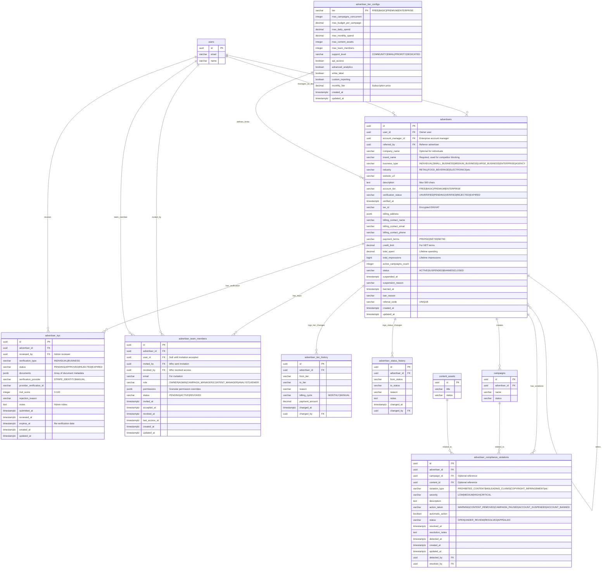

# Database ERD - Advertiser Management Module

## Entity Relationship Diagram



## Table Relationships

### Core Relationships

1. **advertisers → users** (Many-to-One)
   - Each advertiser is owned by one user (user_id)
   - One user can own multiple advertiser accounts
   - Constraint: `ON DELETE RESTRICT` (cannot delete user who owns advertiser)

2. **advertisers → users (account_manager)** (Many-to-One, Optional)
   - Enterprise tier advertisers have dedicated account managers
   - Constraint: `ON DELETE SET NULL`

3. **advertisers → advertisers (referral)** (Many-to-One, Optional)
   - Advertisers can refer other advertisers via referral code
   - Self-referencing relationship
   - Constraint: `ON DELETE SET NULL`

4. **advertisers → advertiser_kyc** (One-to-Many)
   - Each advertiser can have multiple KYC verification attempts
   - Most recent APPROVED record is the active verification
   - Constraint: `ON DELETE CASCADE` (remove KYC records with advertiser)

5. **advertisers → advertiser_team_members** (One-to-Many)
   - Each advertiser has team members with various roles
   - One OWNER (required), multiple other roles allowed
   - Constraint: `ON DELETE CASCADE` (remove team access with advertiser)

6. **users → advertiser_team_members** (One-to-Many)
   - One user can be team member of multiple advertisers
   - user_id is NULL for pending invitations
   - Constraint: `ON DELETE SET NULL`

7. **advertisers → advertiser_tier_configs** (Many-to-One)
   - Each advertiser belongs to one tier
   - Tier defines all limits and features
   - No foreign key (tier is enum)

8. **advertisers → advertiser_tier_history** (One-to-Many)
   - Complete audit trail of tier changes
   - Tracks upgrades, downgrades, billing info
   - Constraint: `ON DELETE CASCADE`

9. **advertisers → advertiser_status_history** (One-to-Many)
   - Complete audit trail of status changes
   - Tracks suspensions, bans, reactivations
   - Constraint: `ON DELETE CASCADE`

10. **advertisers → advertiser_compliance_violations** (One-to-Many)
    - Tracks all compliance and policy violations
    - Can reference specific campaign or content
    - Constraint: `ON DELETE CASCADE`

11. **campaigns → advertiser_compliance_violations** (One-to-Many, Optional)
    - Violations can be tied to specific campaigns
    - Constraint: `ON DELETE SET NULL`

12. **content_assets → advertiser_compliance_violations** (One-to-Many, Optional)
    - Violations can be tied to specific content
    - Constraint: `ON DELETE SET NULL`

### Foreign Key Constraints

| Table | Foreign Key | References | On Delete |
|-------|-------------|------------|-----------|
| advertisers | user_id | users(id) | RESTRICT |
| advertisers | account_manager_id | users(id) | SET NULL |
| advertisers | referred_by | advertisers(id) | SET NULL |
| advertiser_kyc | advertiser_id | advertisers(id) | CASCADE |
| advertiser_kyc | reviewed_by | users(id) | SET NULL |
| advertiser_team_members | advertiser_id | advertisers(id) | CASCADE |
| advertiser_team_members | user_id | users(id) | SET NULL |
| advertiser_team_members | invited_by | users(id) | SET NULL |
| advertiser_team_members | revoked_by | users(id) | SET NULL |
| advertiser_tier_history | advertiser_id | advertisers(id) | CASCADE |
| advertiser_tier_history | changed_by | users(id) | SET NULL |
| advertiser_status_history | advertiser_id | advertisers(id) | CASCADE |
| advertiser_status_history | changed_by | users(id) | SET NULL |
| advertiser_compliance_violations | advertiser_id | advertisers(id) | CASCADE |
| advertiser_compliance_violations | campaign_id | campaigns(id) | SET NULL |
| advertiser_compliance_violations | content_id | content_assets(id) | SET NULL |
| advertiser_compliance_violations | detected_by | users(id) | SET NULL |
| advertiser_compliance_violations | resolved_by | users(id) | SET NULL |

## Indexes

### advertisers
- `idx_advertisers_user_id` - Query by owner user
- `idx_advertisers_status` - Filter by account status
- `idx_advertisers_account_tier` - Filter by tier
- `idx_advertisers_verification_status` - Filter by KYC status
- `idx_advertisers_industry` - Filter by industry
- `idx_advertisers_referral_code` - Lookup by referral code (UNIQUE)
- `idx_advertisers_referred_by` - Find referrals by advertiser
- `idx_advertisers_created_at` - Sort by registration date
- `idx_advertisers_status_tier` - Composite for status + tier queries
- `idx_advertisers_manager` - Partial index for account managers (Enterprise)

### advertiser_kyc
- `idx_advertiser_kyc_advertiser_id` - Join optimization
- `idx_advertiser_kyc_status` - Filter by verification status
- `idx_advertiser_kyc_submitted_at` - Sort by submission date
- `idx_advertiser_kyc_expires_at` - Find expiring verifications (partial)
- `idx_advertiser_kyc_provider` - Lookup by external provider
- `idx_advertiser_kyc_pending` - Partial index for pending reviews (SLA monitoring)

### advertiser_team_members
- `idx_team_members_advertiser_id` - Join optimization
- `idx_team_members_user_id` - Reverse lookup (user's teams)
- `idx_team_members_status` - Filter by invitation status
- `idx_team_members_role` - Filter by role
- `idx_team_members_advertiser_status` - Composite for team queries
- `idx_team_members_email` - Partial index for pending invitations
- `idx_team_members_last_access` - Partial index for active member tracking

### advertiser_tier_configs
- `idx_tier_configs_monthly_fee` - Sort by pricing

### advertiser_tier_history
- `idx_tier_history_advertiser_id` - Audit trail queries
- `idx_tier_history_changed_at` - Time-based queries
- `idx_tier_history_to_tier` - Filter by target tier

### advertiser_status_history
- `idx_status_history_advertiser_id` - Audit trail queries
- `idx_status_history_changed_at` - Time-based queries
- `idx_status_history_to_status` - Filter by target status
- `idx_status_history_advertiser_date` - Composite for timeline

### advertiser_compliance_violations
- `idx_violations_advertiser_id` - Violation history queries
- `idx_violations_campaign_id` - Campaign-specific violations
- `idx_violations_status` - Filter by resolution status
- `idx_violations_severity` - Filter by severity level
- `idx_violations_type` - Filter by violation type
- `idx_violations_detected_at` - Time-based queries
- `idx_violations_open` - Partial index for unresolved violations

## Data Types

### Key Data Types Used

- **uuid**: Primary keys and foreign keys (128-bit universally unique identifier)
- **varchar(n)**: Variable-length strings with maximum length
- **text**: Unlimited length text
- **decimal(p,s)**: Exact numeric with precision and scale
- **bigint**: Large integer values (for counters like impressions)
- **integer**: Standard integer values
- **boolean**: True/false flags
- **timestamptz**: Timestamp with timezone
- **jsonb**: Binary JSON (efficient storage and indexing)

### Money Representation

All monetary values use **DECIMAL(12, 2)** or **DECIMAL(10, 2)**:
- Campaign/spending budgets: DECIMAL(12, 2)
  - Range: -9,999,999,999.99 to 9,999,999,999.99
  - Sufficient for large enterprise budgets
- Monthly fees: DECIMAL(10, 2)
  - Range: -99,999,999.99 to 99,999,999.99
  - Sufficient for subscription pricing

### JSONB Type

Used for flexible schemas:

**billing_address**:
```json
{
  "street": "123 Main St",
  "street2": "Suite 100",
  "city": "San Francisco",
  "state": "CA",
  "postal_code": "94102",
  "country": "US"
}
```

**documents** (in advertiser_kyc):
```json
[
  {
    "type": "BUSINESS_REGISTRATION",
    "file_id": "uuid",
    "file_name": "business_cert.pdf",
    "issue_date": "2020-01-15",
    "expiry_date": null,
    "verified": true
  },
  {
    "type": "TAX_ID",
    "value": "12-3456789",
    "country": "US",
    "verified": true
  }
]
```

**permissions** (in advertiser_team_members):
```json
{
  "campaigns": ["create", "read", "update", "delete"],
  "content": ["upload", "read", "update"],
  "wallet": ["view_balance"],
  "reports": ["view_all", "export"]
}
```

## Cardinality

### One-to-One (1:1)
None - All relationships are one-to-many or many-to-one

### One-to-Many (1:N)
- users → advertisers (one user can own multiple advertiser accounts)
- advertisers → advertiser_kyc (one advertiser, multiple verification attempts)
- advertisers → advertiser_team_members (one advertiser, multiple team members)
- advertisers → advertiser_tier_history (one advertiser, multiple tier changes)
- advertisers → advertiser_status_history (one advertiser, multiple status changes)
- advertisers → advertiser_compliance_violations (one advertiser, multiple violations)
- advertisers → campaigns (one advertiser, many campaigns)
- users → advertiser_team_members (one user can be member of multiple teams)
- campaigns → advertiser_compliance_violations (one campaign, multiple violations)
- content_assets → advertiser_compliance_violations (one content asset, multiple violations)

### Many-to-Many (M:N)
- users ↔ advertisers (via advertiser_team_members)
  - One user can be team member of multiple advertisers
  - One advertiser can have multiple team member users
  - Junction table: advertiser_team_members

## Business Rules & Constraints

### Account Tier System

| Tier | Max Campaigns | Budget/Campaign | Daily Spend | Monthly Spend | Content Assets | Team Members | Monthly Fee |
|------|---------------|-----------------|-------------|---------------|----------------|--------------|-------------|
| FREE | 2 | $500 | $100 | $1,000 | 10 | 1 | $0 |
| BASIC | 5 | $2,000 | $500 | $5,000 | 50 | 3 | $99 |
| PREMIUM | 20 | $10,000 | $2,000 | $50,000 | 200 | 10 | $499 |
| ENTERPRISE | Unlimited | Custom | Custom | Custom | Unlimited | Unlimited | $2,000+ |

### Verification Requirements

**UNVERIFIED (default)**:
- Can use FREE tier
- Limited to FREE tier limits
- No KYC required initially

**VERIFIED (after KYC approval)**:
- Can upgrade to any tier
- Higher spending limits
- NET payment terms available
- Re-verification required every 2 years

### Team Member Roles & Permissions

| Role | Campaigns | Content | Wallet | Billing | Reports | Settings | Team |
|------|-----------|---------|--------|---------|---------|----------|------|
| OWNER | Full | Full | Full | Full | Full | Full | Full |
| ADMIN | Full | Full | View | View | Full | Profile | Manage |
| CAMPAIGN_MANAGER | Create/Edit | Upload/Edit | View Balance | None | View | None | None |
| CONTENT_MANAGER | View | Full | None | None | Content | None | None |
| ANALYST | View | View | None | None | Full | None | None |
| VIEWER | View | View | None | None | Basic | None | None |

**Constraints**:
- Only ONE OWNER per advertiser (enforced by trigger)
- Owner cannot be removed (must transfer ownership first)
- Invitation expires after 7 days
- user_id is NULL until invitation accepted

### Account Status Transitions

```
ACTIVE → SUSPENDED (payment failure, policy violation)
SUSPENDED → ACTIVE (issue resolved)
SUSPENDED → BANNED (repeated violations)
ACTIVE → BANNED (severe violation)
ACTIVE → CLOSED (user initiated)
BANNED → ACTIVE (rare, appeal approved)
```

**Status Effects**:

- **ACTIVE**: Normal operation, all features available
- **SUSPENDED**: Campaigns paused, no new campaigns, read-only access
- **BANNED**: All campaigns terminated, content removed, login disabled
- **CLOSED**: User-initiated closure, data preserved for 90 days

### Compliance Violation Escalation

| Offense | Action | Duration |
|---------|--------|----------|
| 1st | WARNING | - |
| 2nd | SUSPENSION | 7 days |
| 3rd | SUSPENSION | 30 days |
| 4th+ | PERMANENT BAN | - |

**Severity Levels**:
- **LOW**: Warning notification
- **MEDIUM**: Content removal required
- **HIGH**: Campaign pause + review
- **CRITICAL**: Immediate suspension

## Database Size Estimates

### Per Advertiser
- advertisers table: ~1.5 KB per row
- advertiser_kyc: ~2 KB per verification (avg 1-2 per advertiser)
- advertiser_team_members: ~400 bytes per member (avg 2 per advertiser = 800 bytes)
- advertiser_tier_configs: ~300 bytes total (4 rows)
- **Subtotal**: ~4.3 KB per advertiser

### Audit Tables (Per Advertiser Per Year)
- advertiser_tier_history: ~200 bytes per change (avg 1/year = 200 bytes)
- advertiser_status_history: ~250 bytes per change (avg 2/year = 500 bytes)
- advertiser_compliance_violations: ~500 bytes per violation (avg 5/year = 2.5 KB)
- **Subtotal**: ~3.2 KB per advertiser per year

### Projected Storage (10,000 advertisers)

**Initial (Year 1)**:
- Core advertiser data: 10,000 × 4.3 KB = **43 MB**
- Audit/history data: 10,000 × 3.2 KB = **32 MB**
- **Total (Year 1)**: ~**75 MB**

**Growth (Per Additional Year)**:
- Audit trail growth: 10,000 × 3.2 KB = **32 MB/year**
- New advertisers (20% growth): 2,000 × 4.3 KB = **8.6 MB**
- **Annual Growth**: ~**40 MB/year**

**5-Year Projection (10,000 → 20,000 advertisers)**:
- Core data: 20,000 × 4.3 KB = **86 MB**
- 5 years audit: 20,000 × 3.2 KB × 5 = **320 MB**
- **Total (5 years)**: ~**406 MB**

With PostgreSQL compression and indexing overhead (2x factor), expect ~**800 MB** for 5 years of 20,000 advertisers.

This is significantly smaller than other modules (campaign, impression) because:
- Advertiser data is relatively static
- Less frequent updates compared to campaigns/impressions
- Audit trails are lightweight

## Views

### v_active_advertisers
**Purpose**: Active advertisers with key metrics and team/violation counts

**Columns**:
- id, brand_name, company_name
- business_type, industry, account_tier
- verification_status, status
- total_spent, total_impressions, active_campaigns_count
- team_members_count (active only)
- open_violations_count
- created_at

**Use Cases**:
- Dashboard overview
- Account health monitoring
- Customer success tracking

### v_advertiser_tier_compliance
**Purpose**: Monitor advertiser usage vs tier limits

**Columns**:
- id, brand_name, account_tier
- active_campaigns_count, max_campaigns_concurrent
- campaign_limit_status (WITHIN_LIMIT|NEAR_LIMIT|EXCEEDED)
- team_members_count, max_team_members
- team_limit_status (WITHIN_LIMIT|NEAR_LIMIT|EXCEEDED)

**Use Cases**:
- Identify upgrade candidates
- Enforce tier limits
- Upsell opportunities

### v_pending_kyc_verifications
**Purpose**: KYC verifications awaiting review with SLA tracking

**Columns**:
- id, advertiser_id, brand_name, company_name
- verification_type, submitted_at, risk_score
- hours_pending (for SLA monitoring)

**Use Cases**:
- Compliance team queue
- SLA monitoring (target: review within 48h)
- High-risk flagging

## Triggers & Functions

### Triggers

1. **trigger_advertisers_updated_at**
   - Updates updated_at on every advertiser modification
   - Ensures accurate audit timestamps

2. **trigger_generate_referral_code**
   - Auto-generates unique 10-character referral code
   - Runs on INSERT before saving

3. **trigger_validate_tier_limits**
   - Warns (not blocks) when advertiser exceeds tier limits
   - Allows grandfathering during downgrades

4. **trigger_log_status_change**
   - Automatically logs status changes to advertiser_status_history
   - Captures suspension/ban reasons

5. **trigger_log_tier_change**
   - Automatically logs tier changes to advertiser_tier_history
   - Tracks upgrades/downgrades

6. **trigger_validate_single_owner**
   - Enforces ONE OWNER per advertiser constraint
   - Prevents multiple active owners

### Functions

1. **generate_referral_code()**
   - Creates unique referral code from MD5 hash
   - Format: 10 uppercase alphanumeric characters

2. **validate_advertiser_tier_limits()**
   - Checks if advertiser exceeds tier limits
   - Issues WARNING (doesn't block) for visibility

3. **log_advertiser_status_change()**
   - Inserts record into advertiser_status_history
   - Captures old/new status and reason

4. **log_advertiser_tier_change()**
   - Inserts record into advertiser_tier_history
   - Tracks tier upgrades/downgrades

5. **validate_single_owner()**
   - Prevents multiple OWNER roles per advertiser
   - Raises exception if violated

---

*Last Updated: 2026-01-23*
