# Database ERD - Authentication & Authorization Module

## Entity Relationship Diagram

```mermaid
erDiagram
    users ||--o{ user_roles : "has"
    users ||--o{ user_permissions : "has"
    users ||--o{ user_sessions : "creates"
    users ||--o{ oauth_connections : "connects"
    users ||--o{ email_verification_tokens : "verifies"
    users ||--o{ audit_logs : "performs"
    users ||--o{ security_events : "triggers"

    roles ||--o{ user_roles : "assigned_to"
    roles ||--o{ role_permissions : "has"
    roles ||--o| roles : "inherits_from"

    permissions ||--o{ role_permissions : "granted_to"
    permissions ||--o{ user_permissions : "assigned_to"

    user_sessions ||--o{ audit_logs : "tracks"
    user_sessions ||--o{ security_events : "monitors"

    users {
        uuid id PK
        varchar email "UNIQUE, NOT NULL"
        boolean email_verified
        varchar password_hash "NULL for OAuth-only"
        varchar first_name
        varchar last_name
        varchar full_name "GENERATED"
        varchar phone_number
        boolean phone_verified
        varchar user_type "ADMIN|ADVERTISER|SUPPLIER|CONTENT_MODERATOR"
        varchar status "PENDING_VERIFICATION|ACTIVE|SUSPENDED|BANNED"
        boolean mfa_enabled
        varchar mfa_secret
        text_array mfa_backup_codes
        varchar oauth_provider
        varchar oauth_provider_id
        timestamptz last_login_at
        inet last_login_ip
        integer failed_login_attempts
        timestamptz account_locked_until
        timestamptz created_at
        timestamptz updated_at
        timestamptz deleted_at
    }

    roles {
        uuid id PK
        varchar name "UNIQUE, NOT NULL"
        varchar display_name
        text description
        varchar role_type "SYSTEM|CUSTOM"
        uuid parent_role_id FK
        varchar scope "GLOBAL|ORGANIZATION|CAMPAIGN|CONTENT"
        boolean is_active
        boolean is_assignable
        timestamptz created_at
    }

    permissions {
        uuid id PK
        varchar name "UNIQUE, NOT NULL"
        varchar display_name
        varchar resource "CAMPAIGN|CONTENT|USER|WALLET"
        varchar action "CREATE|READ|UPDATE|DELETE|APPROVE"
        varchar scope "GLOBAL|ORGANIZATION|OWN|ASSIGNED"
        varchar category
        boolean is_active
        boolean is_system
        timestamptz created_at
    }

    role_permissions {
        uuid id PK
        uuid role_id FK
        uuid permission_id FK
        boolean is_granted "TRUE=grant, FALSE=deny"
        jsonb conditions
        timestamptz assigned_at
        uuid assigned_by FK
    }

    user_roles {
        uuid id PK
        uuid user_id FK
        uuid role_id FK
        varchar assigned_scope "GLOBAL|ORGANIZATION|CAMPAIGN"
        uuid scope_resource_id
        timestamptz valid_from
        timestamptz valid_until
        boolean is_active
        timestamptz assigned_at
        timestamptz revoked_at
        uuid assigned_by FK
    }

    user_permissions {
        uuid id PK
        uuid user_id FK
        uuid permission_id FK
        boolean is_granted
        varchar assigned_scope
        uuid scope_resource_id
        jsonb conditions
        timestamptz valid_from
        timestamptz valid_until
        text reason "REQUIRED"
        timestamptz assigned_at
        uuid assigned_by FK
    }

    user_sessions {
        uuid id PK
        uuid user_id FK
        varchar access_token_jti "UNIQUE, JWT ID"
        varchar refresh_token_hash "UNIQUE, hashed"
        timestamptz access_token_expires_at
        timestamptz refresh_token_expires_at
        varchar session_type "WEB|MOBILE|API|ADMIN"
        inet ip_address
        text user_agent
        varchar device_fingerprint
        varchar country_code
        varchar city
        boolean is_active
        timestamptz revoked_at
        timestamptz last_activity_at
        timestamptz created_at
    }

    oauth_connections {
        uuid id PK
        uuid user_id FK
        varchar provider "GOOGLE|FACEBOOK|MICROSOFT|APPLE"
        varchar provider_user_id
        varchar provider_email
        text access_token "encrypted"
        text refresh_token "encrypted"
        timestamptz token_expires_at
        jsonb provider_profile
        text_array scopes
        boolean is_primary
        boolean is_active
        timestamptz connected_at
        timestamptz last_synced_at
    }

    email_verification_tokens {
        uuid id PK
        uuid user_id FK
        varchar token "UNIQUE"
        varchar email
        timestamptz expires_at
        boolean verified
        timestamptz verified_at
        timestamptz created_at
    }

    audit_logs {
        uuid id PK
        uuid user_id FK
        uuid session_id FK
        uuid impersonator_id FK
        varchar action "USER_LOGIN|CAMPAIGN_CREATE|etc"
        varchar action_category "AUTHENTICATION|AUTHORIZATION|DATA_CHANGE"
        varchar action_status "SUCCESS|FAILURE|PARTIAL|PENDING"
        varchar resource_type
        uuid resource_id
        varchar resource_name
        jsonb old_values
        jsonb new_values
        text changes_summary
        inet ip_address
        text user_agent
        uuid request_id
        varchar api_endpoint
        boolean is_suspicious
        integer risk_score "0-100"
        boolean flagged_for_review
        timestamptz occurred_at
        jsonb metadata
    }

    security_events {
        uuid id PK
        uuid user_id FK
        uuid session_id FK
        varchar event_type "FAILED_LOGIN|ACCOUNT_LOCKED|SUSPICIOUS_ACTIVITY"
        varchar severity "INFO|LOW|MEDIUM|HIGH|CRITICAL"
        text description
        jsonb details
        inet ip_address
        text user_agent
        varchar action_taken
        boolean automated_response
        boolean investigated
        timestamptz investigated_at
        uuid investigated_by FK
        boolean false_positive
        timestamptz occurred_at
        jsonb metadata
    }
```



## Table Relationships

### Core Relationships

1. **users → user_roles** (One-to-Many)
   - Each user can have multiple roles
   - Roles can be scoped to specific resources (global, organization, campaign)
   - Supports temporal validity (valid_from, valid_until)
   - Constraint: `UNIQUE(user_id, role_id, assigned_scope, scope_resource_id)`

2. **users → user_permissions** (One-to-Many)
   - Direct permission assignments bypassing roles
   - Used for exceptions and temporary grants
   - Requires justification (reason field)
   - Supports temporal validity and scoping

3. **users → user_sessions** (One-to-Many)
   - Each user can have multiple active sessions (web, mobile, API)
   - Tracks JWT tokens and device information
   - Automatic expiration and revocation support

4. **roles → role_permissions** (One-to-Many)
   - Maps permissions to roles (RBAC)
   - Supports grant/deny logic (is_granted flag)
   - Optional conditions for conditional permissions

5. **roles → roles** (Self-Referencing, One-to-Many)
   - Role hierarchy through parent_role_id
   - Supports role inheritance patterns
   - Used for organizational role structures

6. **users → oauth_connections** (One-to-Many)
   - Multiple OAuth providers per user (Google, Facebook, etc.)
   - Stores encrypted tokens
   - Tracks primary OAuth provider

7. **users → audit_logs** (One-to-Many)
   - Complete audit trail of all user actions
   - Tracks changes with before/after states
   - Supports security flagging and review

8. **users → security_events** (One-to-Many)
   - Security-specific incidents and alerts
   - Severity-based classification
   - Investigation workflow support

### Foreign Key Constraints

| Table | Foreign Key | References | On Delete |
|-------|-------------|------------|-----------|
| users | created_by | users(id) | SET NULL |
| users | updated_by | users(id) | SET NULL |
| users | suspended_by | users(id) | SET NULL |
| users | deactivated_by | users(id) | SET NULL |
| users | banned_by | users(id) | SET NULL |
| roles | parent_role_id | roles(id) | SET NULL |
| roles | created_by | users(id) | SET NULL |
| roles | updated_by | users(id) | SET NULL |
| permissions | created_by | users(id) | SET NULL |
| role_permissions | role_id | roles(id) | CASCADE |
| role_permissions | permission_id | permissions(id) | CASCADE |
| role_permissions | assigned_by | users(id) | SET NULL |
| user_roles | user_id | users(id) | CASCADE |
| user_roles | role_id | roles(id) | CASCADE |
| user_roles | assigned_by | users(id) | SET NULL |
| user_roles | revoked_by | users(id) | SET NULL |
| user_permissions | user_id | users(id) | CASCADE |
| user_permissions | permission_id | permissions(id) | CASCADE |
| user_permissions | assigned_by | users(id) | SET NULL |
| user_permissions | revoked_by | users(id) | SET NULL |
| user_sessions | user_id | users(id) | CASCADE |
| oauth_connections | user_id | users(id) | CASCADE |
| email_verification_tokens | user_id | users(id) | CASCADE |
| audit_logs | user_id | users(id) | SET NULL |
| audit_logs | session_id | user_sessions(id) | SET NULL |
| audit_logs | impersonator_id | users(id) | SET NULL |
| security_events | user_id | users(id) | SET NULL |
| security_events | session_id | user_sessions(id) | SET NULL |
| security_events | investigated_by | users(id) | SET NULL |

## Indexes

### users
- `idx_users_email` - Fast email lookup (unique login)
- `idx_users_status` - Filter by account status
- `idx_users_user_type` - Filter by user type (role)
- `idx_users_created_at` - Sort by registration date
- `idx_users_last_login_at` - Sort by last login
- `idx_users_oauth_provider` - OAuth provider lookups
- `idx_users_email_verified` - Partial index for unverified accounts
- `idx_users_password_reset_token` - Fast password reset token validation

### roles
- `idx_roles_name` - Fast role name lookup
- `idx_roles_role_type` - Filter system vs custom roles
- `idx_roles_is_active` - Partial index for active roles
- `idx_roles_parent_role_id` - Role hierarchy queries
- `idx_roles_scope` - Filter by role scope

### permissions
- `idx_permissions_name` - Fast permission lookup
- `idx_permissions_resource` - Filter by resource type
- `idx_permissions_action` - Filter by action type
- `idx_permissions_category` - Group by category
- `idx_permissions_is_active` - Partial index for active permissions
- `idx_permissions_resource_action` - Composite for permission checks

### role_permissions
- `idx_role_permissions_role_id` - Join optimization
- `idx_role_permissions_permission_id` - Reverse lookup
- `idx_role_permissions_granted` - Filter granted vs denied
- `idx_role_permissions_conditions` - GIN index for JSONB conditions

### user_roles
- `idx_user_roles_user_id` - User's roles lookup
- `idx_user_roles_role_id` - Role membership queries
- `idx_user_roles_is_active` - Partial index for active assignments
- `idx_user_roles_scope` - Scoped role queries
- `idx_user_roles_validity` - Temporal validity checks
- `idx_user_roles_user_active` - Composite for permission checks

### user_permissions
- `idx_user_permissions_user_id` - User's direct permissions
- `idx_user_permissions_permission_id` - Permission usage tracking
- `idx_user_permissions_granted` - Filter granted vs denied
- `idx_user_permissions_validity` - Temporal validity checks
- `idx_user_permissions_user_active` - Composite for active permissions

### user_sessions
- `idx_user_sessions_user_id` - User's sessions lookup
- `idx_user_sessions_access_token_jti` - JWT validation
- `idx_user_sessions_refresh_token_hash` - Token refresh
- `idx_user_sessions_is_active` - Partial index for active sessions
- `idx_user_sessions_created_at` - Sort by session creation
- `idx_user_sessions_expires_at` - Expiration cleanup
- `idx_user_sessions_user_active` - Composite for user session count
- `idx_user_sessions_last_activity` - Activity-based queries

### oauth_connections
- `idx_oauth_connections_user_id` - User's OAuth accounts
- `idx_oauth_connections_provider` - Provider-based queries
- `idx_oauth_connections_provider_user_id` - OAuth provider lookup
- `idx_oauth_connections_is_active` - Partial index for active connections
- `idx_oauth_connections_is_primary` - Partial index for primary provider

### email_verification_tokens
- `idx_email_verification_tokens_user_id` - User's tokens
- `idx_email_verification_tokens_token` - Partial index for unverified tokens
- `idx_email_verification_tokens_expires_at` - Expiration cleanup
- `idx_email_verification_tokens_verified` - Filter verified tokens

### audit_logs
- `idx_audit_logs_user_id` - User's activity history
- `idx_audit_logs_session_id` - Session-based audit trail
- `idx_audit_logs_occurred_at` - Time-series queries
- `idx_audit_logs_action` - Filter by action type
- `idx_audit_logs_action_category` - Category-based reporting
- `idx_audit_logs_action_status` - Filter by status
- `idx_audit_logs_resource` - Resource-specific audit trail
- `idx_audit_logs_user_action` - Composite for user activity
- `idx_audit_logs_ip_address` - IP-based security queries
- `idx_audit_logs_suspicious` - Partial index for suspicious activity
- `idx_audit_logs_flagged` - Partial index for review queue
- `idx_audit_logs_request_id` - Request tracing

### security_events
- `idx_security_events_user_id` - User's security incidents
- `idx_security_events_occurred_at` - Time-series queries
- `idx_security_events_event_type` - Filter by event type
- `idx_security_events_severity` - Severity-based prioritization
- `idx_security_events_ip_address` - IP-based threat detection
- `idx_security_events_investigated` - Partial index for pending investigations
- `idx_security_events_false_positive` - False positive tracking

## Data Types

### Key Data Types Used

- **uuid**: Primary keys and foreign keys (128-bit universally unique identifier)
- **varchar(n)**: Variable-length strings with maximum length
- **text**: Unlimited length text (descriptions, notes, logs)
- **boolean**: True/false flags (status, feature toggles)
- **timestamptz**: Timestamp with timezone (all temporal data)
- **inet**: IP address (IPv4 or IPv6)
- **integer**: Standard integer values (counters, scores)
- **text[]**: Array of text values (backup codes, scopes)
- **jsonb**: Binary JSON (flexible metadata, conditions, profile data)

### Security Data Types

- **password_hash**: `VARCHAR(255)` - Bcrypt/Argon2 hashed passwords
- **access_token_jti**: `VARCHAR(64)` - JWT ID for token revocation
- **refresh_token_hash**: `VARCHAR(255)` - Hashed refresh tokens
- **mfa_secret**: `VARCHAR(64)` - TOTP secret keys (base32 encoded)
- **device_fingerprint**: `VARCHAR(255)` - Hashed device identifiers
- **ip_address**: `INET` - Native PostgreSQL IP address type with CIDR support

### JSONB Usage

Used for flexible schemas and nested data:

1. **role_permissions.conditions**: Conditional permission rules
   ```json
   {
     "budget_limit": 10000,
     "max_campaigns": 5,
     "allowed_regions": ["US", "CA", "UK"]
   }
   ```

2. **oauth_connections.provider_profile**: OAuth provider profile data
   ```json
   {
     "name": "John Doe",
     "picture": "https://...",
     "email_verified": true,
     "locale": "en"
   }
   ```

3. **audit_logs.old_values / new_values**: State change tracking
   ```json
   {
     "status": "ACTIVE",
     "email": "user@example.com",
     "roles": ["ADVERTISER_OWNER"]
   }
   ```

4. **security_events.details**: Event-specific metadata
   ```json
   {
     "failed_attempts": 5,
     "blocked_until": "2026-01-23T12:00:00Z",
     "detection_rules": ["brute_force", "geo_anomaly"]
   }
   ```

## Cardinality

### One-to-One (1:1)
- None in this module (wallet relationship is in wallet module)

### One-to-Many (1:N)
- users → user_roles (one user, many role assignments)
- users → user_permissions (one user, many direct permissions)
- users → user_sessions (one user, multiple concurrent sessions)
- users → oauth_connections (one user, multiple OAuth providers)
- users → email_verification_tokens (one user, multiple tokens over time)
- users → audit_logs (one user, many actions logged)
- users → security_events (one user, many security incidents)
- roles → user_roles (one role, many user assignments)
- roles → role_permissions (one role, many permissions)
- permissions → role_permissions (one permission, many role assignments)
- permissions → user_permissions (one permission, many user assignments)

### Many-to-Many (M:N)
- users ↔ roles (via user_roles)
  - One user can have multiple roles
  - One role can be assigned to multiple users
  - Includes scoping and temporal validity

- roles ↔ permissions (via role_permissions)
  - One role can have multiple permissions
  - One permission can be granted to multiple roles
  - Supports grant/deny logic

- users ↔ permissions (via user_permissions)
  - One user can have multiple direct permissions
  - One permission can be directly assigned to multiple users
  - Used for exceptions and overrides

### Self-Referencing (Hierarchy)
- roles → roles (parent_role_id)
  - Supports role hierarchy and inheritance
  - One role can have one parent role
  - One parent role can have many child roles

## Database Size Estimates

### Per User
- users table: ~1.5 KB per row (with profile data)
- user_roles: ~200 bytes per role assignment (avg 2 roles = 400 bytes)
- user_permissions: ~300 bytes per direct permission (avg 1 = 300 bytes)
- oauth_connections: ~2 KB per OAuth connection (avg 1 = 2 KB)
- **Subtotal**: ~4.2 KB per user

### Per Active User Per Day
- user_sessions: ~800 bytes per session (avg 1.5 sessions = 1.2 KB)
- audit_logs: ~1 KB per action (avg 50 actions/day = 50 KB)
- security_events: ~500 bytes per event (avg 0.1 events/day = 50 bytes)
- **Subtotal**: ~51.25 KB per active user per day

### System-Wide (One-Time)
- roles: ~500 bytes × 50 roles = **25 KB**
- permissions: ~300 bytes × 200 permissions = **60 KB**
- role_permissions: ~200 bytes × 500 mappings = **100 KB**
- **Subtotal**: ~**185 KB** for RBAC configuration

### Projected Storage (1 year, 100,000 users, 50% daily active)

#### Core User Data
- User accounts: 100,000 × 4.2 KB = **420 MB**
- Email verification tokens: 100,000 × 300 bytes = **30 MB**

#### Daily Activity (50,000 active users/day)
- Sessions (30-day retention): 50,000 × 1.2 KB × 30 = **1.8 GB**
- Audit logs (1 year): 50,000 × 50 KB × 365 = **912.5 GB**
- Security events (1 year): 50,000 × 50 bytes × 365 = **912.5 MB**

#### Total Storage (1 year)
- Core data: **450 MB**
- Active sessions: **1.8 GB**
- Audit trail: **913.4 GB**
- **Total**: ~**916 GB** (uncompressed)

### Optimization Strategies

1. **Audit Log Partitioning**
   - Partition by month/quarter
   - Archive old partitions to cold storage
   - Reduces active dataset size by 90%

2. **Session Cleanup**
   - Auto-expire sessions after refresh token expiration
   - Aggressive cleanup of revoked sessions
   - Reduces session table size by 70%

3. **Security Event Archival**
   - Move resolved events to archive tables after 90 days
   - Keep only high-severity events in hot storage
   - Reduces active dataset by 85%

4. **Index Optimization**
   - Partial indexes on frequently queried subsets
   - GIN indexes for JSONB and array columns
   - Covering indexes for common queries

5. **PostgreSQL Features**
   - TOAST compression for large text/jsonb fields
   - Table partitioning for time-series data
   - Materialized views for expensive aggregations

### Expected Compressed Storage (1 year, 100,000 users)
With PostgreSQL compression and archival:
- **~180 GB** (80% reduction through compression and archival)

## RBAC Permission Model

### Permission Naming Convention

Format: `{resource}:{action}:{scope}`

Examples:
- `campaign:create:global` - Create campaigns for any advertiser
- `campaign:create:own` - Create campaigns for own account
- `content:approve:global` - Approve any content submission
- `user:read:own` - Read own user profile

### Scope Hierarchy

1. **GLOBAL**: Access to all resources across the platform
2. **ORGANIZATION**: Access limited to specific organization/account
3. **OWN**: Access only to resources owned by the user
4. **ASSIGNED**: Access to specifically assigned resources

### Permission Resolution Logic

```
User Permission Check:
1. Check user_permissions (direct assignments) - HIGHEST PRIORITY
   - If explicitly DENIED → return FALSE
   - If explicitly GRANTED → return TRUE
2. Check user_roles → role_permissions
   - Aggregate all permissions from active roles
   - If any role explicitly DENIES → return FALSE
   - If any role explicitly GRANTS → return TRUE
3. Default → return FALSE (deny by default)
```

### System Roles & Default Permissions

#### SUPER_ADMIN
- **All Permissions**: `*:*:global`
- Full platform access, cannot be restricted

#### ADMIN
- User management: `user:*:global`
- Role management: `role:*:global`
- Audit access: `audit:read:global`
- Security oversight: `security:*:global`

#### ADVERTISER_OWNER
- Campaign management: `campaign:*:own`
- Content management: `content:*:own`
- Wallet access: `wallet:*:own`
- Analytics: `analytics:*:own`

#### ADVERTISER_MANAGER
- Campaign CRUD: `campaign:create|read|update:own`
- Content CRUD: `content:create|read|update:own`
- Analytics read: `analytics:read:own`

#### ADVERTISER_VIEWER
- Campaign read: `campaign:read:own`
- Content read: `content:read:own`
- Analytics read: `analytics:read:own`

#### SUPPLIER_OWNER
- Device management: `device:*:own`
- Inventory management: `inventory:*:own`
- Wallet access: `wallet:*:own`
- Analytics: `analytics:*:own`

#### SUPPLIER_MANAGER
- Device CRUD: `device:create|read|update:own`
- Inventory management: `inventory:*:own`

#### SUPPLIER_VIEWER
- Device read: `device:read:own`
- Analytics read: `analytics:read:own`

#### CONTENT_MODERATOR
- Content approval: `content:approve:global`
- Content rejection: `content:reject:global`
- Content read: `content:read:global`

#### ANALYST
- Analytics read: `analytics:read:global`
- Export reports: `analytics:export:global`

#### SUPPORT_AGENT
- User read: `user:read:global`
- Audit logs: `audit:read:global`
- Basic troubleshooting access

## Security Features

### Authentication
1. **Email/Password**: Bcrypt hashed passwords (cost factor 12)
2. **OAuth 2.0**: Google, Facebook, Microsoft, Apple
3. **Multi-Factor Authentication (MFA)**: TOTP-based (RFC 6238)
4. **Email Verification**: Required for account activation
5. **Password Reset**: Token-based with expiration

### Session Management
1. **JWT Tokens**:
   - Access tokens: Short-lived (15 minutes)
   - Refresh tokens: Long-lived (30 days)
   - JTI claim for revocation
2. **Device Fingerprinting**: Track suspicious device changes
3. **IP Tracking**: Geo-location and anomaly detection
4. **Concurrent Sessions**: Multi-device support with visibility
5. **Session Revocation**: User-initiated or admin-forced

### Authorization
1. **Role-Based Access Control (RBAC)**: Flexible role assignments
2. **Attribute-Based Access Control (ABAC)**: Conditional permissions
3. **Scope-Based Access**: Global, organizational, and resource-level
4. **Temporal Permissions**: Time-bound role/permission assignments
5. **Permission Inheritance**: Hierarchical role structure
6. **Explicit Deny**: Deny rules override grants

### Audit & Monitoring
1. **Comprehensive Audit Trail**: All actions logged with before/after states
2. **Security Event Detection**: Automated threat detection
3. **Risk Scoring**: Behavioral analysis (0-100 score)
4. **Suspicious Activity Flagging**: Machine learning-based detection
5. **Investigation Workflow**: Track security incident resolution
6. **Request Tracing**: End-to-end request tracking

### Account Protection
1. **Failed Login Throttling**: Auto-lock after 5 failed attempts
2. **Account Lock**: 30-minute cooldown period
3. **Suspicious Login Detection**: Geo-anomaly, device change detection
4. **Session Hijacking Prevention**: Token binding, IP validation
5. **Brute Force Protection**: Rate limiting, CAPTCHA integration
6. **Account Status Management**: Suspend, ban, deactivate

### Data Protection
1. **Soft Delete**: User accounts retained for audit compliance
2. **Password History**: Prevent password reuse
3. **Token Hashing**: Refresh tokens stored hashed
4. **OAuth Token Encryption**: Third-party tokens encrypted at rest
5. **PII Minimization**: Only essential data collected
6. **GDPR Compliance**: Right to erasure, data portability

## Query Patterns

### Common Queries

#### Check User Permission
```sql
SELECT check_user_permission(
    'user-uuid',
    'campaign:create:own',
    NULL
) AS has_permission;
```

#### Get All User Permissions
```sql
SELECT * FROM v_user_permissions
WHERE user_id = 'user-uuid'
    AND is_granted = TRUE
ORDER BY resource, action;
```

#### Get Active Users with Roles
```sql
SELECT * FROM v_active_users_with_roles
WHERE email LIKE '%@example.com'
ORDER BY last_login_at DESC;
```

#### Validate Session
```sql
SELECT us.*, u.status AS user_status
FROM user_sessions us
JOIN users u ON us.user_id = u.id
WHERE us.access_token_jti = 'jwt-id'
    AND us.is_active = TRUE
    AND us.access_token_expires_at > CURRENT_TIMESTAMP
    AND u.status = 'ACTIVE';
```

#### Recent Security Events
```sql
SELECT * FROM security_events
WHERE severity IN ('HIGH', 'CRITICAL')
    AND investigated = FALSE
ORDER BY occurred_at DESC
LIMIT 50;
```

#### User Audit Trail
```sql
SELECT
    al.action,
    al.action_status,
    al.resource_type,
    al.resource_name,
    al.changes_summary,
    al.occurred_at
FROM audit_logs al
WHERE al.user_id = 'user-uuid'
    AND al.occurred_at >= CURRENT_TIMESTAMP - INTERVAL '30 days'
ORDER BY al.occurred_at DESC;
```

## Maintenance

### Scheduled Jobs

1. **Session Cleanup** (every 1 hour)
   ```sql
   SELECT expire_old_sessions();
   ```

2. **Token Cleanup** (daily at 2 AM)
   ```sql
   DELETE FROM email_verification_tokens
   WHERE expires_at < CURRENT_TIMESTAMP - INTERVAL '7 days';
   ```

3. **Audit Log Archival** (monthly)
   ```sql
   -- Move logs older than 90 days to archive table
   INSERT INTO audit_logs_archive
   SELECT * FROM audit_logs
   WHERE occurred_at < CURRENT_DATE - INTERVAL '90 days';

   DELETE FROM audit_logs
   WHERE occurred_at < CURRENT_DATE - INTERVAL '90 days';
   ```

4. **Security Event Review** (daily)
   ```sql
   -- Flag high-severity uninvestigated events
   UPDATE security_events
   SET flagged_for_review = TRUE
   WHERE severity IN ('HIGH', 'CRITICAL')
       AND investigated = FALSE
       AND occurred_at < CURRENT_TIMESTAMP - INTERVAL '24 hours';
   ```

5. **Inactive Session Cleanup** (daily)
   ```sql
   UPDATE user_sessions
   SET is_active = FALSE,
       revoked_at = CURRENT_TIMESTAMP,
       revocation_reason = 'INACTIVE'
   WHERE is_active = TRUE
       AND last_activity_at < CURRENT_TIMESTAMP - INTERVAL '30 days';
   ```

---

*Last Updated: 2026-01-23*
