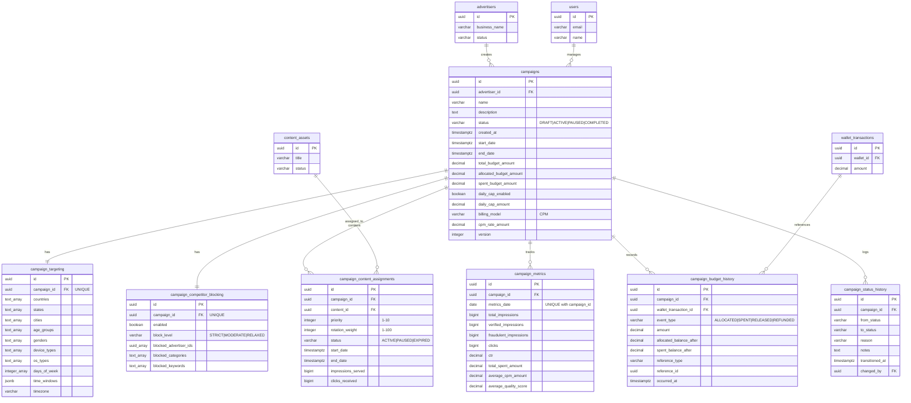

# Database ERD - Campaign Management Module

## Entity Relationship Diagram



## Table Relationships

### Core Relationships

1. **campaigns → advertisers** (Many-to-One)
   - Each campaign belongs to one advertiser
   - One advertiser can have many campaigns
   - Constraint: `ON DELETE RESTRICT` (cannot delete advertiser with active campaigns)

2. **campaigns → campaign_targeting** (One-to-One)
   - Each campaign has exactly one targeting configuration
   - Constraint: `UNIQUE(campaign_id)`
   - Cascade delete: Deleting campaign removes targeting

3. **campaigns → campaign_competitor_blocking** (One-to-One)
   - Each campaign has exactly one competitor blocking configuration
   - Constraint: `UNIQUE(campaign_id)`
   - Cascade delete: Deleting campaign removes blocking rules

4. **campaigns → campaign_content_assignments** (One-to-Many)
   - Each campaign can have multiple content assignments
   - Each assignment links to one content asset
   - Constraint: `UNIQUE(campaign_id, content_id)` prevents duplicate assignments
   - Cascade delete: Deleting campaign removes all assignments

5. **campaigns → campaign_metrics** (One-to-Many)
   - Each campaign can have multiple daily metric records
   - Constraint: `UNIQUE(campaign_id, metrics_date)` ensures one record per day
   - Cascade delete: Deleting campaign removes all metrics

6. **campaigns → campaign_budget_history** (One-to-Many)
   - Each campaign has complete audit trail of budget transactions
   - References `wallet_transactions` for payment tracking
   - Cascade delete: Deleting campaign removes history

7. **campaigns → campaign_status_history** (One-to-Many)
   - Complete audit trail of all status transitions
   - Tracks who made changes and when
   - Cascade delete: Deleting campaign removes history

### Foreign Key Constraints

| Table | Foreign Key | References | On Delete |
|-------|-------------|------------|-----------|
| campaigns | advertiser_id | advertisers(id) | RESTRICT |
| campaigns | created_by | users(id) | SET NULL |
| campaigns | updated_by | users(id) | SET NULL |
| campaigns | rejected_by | users(id) | SET NULL |
| campaigns | paused_by | users(id) | SET NULL |
| campaign_targeting | campaign_id | campaigns(id) | CASCADE |
| campaign_competitor_blocking | campaign_id | campaigns(id) | CASCADE |
| campaign_content_assignments | campaign_id | campaigns(id) | CASCADE |
| campaign_content_assignments | content_id | content_assets(id) | RESTRICT |
| campaign_metrics | campaign_id | campaigns(id) | CASCADE |
| campaign_budget_history | campaign_id | campaigns(id) | CASCADE |
| campaign_budget_history | wallet_transaction_id | wallet_transactions(id) | SET NULL |
| campaign_status_history | campaign_id | campaigns(id) | CASCADE |
| campaign_status_history | changed_by | users(id) | SET NULL |

## Indexes

### campaigns
- `idx_campaigns_advertiser_id` - Query campaigns by advertiser
- `idx_campaigns_status` - Filter by status (ACTIVE, PAUSED, etc.)
- `idx_campaigns_created_at` - Sort by creation date
- `idx_campaigns_start_date` - Find campaigns starting soon
- `idx_campaigns_end_date` - Find campaigns ending soon
- `idx_campaigns_status_dates` - Composite index for date-based queries
- `idx_campaigns_advertiser_status` - Advertiser-specific status queries

### campaign_targeting
- `idx_campaign_targeting_campaign_id` - Join optimization
- `idx_campaign_targeting_countries` - GIN index for array searches
- `idx_campaign_targeting_device_types` - GIN index for device filtering

### campaign_competitor_blocking
- `idx_competitor_blocking_campaign_id` - Join optimization
- `idx_competitor_blocking_enabled` - Partial index for active blocking

### campaign_content_assignments
- `idx_content_assignments_campaign_id` - Join optimization
- `idx_content_assignments_content_id` - Reverse lookup
- `idx_content_assignments_status` - Filter active assignments
- `idx_content_assignments_campaign_status` - Composite for campaign queries

### campaign_metrics
- `idx_campaign_metrics_campaign_id` - Join optimization
- `idx_campaign_metrics_date` - Time-series queries
- `idx_campaign_metrics_campaign_date` - Composite for reporting

### campaign_budget_history
- `idx_budget_history_campaign_id` - Audit trail queries
- `idx_budget_history_occurred_at` - Time-based queries
- `idx_budget_history_event_type` - Filter by transaction type
- `idx_budget_history_campaign_date` - Composite for timeline

### campaign_status_history
- `idx_status_history_campaign_id` - Audit trail queries
- `idx_status_history_transitioned_at` - Time-based queries
- `idx_status_history_to_status` - Filter by target status

## Data Types

### Key Data Types Used

- **uuid**: Primary keys and foreign keys (128-bit universally unique identifier)
- **varchar(n)**: Variable-length strings with maximum length
- **text**: Unlimited length text
- **decimal(p,s)**: Exact numeric with precision and scale
- **bigint**: Large integer values (for counters)
- **integer**: Standard integer values
- **boolean**: True/false flags
- **timestamptz**: Timestamp with timezone
- **date**: Date only (no time component)
- **text[]**: Array of text values
- **integer[]**: Array of integer values
- **uuid[]**: Array of UUID values
- **jsonb**: Binary JSON (efficient storage and indexing)

### Money Representation

All monetary values use **DECIMAL(12, 2)**:
- 12 digits total
- 2 decimal places
- Range: -9,999,999,999.99 to 9,999,999,999.99
- Sufficient for campaign budgets up to $10 billion

### Array Types

Arrays are used for multi-value fields:
- **countries**: `TEXT[]` - ISO country codes
- **device_types**: `VARCHAR(50)[]` - Device categories
- **blocked_advertiser_ids**: `UUID[]` - Competitor IDs
- **days_of_week**: `INTEGER[]` - 1-7 for Monday-Sunday

### JSONB Type

Used for flexible schemas:
- **time_windows**: Day parting configuration
  ```json
  [
    {"start": "09:00", "end": "12:00"},
    {"start": "18:00", "end": "22:00"}
  ]
  ```

## Cardinality

### One-to-One (1:1)
- campaigns ↔ campaign_targeting
- campaigns ↔ campaign_competitor_blocking

### One-to-Many (1:N)
- advertisers → campaigns (one advertiser, many campaigns)
- campaigns → campaign_content_assignments (one campaign, many content items)
- campaigns → campaign_metrics (one campaign, many daily metrics)
- campaigns → campaign_budget_history (one campaign, many budget events)
- campaigns → campaign_status_history (one campaign, many status changes)

### Many-to-Many (M:N)
- campaigns ↔ content_assets (via campaign_content_assignments)
  - One campaign can have multiple content assets
  - One content asset can be used in multiple campaigns

## Database Size Estimates

### Per Campaign
- campaigns table: ~2 KB per row
- campaign_targeting: ~1 KB per row
- campaign_competitor_blocking: ~500 bytes per row
- **Subtotal**: ~3.5 KB per campaign

### Per Campaign Per Day (Active)
- campaign_metrics: ~500 bytes per day
- campaign_budget_history: ~300 bytes per transaction (avg 100/day = 30 KB)
- campaign_status_history: ~200 bytes per status change (avg 5/campaign = 1 KB)
- campaign_content_assignments: ~400 bytes per assignment (avg 3 per campaign = 1.2 KB)
- **Subtotal**: ~32.7 KB per active campaign per day

### Projected Storage (1 year, 10,000 active campaigns)
- Core campaign data: 10,000 × 3.5 KB = **35 MB**
- Daily metrics (365 days): 10,000 × 365 × 500 bytes = **1.8 GB**
- Budget history: 10,000 × 365 × 30 KB = **109 GB**
- **Total (1 year)**: ~**111 GB** (uncompressed)

With PostgreSQL compression and archival strategies, actual storage will be significantly less.

---

*Last Updated: 2026-01-23*
