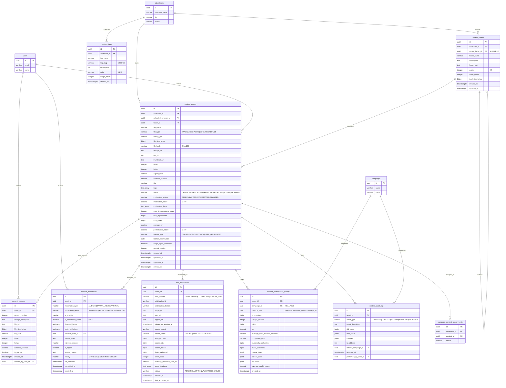

# Database ERD - Content Management Module

## Entity Relationship Diagram



## Table Relationships

### Core Relationships

1. **content_assets → advertisers** (Many-to-One)
   - Each content asset belongs to one advertiser
   - One advertiser can have many content assets
   - Constraint: `ON DELETE RESTRICT` (cannot delete advertiser with content)

2. **content_assets → content_folders** (Many-to-One)
   - Each content asset can belong to one folder
   - One folder can contain many assets
   - Constraint: `ON DELETE SET NULL` (if folder deleted, assets become uncategorized)

3. **content_folders → content_folders** (Self-Referencing, One-to-Many)
   - Folders can be nested within folders
   - Maximum depth of 5 levels enforced by constraint
   - Constraint: `ON DELETE CASCADE` (deleting folder deletes subfolders)

4. **content_assets → content_versions** (One-to-Many)
   - Each content asset can have multiple versions
   - Version history tracks all changes
   - Constraint: `UNIQUE(asset_id, version_number)` ensures no duplicate versions
   - Cascade delete: Deleting asset removes all versions

5. **content_assets → content_moderation** (One-to-Many)
   - Each content asset can have multiple moderation records (AI scans, manual reviews, appeals)
   - Complete audit trail of all moderation activities
   - Cascade delete: Deleting asset removes moderation history

6. **content_assets → cdn_distributions** (One-to-Many)
   - Each content asset can be distributed via multiple CDN providers
   - Tracks delivery performance and caching
   - Constraint: `UNIQUE(asset_id, cdn_provider)` prevents duplicates per provider
   - Cascade delete: Deleting asset removes CDN records

7. **content_assets → content_performance_history** (One-to-Many)
   - Daily aggregated performance metrics per asset
   - Can be broken down by campaign
   - Constraint: `UNIQUE(asset_id, campaign_id, metrics_date)` ensures one record per day
   - Cascade delete: Deleting asset removes performance history

8. **content_assets → content_audit_log** (One-to-Many)
   - Complete audit trail of all operations
   - Tracks who did what and when
   - Cascade delete: Deleting asset removes audit log

9. **content_assets → campaign_content_assignments** (One-to-Many)
   - Links content to campaigns
   - Defined in campaign schema
   - Constraint: `ON DELETE RESTRICT` (cannot delete content used in active campaigns)

### Foreign Key Constraints

| Table | Foreign Key | References | On Delete |
|-------|-------------|------------|-----------|
| content_assets | advertiser_id | advertisers(id) | RESTRICT |
| content_assets | uploaded_by_user_id | users(id) | SET NULL |
| content_assets | folder_id | content_folders(id) | SET NULL |
| content_assets | moderated_by_user_id | users(id) | SET NULL |
| content_assets | created_by | users(id) | SET NULL |
| content_assets | updated_by | users(id) | SET NULL |
| content_folders | advertiser_id | advertisers(id) | CASCADE |
| content_folders | parent_folder_id | content_folders(id) | CASCADE |
| content_folders | created_by | users(id) | SET NULL |
| content_versions | asset_id | content_assets(id) | CASCADE |
| content_versions | created_by_user_id | users(id) | SET NULL |
| content_moderation | asset_id | content_assets(id) | CASCADE |
| content_moderation | reviewer_user_id | users(id) | SET NULL |
| cdn_distributions | asset_id | content_assets(id) | CASCADE |
| content_tags | advertiser_id | advertisers(id) | CASCADE |
| content_performance_history | asset_id | content_assets(id) | CASCADE |
| content_performance_history | campaign_id | campaigns(id) | SET NULL |
| content_audit_log | asset_id | content_assets(id) | CASCADE |
| content_audit_log | performed_by_user_id | users(id) | SET NULL |
| content_audit_log | referrer_campaign_id | campaigns(id) | SET NULL |

## Indexes

### content_assets
- `idx_content_assets_advertiser_id` - Query content by advertiser
- `idx_content_assets_status` - Filter by status (APPROVED, PENDING, etc.)
- `idx_content_assets_file_type` - Filter by content type (IMAGE, VIDEO, etc.)
- `idx_content_assets_moderation_status` - Filter by moderation status
- `idx_content_assets_created_at` - Sort by upload date
- `idx_content_assets_folder_id` - Query content in folder
- `idx_content_assets_tags` - GIN index for tag searches
- `idx_content_assets_advertiser_status` - Composite for advertiser-specific queries
- `idx_content_assets_license_expiry` - Find expiring licenses (partial index)
- `idx_content_assets_performance` - Sort by performance score
- `idx_content_assets_file_hash` - Deduplication detection
- `idx_content_assets_deleted_at` - Soft delete support (partial index)

### content_folders
- `idx_content_folders_advertiser_id` - Query folders by advertiser
- `idx_content_folders_parent_id` - Navigate folder hierarchy
- `idx_content_folders_path` - Full path searches

### content_versions
- `idx_content_versions_asset_id` - Join optimization
- `idx_content_versions_current` - Find current version (partial index)
- `idx_content_versions_created_at` - Sort by version date

### content_moderation
- `idx_content_moderation_asset_id` - Join optimization
- `idx_content_moderation_type` - Filter by moderation type
- `idx_content_moderation_result` - Filter by result
- `idx_content_moderation_pending` - Moderation queue (partial index with priority)
- `idx_content_moderation_reviewer` - Reviewer activity tracking
- `idx_content_moderation_sla` - SLA tracking (partial index)
- `idx_content_moderation_created_at` - Time-based queries

### cdn_distributions
- `idx_cdn_distributions_asset_id` - Join optimization
- `idx_cdn_distributions_provider` - Filter by CDN provider
- `idx_cdn_distributions_status` - Filter by distribution status
- `idx_cdn_distributions_cache_status` - Cache management
- `idx_cdn_distributions_signed_url_expiry` - Find expiring signed URLs (partial index)

### content_tags
- `idx_content_tags_advertiser_id` - Query tags by advertiser
- `idx_content_tags_usage_count` - Sort by popularity
- `idx_content_tags_name` - Tag name searches

### content_performance_history
- `idx_content_performance_asset_id` - Join optimization
- `idx_content_performance_campaign_id` - Campaign-specific metrics
- `idx_content_performance_date` - Time-series queries
- `idx_content_performance_asset_date` - Composite for asset timeline
- `idx_content_performance_ctr` - Sort by engagement

### content_audit_log
- `idx_content_audit_log_asset_id` - Audit trail queries
- `idx_content_audit_log_event_type` - Filter by event type
- `idx_content_audit_log_occurred_at` - Time-based queries
- `idx_content_audit_log_user_id` - User activity tracking
- `idx_content_audit_log_asset_event` - Composite for asset timeline

## Data Types

### Key Data Types Used

- **uuid**: Primary keys and foreign keys (128-bit universally unique identifier)
- **varchar(n)**: Variable-length strings with maximum length
- **text**: Unlimited length text
- **bigint**: Large integer values (for file sizes, counters)
- **integer**: Standard integer values
- **decimal(p,s)**: Exact numeric with precision and scale
- **boolean**: True/false flags
- **timestamptz**: Timestamp with timezone
- **date**: Date only (no time component)
- **text[]**: Array of text values
- **jsonb**: Binary JSON (efficient storage and indexing)
- **inet**: IP address storage

### File Size Representation

File sizes use **BIGINT**:
- Range: -9,223,372,036,854,775,808 to 9,223,372,036,854,775,807 bytes
- Maximum supported file: ~9 exabytes (far exceeds business requirement of 500 MB)
- Allows aggregation without overflow

### Score Representation

All scores use **DECIMAL(5, 2)**:
- Range: 0.00 to 100.00
- AI moderation scores (0-100, where 100 = safe)
- Performance scores (0-100, weighted calculation)
- Quality scores (0-100)

### Array Types

Arrays are used for multi-value fields:
- **tags**: `TEXT[]` - User-defined tags
- **moderation_flags**: `TEXT[]` - Policy violations
- **detected_labels**: `TEXT[]` - AI detection results
- **edge_locations**: `TEXT[]` - CDN edge locations
- **top_cities**: `TEXT[]` - Geographic breakdown

### JSONB Type

Used for flexible schemas:
- **device_types**: Performance breakdown by device
  ```json
  {"TABLET": 500, "TV": 300, "KIOSK": 200}
  ```
- **screen_sizes**: Display resolution breakdown
  ```json
  {"1920x1080": 800, "3840x2160": 200}
  ```
- **countries**: Geographic distribution
  ```json
  {"US": 700, "CA": 200, "UK": 100}
  ```
- **old_value/new_value**: Audit log state snapshots
- **changes**: Field-level change tracking

## Cardinality

### One-to-One (1:1)
None in this module (all relationships are one-to-many or many-to-many via junction tables)

### One-to-Many (1:N)
- advertisers → content_assets (one advertiser, many assets)
- advertisers → content_folders (one advertiser, many folders)
- advertisers → content_tags (one advertiser, many tags)
- content_folders → content_folders (nested folders, max depth 5)
- content_folders → content_assets (one folder, many assets)
- content_assets → content_versions (one asset, many versions)
- content_assets → content_moderation (one asset, many moderation records)
- content_assets → cdn_distributions (one asset, multiple CDN providers)
- content_assets → content_performance_history (one asset, many daily metrics)
- content_assets → content_audit_log (one asset, many audit events)

### Many-to-Many (M:N)
- content_assets ↔ campaigns (via campaign_content_assignments)
  - One content asset can be used in multiple campaigns
  - One campaign can use multiple content assets
- content_assets ↔ tags (via tags array field)
  - One asset can have multiple tags
  - One tag can be applied to multiple assets

## Business Rules Enforcement

### Content Lifecycle
```
UPLOADED → PROCESSING → PENDING_APPROVAL → APPROVED → ACTIVE → ARCHIVED
                ↓              ↓
        PROCESSING_FAILED   REJECTED
```

Status transitions enforced by application logic and database constraints.

### Moderation Workflow

**AI Moderation Scoring**:
- Score 90-100: Auto-approve (moderation_status = 'APPROVED')
- Score 70-89: Flag for manual review (moderation_status = 'FLAGGED')
- Score < 70: Auto-reject (moderation_status = 'REJECTED')

**Manual Review Queue**:
- Priority: ENTERPRISE > URGENT > STANDARD
- SLA tracking: sla_deadline field with index
- View: `v_moderation_queue` provides filtered queue

### Storage Quotas by Tier

Enforced at application layer (not database constraints):
- FREE: 1 GB total, 100 assets max
- BASIC: 10 GB total, 500 assets max
- PREMIUM: 50 GB total, 2000 assets max
- ENTERPRISE: 500+ GB, unlimited assets

View `v_content_storage_summary` provides usage metrics.

### File Size Limits

Max file sizes by type (enforced at application layer):
- Images: 10 MB
- Videos: 500 MB
- Audio: 50 MB
- Documents (PDF): 20 MB
- HTML5: 50 MB (compressed), 100 MB (unzipped)

### License Management

**Expiration Tracking**:
- `license_expiry_date` field for LICENSED content
- View `v_expiring_licenses` shows content expiring in 30 days
- Index on expiry date for efficient queries

**Expiration Workflow**:
- Alert 30 days before expiration
- Alert 7 days before expiration
- On expiration: status = 'EXPIRED', pause campaigns

### Deduplication

**Hash-Based Detection**:
- `file_hash` stores SHA-256 hash
- Unique constraint: `(advertiser_id, file_hash)`
- Prevents duplicate uploads by same advertiser
- Saves storage costs

### Version Control

**Version Management**:
- `current_version` field on content_assets
- `content_versions` table stores all versions
- Constraint: `UNIQUE(asset_id, version_number)`
- `is_current` flag marks active version

**Version Limits**:
- Standard tiers: 10 versions per asset
- Enterprise: Unlimited versions
- Enforced at application layer

### Performance Scoring

**Calculated Score (0-100)**:
```
performance_score = (
  impression_volume_score × 0.30 +
  ctr_score × 0.30 +
  campaign_usage_score × 0.20 +
  recency_score × 0.20
)
```

Function: `calculate_content_performance_score()`

View: `v_top_performing_content` (score >= 80)

### Soft Delete

**Deletion Process**:
1. Set `deleted_at = CURRENT_TIMESTAMP`
2. Hide from user views
3. Retain for 30 days (recovery period)
4. Permanent delete after 30 days

**Active Campaign Protection**:
- Cannot permanently delete content used in active campaigns
- Warning shown to user
- Campaigns continue using deleted content (URL still accessible)

## Database Size Estimates

### Per Content Asset
- content_assets table: ~1.5 KB per row (with metadata)
- content_versions: ~500 bytes per version (avg 5 versions = 2.5 KB)
- content_moderation: ~800 bytes per moderation record (avg 2 per asset = 1.6 KB)
- cdn_distributions: ~600 bytes per CDN provider (avg 1 per asset = 600 bytes)
- content_audit_log: ~400 bytes per event (avg 5 events = 2 KB)
- **Subtotal**: ~8.2 KB per asset (metadata only, excludes file storage)

### Per Asset Per Day (Active)
- content_performance_history: ~1 KB per day per campaign (avg 2 campaigns = 2 KB)
- Additional audit events: ~400 bytes per event (avg 2/day = 800 bytes)
- **Subtotal**: ~2.8 KB per active asset per day

### Projected Storage (1 year, 100,000 active assets)

**Metadata Storage**:
- Core asset data: 100,000 × 8.2 KB = **820 MB**
- Daily performance (365 days): 100,000 × 365 × 2 KB = **73 GB**
- Folders and tags: ~**10 MB**
- **Total Metadata (1 year)**: ~**74 GB** (uncompressed)

**File Storage** (separate from database):
Assuming average file size of 5 MB per asset:
- 100,000 assets × 5 MB = **500 GB**
- 5 versions per asset: 500 GB × 5 = **2.5 TB**
- Total file storage: ~**3 TB** (with versions)

**CDN Bandwidth** (monthly):
Assuming 10 KB average file, 1M impressions per asset per month:
- 100,000 assets × 1M impressions × 10 KB = **1 PB/month**
- Actual varies significantly by content type and usage

With PostgreSQL compression, TOAST, and archival strategies, actual database storage will be 50-70% of uncompressed size.

### Storage Optimization Strategies

1. **TOAST Compression**: Large text fields automatically compressed
2. **JSONB Compression**: Binary JSON more efficient than text JSON
3. **Partial Indexes**: Indexes only on relevant subsets (WHERE clauses)
4. **Archival**: Move old performance data to archive tables (>365 days)
5. **Partitioning**: Partition performance_history by date (monthly/quarterly)
6. **CDN Offloading**: Store actual files in S3/GCS, not database

## Triggers and Automation

### Automated Triggers

1. **update_content_updated_at()**
   - Updates `updated_at` timestamp on every row change
   - Applied to: content_assets, content_folders, cdn_distributions

2. **update_folder_statistics()**
   - Recalculates folder asset_count and total_size_bytes
   - Triggered on: INSERT, UPDATE, DELETE on content_assets

3. **validate_folder_depth()**
   - Ensures folder nesting doesn't exceed 5 levels
   - Calculates and sets folder depth automatically
   - Raises exception if max depth exceeded

4. **log_content_audit_event()**
   - Automatically logs all content operations to audit log
   - Captures old and new values as JSONB
   - Triggered on: INSERT, UPDATE, DELETE on content_assets

### Scheduled Jobs (Application Layer)

1. **Calculate Performance Scores**
   - Run: Daily at midnight
   - Updates: content_assets.performance_score
   - Uses: calculate_content_performance_score() function

2. **License Expiration Alerts**
   - Run: Daily
   - Query: v_expiring_licenses view
   - Action: Send email notifications

3. **Auto-Archive Unused Content**
   - Run: Monthly
   - Criteria: Not used in 365 days
   - Action: Set status = 'ARCHIVED'

4. **Purge Soft-Deleted Content**
   - Run: Daily
   - Criteria: deleted_at > 30 days ago
   - Action: Permanent deletion

5. **Aggregate Performance Metrics**
   - Run: Hourly
   - Source: Real-time impression logs
   - Target: content_performance_history

## Views and Reporting

### Available Views

1. **v_active_content**
   - Shows all approved, non-deleted content
   - Includes performance metrics and license status
   - Used by: Content library UI

2. **v_moderation_queue**
   - Shows pending moderation items
   - Prioritized by tier and SLA
   - Includes overdue/urgent flags
   - Used by: Moderation dashboard

3. **v_content_storage_summary**
   - Aggregated storage usage by advertiser
   - Breakdown by content type
   - Status counts (approved, pending, rejected)
   - Used by: Admin reporting, quota enforcement

4. **v_top_performing_content**
   - Content with performance_score >= 80
   - Sorted by score and impressions
   - Used by: Content recommendations

5. **v_expiring_licenses**
   - Content with licenses expiring in 30 days
   - Urgency levels: EXPIRED, CRITICAL, WARNING
   - Used by: Automated alerts, advertiser dashboard

### Common Queries

See SQL file for sample queries including:
- Moderation queue with priorities
- Advertiser storage usage
- Top performing content
- Content performance over time
- Content audit trail
- Duplicate content detection

---

*Last Updated: 2026-01-23*
