# Database ERD - Device Management Module

## Entity Relationship Diagram

```mermaid
erDiagram
    stores ||--o{ devices : "contains"
    suppliers ||--o{ devices : "owns"
    users ||--o{ devices : "manages"

    devices ||--o{ device_heartbeats : "sends"
    devices ||--o{ device_content_cache : "caches"
    devices ||--o{ device_content_sync : "syncs"
    devices ||--o{ device_health_logs : "tracks"
    devices ||--o{ device_playlists : "plays"
    devices ||--o{ device_maintenance_logs : "maintains"
    devices ||--|| device_activation_keys : "activates_with"
    devices ||--o{ device_transfer_logs : "transfers"

    campaigns ||--o{ device_playlists : "scheduled_on"
    content_assets ||--o{ device_playlists : "assigned_to"
    content_assets ||--o{ device_content_cache : "cached_as"
    content_assets ||--o{ device_heartbeats : "currently_playing"
    campaigns ||--o{ device_heartbeats : "tracks_playback"

    users ||--o{ device_maintenance_logs : "performs"
    users ||--o{ device_transfer_logs : "executes"
    users ||--o{ device_activation_keys : "uses"

    devices {
        uuid id PK
        uuid store_id FK
        uuid supplier_id FK
        varchar device_code "UNIQUE, 16-char"
        varchar device_name
        varchar device_type "DISPLAY|VIDEO_WALL|KIOSK|etc"
        varchar status "REGISTERED|ACTIVE|OFFLINE|etc"
        integer screen_size_inches "32-100"
        varchar screen_resolution "1920x1080, etc"
        varchar screen_orientation "LANDSCAPE|PORTRAIT"
        varchar hardware_model
        varchar os_type "ANDROID|WINDOWS|LINUX|etc"
        varchar os_version
        varchar player_version
        varchar mac_address
        varchar ip_address
        text public_key
        jsonb location "GeoJSON Point"
        varchar timezone
        integer advertising_slots_per_hour "6-60"
        integer max_content_duration "10-300 sec"
        jsonb operating_hours
        integer heartbeat_interval "300 sec default"
        timestamptz last_heartbeat_at
        timestamptz last_sync_at
        timestamptz last_impression_at
        bigint total_uptime_minutes
        bigint total_downtime_minutes
        decimal uptime_percentage
        bigint total_impressions
        decimal total_revenue_generated
        integer health_score "0-100"
        integer current_cpu_usage
        integer current_memory_usage
        integer current_disk_usage
        jsonb flags
        timestamptz registered_at
        timestamptz activated_at
        timestamptz decommissioned_at
    }

    device_heartbeats {
        uuid id PK
        uuid device_id FK
        timestamptz server_timestamp
        timestamptz device_timestamp
        integer time_skew_seconds
        varchar status "ONLINE|DEGRADED|ERROR"
        bigint sequence_number "UNIQUE with device_id"
        integer cpu_usage
        integer memory_usage
        integer disk_usage
        decimal disk_free_gb
        integer temperature_celsius
        integer network_latency_ms
        integer network_bandwidth_kbps
        varchar network_connection_type
        varchar ip_address
        boolean screen_on
        boolean content_playing
        uuid current_content_id FK
        uuid current_campaign_id FK
        uuid playlist_id
        integer error_count
        jsonb error_messages
        jsonb location
        text signature
        boolean signature_valid
    }

    device_content_cache {
        uuid id PK
        uuid device_id FK
        uuid content_id FK "UNIQUE with device_id"
        timestamptz cached_at
        timestamptz last_accessed_at
        bigint access_count
        bigint file_size_bytes
        varchar file_checksum "SHA256"
        text cdn_url
        varchar status "PENDING|DOWNLOADING|CACHED|etc"
        timestamptz checksum_verified_at
        integer verification_failures
        timestamptz expires_at
    }

    device_content_sync {
        uuid id PK
        uuid device_id FK
        varchar sync_type "FULL|INCREMENTAL|FORCED"
        varchar status "PENDING|IN_PROGRESS|COMPLETED|etc"
        integer total_files
        integer synced_files
        integer failed_files
        bigint total_bytes
        bigint synced_bytes
        integer bandwidth_kbps
        integer duration_seconds
        varchar from_manifest_version
        varchar to_manifest_version
        uuid_array added_content_ids
        uuid_array updated_content_ids
        uuid_array removed_content_ids
        text error_message
        integer retry_count
        timestamptz started_at
        timestamptz completed_at
        varchar initiated_by "DEVICE|SERVER|ADMIN"
    }

    device_health_logs {
        uuid id PK
        uuid device_id FK
        date log_date "UNIQUE with device_id, log_hour"
        integer log_hour "0-23"
        integer uptime_minutes
        integer downtime_minutes
        decimal uptime_percentage
        decimal avg_cpu_usage
        decimal avg_memory_usage
        decimal avg_disk_usage
        integer avg_network_latency_ms
        integer heartbeats_received
        integer heartbeats_expected
        decimal heartbeat_success_rate
        bigint impressions_served
        integer content_load_errors
        integer total_errors
        jsonb error_summary
        integer health_score
    }

    device_playlists {
        uuid id PK
        uuid device_id FK
        uuid campaign_id FK
        uuid content_asset_id FK
        integer priority "1-10"
        integer weight "1-100"
        timestamptz start_date
        timestamptz end_date
        jsonb time_restrictions
        bigint play_count
        timestamptz last_played_at
        varchar status "PENDING|ACTIVE|COMPLETED|etc"
    }

    device_maintenance_logs {
        uuid id PK
        uuid device_id FK
        uuid performed_by FK
        varchar maintenance_type "SCHEDULED|EMERGENCY|etc"
        varchar status "SCHEDULED|IN_PROGRESS|etc"
        text description
        text notes
        jsonb parts_replaced
        decimal cost_amount
        timestamptz scheduled_at
        timestamptz started_at
        timestamptz completed_at
        integer duration_minutes
    }

    device_activation_keys {
        uuid id PK
        varchar device_code FK "UNIQUE"
        varchar activation_key "UNIQUE"
        varchar status "UNUSED|USED|EXPIRED"
        timestamptz created_at
        timestamptz expires_at "30 days"
        timestamptz used_at
        uuid used_by FK
    }

    device_transfer_logs {
        uuid id PK
        uuid device_id FK
        uuid from_store_id FK
        uuid to_store_id FK
        uuid transferred_by FK
        text reason
        integer paused_campaigns_count
        uuid_array affected_campaign_ids
        timestamptz transferred_at
    }

    stores {
        uuid id PK
        varchar name
        uuid supplier_id FK
        varchar status
        jsonb location
    }

    suppliers {
        uuid id PK
        varchar business_name
        varchar status
    }

    users {
        uuid id PK
        varchar email
        varchar name
    }

    campaigns {
        uuid id PK
        varchar name
        varchar status
    }

    content_assets {
        uuid id PK
        varchar title
        varchar status
    }
```



## Table Relationships

### Core Relationships

1. **devices → stores** (Many-to-One)
   - Each device is installed at one store
   - One store can have multiple devices
   - Constraint: `ON DELETE RESTRICT` (cannot delete store with active devices)

2. **devices → suppliers** (Many-to-One)
   - Each device belongs to one supplier (inherited from store)
   - One supplier can own many devices
   - Constraint: `supplier_id` must match `store.supplier_id`

3. **devices → device_heartbeats** (One-to-Many)
   - Each device sends periodic heartbeats (every 5 minutes)
   - One device has many heartbeat records
   - Cascade delete: Deleting device removes all heartbeats

4. **devices → device_content_cache** (One-to-Many)
   - Each device caches multiple content files locally
   - Constraint: `UNIQUE(device_id, content_id)` prevents duplicate cache entries
   - Cascade delete: Deleting device removes cache records

5. **devices → device_content_sync** (One-to-Many)
   - Each device has multiple sync records (history of synchronizations)
   - Tracks full, incremental, and forced syncs
   - Cascade delete: Deleting device removes sync history

6. **devices → device_health_logs** (One-to-Many)
   - Each device has hourly health metric aggregations
   - Constraint: `UNIQUE(device_id, log_date, log_hour)` one record per hour
   - Cascade delete: Deleting device removes health logs

7. **devices → device_playlists** (One-to-Many)
   - Each device has multiple playlist items (content queue)
   - Links device to campaigns and content
   - Cascade delete: Deleting device removes playlist

8. **devices → device_maintenance_logs** (One-to-Many)
   - Complete maintenance history for each device
   - Tracks scheduled and emergency maintenance
   - Cascade delete: Deleting device removes maintenance logs

9. **devices → device_activation_keys** (One-to-One)
   - Each device has one activation key for initial setup
   - Single-use key with 30-day expiry
   - Cascade delete: Deleting device removes activation key

10. **devices → device_transfer_logs** (One-to-Many)
    - Audit trail of device transfers between stores
    - Tracks affected campaigns
    - Cascade delete: Deleting device removes transfer history

### Foreign Key Constraints

| Table | Foreign Key | References | On Delete |
|-------|-------------|------------|-----------|
| devices | store_id | stores(id) | RESTRICT |
| devices | supplier_id | suppliers(id) | RESTRICT |
| devices | created_by | users(id) | SET NULL |
| devices | updated_by | users(id) | SET NULL |
| device_heartbeats | device_id | devices(id) | CASCADE |
| device_heartbeats | current_content_id | content_assets(id) | SET NULL |
| device_heartbeats | current_campaign_id | campaigns(id) | SET NULL |
| device_content_cache | device_id | devices(id) | CASCADE |
| device_content_cache | content_id | content_assets(id) | CASCADE |
| device_content_sync | device_id | devices(id) | CASCADE |
| device_health_logs | device_id | devices(id) | CASCADE |
| device_playlists | device_id | devices(id) | CASCADE |
| device_playlists | campaign_id | campaigns(id) | CASCADE |
| device_playlists | content_asset_id | content_assets(id) | CASCADE |
| device_maintenance_logs | device_id | devices(id) | CASCADE |
| device_maintenance_logs | performed_by | users(id) | RESTRICT |
| device_activation_keys | device_code | devices(device_code) | CASCADE |
| device_activation_keys | used_by | users(id) | SET NULL |
| device_transfer_logs | device_id | devices(id) | CASCADE |
| device_transfer_logs | from_store_id | stores(id) | RESTRICT |
| device_transfer_logs | to_store_id | stores(id) | RESTRICT |
| device_transfer_logs | transferred_by | users(id) | RESTRICT |

## Indexes

### devices
- `idx_devices_store_id` - Query devices by store
- `idx_devices_supplier_id` - Query devices by supplier
- `idx_devices_device_code` - Unique device code lookup
- `idx_devices_status` - Filter by status (ACTIVE, OFFLINE, etc.)
- `idx_devices_last_heartbeat_at` - Find devices by last heartbeat
- `idx_devices_health_score` - Query by health score
- `idx_devices_status_heartbeat` - Composite index for status + heartbeat queries
- `idx_devices_supplier_status` - Supplier-specific status queries
- `idx_devices_location` - GIN index for geospatial queries

### device_heartbeats
- `idx_heartbeats_device_id` - Join optimization
- `idx_heartbeats_server_timestamp` - Time-series queries
- `idx_heartbeats_device_timestamp` - Device-specific timeline
- `idx_heartbeats_status` - Filter by status
- `idx_heartbeats_signature_valid` - Partial index for failed verifications

### device_content_cache
- `idx_content_cache_device_id` - Join optimization
- `idx_content_cache_content_id` - Reverse lookup
- `idx_content_cache_status` - Filter by cache status
- `idx_content_cache_expires_at` - Find expired content
- `idx_content_cache_device_status` - Composite for device queries

### device_content_sync
- `idx_content_sync_device_id` - Join optimization
- `idx_content_sync_status` - Filter by sync status
- `idx_content_sync_started_at` - Time-based queries
- `idx_content_sync_device_status` - Composite for device queries

### device_health_logs
- `idx_health_logs_device_id` - Join optimization
- `idx_health_logs_log_date` - Time-series queries
- `idx_health_logs_device_date` - Device-specific timeline
- `idx_health_logs_health_score` - Query by health score

### device_playlists
- `idx_playlists_device_id` - Join optimization
- `idx_playlists_campaign_id` - Campaign lookup
- `idx_playlists_content_id` - Content lookup
- `idx_playlists_status` - Filter active playlists
- `idx_playlists_device_status` - Composite for device queries
- `idx_playlists_date_range` - Date range queries

### device_maintenance_logs
- `idx_maintenance_device_id` - Join optimization
- `idx_maintenance_performed_by` - User lookup
- `idx_maintenance_status` - Filter by status
- `idx_maintenance_scheduled_at` - Time-based queries
- `idx_maintenance_device_date` - Device-specific timeline

### device_activation_keys
- `idx_activation_keys_device_code` - Device lookup
- `idx_activation_keys_status` - Filter by status
- `idx_activation_keys_expires_at` - Find expired keys

### device_transfer_logs
- `idx_transfer_logs_device_id` - Device history
- `idx_transfer_logs_from_store` - Source store lookup
- `idx_transfer_logs_to_store` - Destination store lookup
- `idx_transfer_logs_transferred_at` - Time-based queries

## Data Types

### Key Data Types Used

- **uuid**: Primary keys and foreign keys (128-bit universally unique identifier)
- **varchar(n)**: Variable-length strings with maximum length
- **text**: Unlimited length text
- **decimal(p,s)**: Exact numeric with precision and scale
- **bigint**: Large integer values (for counters, sequence numbers)
- **integer**: Standard integer values
- **boolean**: True/false flags
- **timestamptz**: Timestamp with timezone
- **date**: Date only (no time component)
- **jsonb**: Binary JSON (efficient storage and indexing)
- **uuid[]**: Array of UUID values

### Hardware Metrics

All percentage metrics use **INTEGER (0-100)**:
- cpu_usage
- memory_usage
- disk_usage
- uptime_percentage (stored as DECIMAL(5,2) for precision)

### Money Representation

All monetary values use **DECIMAL(12, 2)**:
- 12 digits total
- 2 decimal places
- Range: -9,999,999,999.99 to 9,999,999,999.99
- Used for: total_revenue_generated, cost_amount

### JSONB Types

Used for flexible schemas:
- **location**: GeoJSON Point format
  ```json
  {
    "type": "Point",
    "coordinates": [106.660172, 10.762622]
  }
  ```

- **operating_hours**: Store operating schedule
  ```json
  {
    "monday": {"open": "08:00", "close": "22:00"},
    "tuesday": {"open": "08:00", "close": "22:00"},
    "holidays": {"open": "10:00", "close": "20:00"}
  }
  ```

- **time_restrictions**: Day parting configuration
  ```json
  {
    "days": [1, 2, 3, 4, 5],
    "hours": [{"start": "09:00", "end": "17:00"}]
  }
  ```

- **flags**: System flags
  ```json
  {
    "suspicious": false,
    "needs_maintenance": false,
    "high_resource_usage": false
  }
  ```

- **error_messages**: Error log array
  ```json
  [
    {
      "timestamp": "2026-01-23T10:00:00Z",
      "level": "ERROR",
      "code": "CONTENT_LOAD_FAILED",
      "message": "Failed to load content"
    }
  ]
  ```

## Cardinality

### One-to-One (1:1)
- devices ↔ device_activation_keys (each device has one activation key)

### One-to-Many (1:N)
- stores → devices (one store, many devices)
- suppliers → devices (one supplier, many devices)
- devices → device_heartbeats (one device, many heartbeats)
- devices → device_content_cache (one device, many cached files)
- devices → device_content_sync (one device, many sync records)
- devices → device_health_logs (one device, many hourly logs)
- devices → device_playlists (one device, many playlist items)
- devices → device_maintenance_logs (one device, many maintenance records)
- devices → device_transfer_logs (one device, many transfers)
- users → device_maintenance_logs (one user performs many maintenance tasks)

### Many-to-Many (M:N)
- devices ↔ content_assets (via device_content_cache)
  - One device caches multiple content assets
  - One content asset cached on multiple devices

- devices ↔ campaigns (via device_playlists)
  - One device plays multiple campaigns
  - One campaign plays on multiple devices

## Database Size Estimates

### Per Device
- devices table: ~3 KB per row (with JSONB fields)
- device_activation_keys: ~200 bytes per row
- **Subtotal**: ~3.2 KB per device

### Per Device Per Hour (Active)
- device_heartbeats: ~700 bytes per heartbeat × 12/hour = 8.4 KB/hour
- device_health_logs: ~800 bytes per hour
- **Subtotal**: ~9.2 KB per active device per hour

### Per Device (Variable)
- device_content_cache: ~500 bytes per cached file × avg 20 files = 10 KB
- device_playlists: ~400 bytes per item × avg 10 items = 4 KB
- device_content_sync: ~1 KB per sync × avg 2/day = 2 KB/day
- device_maintenance_logs: ~800 bytes per log × avg 1/month = minimal
- **Subtotal**: ~14 KB base + 2 KB/day

### Projected Storage (1 year, 5,000 active devices)

#### Core Device Data
- devices: 5,000 × 3.2 KB = **16 MB**

#### Heartbeat Data (5-minute intervals)
- Heartbeats per day: 5,000 devices × 12/hour × 24 hours = 1,440,000 heartbeats/day
- Daily: 1,440,000 × 700 bytes = **1 GB/day**
- Yearly: 365 GB (uncompressed)
- With 7-day retention: **7 GB** (older data archived)

#### Health Logs (hourly aggregation)
- Logs per day: 5,000 devices × 24 hours = 120,000 logs/day
- Daily: 120,000 × 800 bytes = **96 MB/day**
- Yearly: 35 GB (uncompressed)
- With 90-day retention: **8.6 GB** (older data in cold storage)

#### Content Cache & Playlists
- Content cache: 5,000 × 10 KB = **50 MB**
- Playlists: 5,000 × 4 KB = **20 MB**
- **Subtotal**: 70 MB (relatively static)

#### Sync & Maintenance Logs
- Sync logs: 5,000 × 2 KB/day × 365 = **3.6 GB/year**
- Maintenance logs: 5,000 × 1/month × 800 bytes = **48 MB/year**
- Transfer logs: minimal (infrequent events)
- **Subtotal**: ~4 GB/year

### Total Storage (1 year, 5,000 devices)
- Core data: **16 MB**
- Heartbeats (7-day retention): **7 GB**
- Health logs (90-day retention): **8.6 GB**
- Content & playlists: **70 MB**
- Sync & maintenance: **4 GB**
- **Total (with retention policies)**: ~**20 GB**

### Scaling Estimates
- **10,000 devices**: ~40 GB (with retention policies)
- **50,000 devices**: ~200 GB (with retention policies)
- **100,000 devices**: ~400 GB (with retention policies)

### Optimization Strategies
1. **Partitioning**: Partition `device_heartbeats` and `device_health_logs` by date
2. **Archival**: Move data >90 days to cold storage (S3, Glacier)
3. **Compression**: PostgreSQL native compression reduces storage by 60-70%
4. **Retention Policies**:
   - Heartbeats: 7 days hot, 90 days warm, 1 year cold
   - Health logs: 90 days hot, 1 year warm, 3 years cold
5. **Aggregation**: Pre-aggregate hourly data to daily summaries for reporting

With compression and proper archival, actual storage requirements will be **significantly less** than estimates above.

---

## Business Rules Reflected in Schema

### 1. Device Lifecycle States
- Status transitions: `REGISTERED → ACTIVE → OFFLINE → MAINTENANCE → DECOMMISSIONED`
- Enforced through status enum constraint
- Lifecycle timestamps tracked: `registered_at`, `activated_at`, `decommissioned_at`

### 2. Heartbeat Protocol
- Expected every 5 minutes (configurable via `heartbeat_interval`)
- Device marked offline after 2 missed heartbeats (10 minutes)
- Sequence number prevents replay attacks
- Signature verification required for security

### 3. Health Score Calculation
- Stored as integer 0-100 in devices table
- Hourly health scores tracked in `device_health_logs`
- Components: uptime (40%), performance (30%), reliability (20%), compliance (10%)
- Computed based on: CPU usage, memory usage, network latency, uptime percentage

### 4. Content Synchronization
- Three sync types: FULL, INCREMENTAL, FORCED
- Manifest versioning for change tracking
- Checksum verification (SHA256) for integrity
- Retry logic with exponential backoff (max 3 retries)

### 5. Device Configuration
- `advertising_slots_per_hour`: 6-60 slots (default: 12)
- `max_content_duration`: 10-300 seconds (default: 60)
- `operating_hours`: JSONB flexible schedule per day of week
- `screen_size_inches`: 32-100 inches (affects CPM rates)

### 6. Security Measures
- RSA 2048-bit public key stored per device
- Every heartbeat and API request must be signed
- Signature verification tracked: `consecutive_signature_failures`
- 3 consecutive failures triggers device suspension

### 7. Fraud Detection
- Location tracking via GPS (GeoJSON format)
- Excessive impression detection via `advertising_slots_per_hour` limit
- Clock skew detection via `time_skew_seconds` in heartbeats
- System flags for suspicious activity in `flags` JSONB field

### 8. Uptime SLA
- Target: 95% uptime (standard), 98% uptime (premium)
- Tracked via: `total_uptime_minutes`, `total_downtime_minutes`
- Calculated: `uptime_percentage` automatically via trigger
- Penalty structure applies if below 95%

### 9. Device Transfer
- Audit trail in `device_transfer_logs`
- Tracks: source store, destination store, affected campaigns
- Only allowed within same supplier
- Triggers content resync and campaign recalculation

### 10. Maintenance Windows
- Scheduled maintenance tracked in `device_maintenance_logs`
- Maintenance types: SCHEDULED, EMERGENCY, FIRMWARE_UPDATE, HARDWARE_REPAIR
- Downtime during maintenance excluded from uptime SLA
- Parts and costs tracked for accounting

---

*Last Updated: 2026-01-23*
