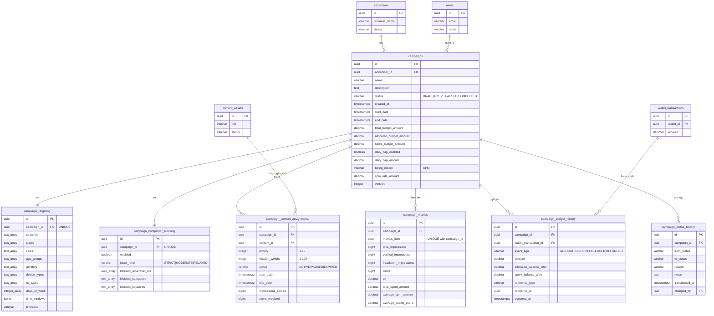

# ERD Cơ sở dữ liệu - Module Quản lý Chiến dịch

## Sơ đồ quan hệ thực thể



## Quan hệ giữa các bảng

### Quan hệ cốt lõi

1. **campaigns → advertisers** (Nhiều-một)
   - Mỗi campaign thuộc về một nhà quảng cáo
   - Một nhà quảng cáo có thể có nhiều campaign
   - Ràng buộc: `ON DELETE RESTRICT` (không thể xóa nhà quảng cáo có campaign đang hoạt động)

2. **campaigns → campaign_targeting** (Một-một)
   - Mỗi campaign có đúng một cấu hình targeting
   - Ràng buộc: `UNIQUE(campaign_id)`
   - Xóa cascade: Xóa campaign sẽ xóa targeting

3. **campaigns → campaign_competitor_blocking** (Một-một)
   - Mỗi campaign có đúng một cấu hình chặn đối thủ cạnh tranh
   - Ràng buộc: `UNIQUE(campaign_id)`
   - Xóa cascade: Xóa campaign sẽ xóa quy tắc chặn

4. **campaigns → campaign_content_assignments** (Một-nhiều)
   - Mỗi campaign có thể có nhiều nội dung được gán
   - Mỗi assignment liên kết đến một nội dung
   - Ràng buộc: `UNIQUE(campaign_id, content_id)` ngăn gán trùng
   - Xóa cascade: Xóa campaign sẽ xóa tất cả assignment

5. **campaigns → campaign_metrics** (Một-nhiều)
   - Mỗi campaign có thể có nhiều bản ghi số liệu hàng ngày
   - Ràng buộc: `UNIQUE(campaign_id, metrics_date)` đảm bảo một bản ghi mỗi ngày
   - Xóa cascade: Xóa campaign sẽ xóa tất cả số liệu

6. **campaigns → campaign_budget_history** (Một-nhiều)
   - Mỗi campaign có audit trail đầy đủ về giao dịch ngân sách
   - Tham chiếu `wallet_transactions` để theo dõi thanh toán
   - Xóa cascade: Xóa campaign sẽ xóa lịch sử

7. **campaigns → campaign_status_history** (Một-nhiều)
   - Audit trail đầy đủ về tất cả chuyển đổi trạng thái
   - Theo dõi ai thực hiện thay đổi và khi nào
   - Xóa cascade: Xóa campaign sẽ xóa lịch sử

### Ràng buộc khóa ngoại

| Bảng | Khóa ngoại | Tham chiếu | On Delete |
|-------|-------------|------------|-----------|
| campaigns | advertiser_id | advertisers(id) | RESTRICT |
| campaigns | created_by | users(id) | SET NULL |
| campaigns | updated_by | users(id) | SET NULL |
| campaigns | rejected_by | users(id) | SET NULL |
| campaigns | paused_by | users(id) | SET NULL |
| campaign_targeting | campaign_id | campaigns(id) | CASCADE |
| campaign_competitor_blocking | campaign_id | campaigns(id) | CASCADE |
| campaign_content_assignments | campaign_id | campaigns(id) | CASCADE |
| campaign_content_assignments | content_id | content_assets(id) | RESTRICT |
| campaign_metrics | campaign_id | campaigns(id) | CASCADE |
| campaign_budget_history | campaign_id | campaigns(id) | CASCADE |
| campaign_budget_history | wallet_transaction_id | wallet_transactions(id) | SET NULL |
| campaign_status_history | campaign_id | campaigns(id) | CASCADE |
| campaign_status_history | changed_by | users(id) | SET NULL |

## Chỉ mục

### campaigns
- `idx_campaigns_advertiser_id` - Truy vấn campaign theo nhà quảng cáo
- `idx_campaigns_status` - Lọc theo trạng thái (ACTIVE, PAUSED, v.v.)
- `idx_campaigns_created_at` - Sắp xếp theo ngày tạo
- `idx_campaigns_start_date` - Tìm campaign bắt đầu sớm
- `idx_campaigns_end_date` - Tìm campaign sắp kết thúc
- `idx_campaigns_status_dates` - Composite index cho truy vấn theo ngày
- `idx_campaigns_advertiser_status` - Truy vấn trạng thái theo nhà quảng cáo

### campaign_targeting
- `idx_campaign_targeting_campaign_id` - Tối ưu hóa join
- `idx_campaign_targeting_countries` - GIN index cho tìm kiếm mảng
- `idx_campaign_targeting_device_types` - GIN index cho lọc thiết bị

### campaign_competitor_blocking
- `idx_competitor_blocking_campaign_id` - Tối ưu hóa join
- `idx_competitor_blocking_enabled` - Partial index cho chặn đang hoạt động

### campaign_content_assignments
- `idx_content_assignments_campaign_id` - Tối ưu hóa join
- `idx_content_assignments_content_id` - Tra cứu ngược
- `idx_content_assignments_status` - Lọc assignment đang hoạt động
- `idx_content_assignments_campaign_status` - Composite cho truy vấn campaign

### campaign_metrics
- `idx_campaign_metrics_campaign_id` - Tối ưu hóa join
- `idx_campaign_metrics_date` - Truy vấn chuỗi thời gian
- `idx_campaign_metrics_campaign_date` - Composite cho báo cáo

### campaign_budget_history
- `idx_budget_history_campaign_id` - Truy vấn audit trail
- `idx_budget_history_occurred_at` - Truy vấn theo thời gian
- `idx_budget_history_event_type` - Lọc theo loại giao dịch
- `idx_budget_history_campaign_date` - Composite cho timeline

### campaign_status_history
- `idx_status_history_campaign_id` - Truy vấn audit trail
- `idx_status_history_transitioned_at` - Truy vấn theo thời gian
- `idx_status_history_to_status` - Lọc theo trạng thái đích

## Kiểu dữ liệu

### Các kiểu dữ liệu chính

- **uuid**: Khóa chính và khóa ngoại (định danh duy nhất toàn cầu 128-bit)
- **varchar(n)**: Chuỗi độ dài thay đổi với độ dài tối đa
- **text**: Văn bản độ dài không giới hạn
- **decimal(p,s)**: Số chính xác với độ chính xác và scale
- **bigint**: Giá trị số nguyên lớn (cho bộ đếm)
- **integer**: Giá trị số nguyên chuẩn
- **boolean**: Cờ đúng/sai
- **timestamptz**: Timestamp với múi giờ
- **date**: Chỉ ngày (không có thành phần thời gian)
- **text[]**: Mảng giá trị văn bản
- **integer[]**: Mảng giá trị số nguyên
- **uuid[]**: Mảng UUID
- **jsonb**: JSON nhị phân (lưu trữ và đánh chỉ mục hiệu quả)

### Biểu diễn tiền tệ

Tất cả giá trị tiền tệ sử dụng **DECIMAL(12, 2)**:
- 12 chữ số tổng cộng
- 2 chữ số thập phân
- Phạm vi: -9,999,999,999.99 đến 9,999,999,999.99
- Đủ cho ngân sách campaign lên đến 10 tỷ USD

### Kiểu mảng

Mảng được sử dụng cho các trường đa giá trị:
- **countries**: `TEXT[]` - Mã quốc gia ISO
- **device_types**: `VARCHAR(50)[]` - Danh mục thiết bị
- **blocked_advertiser_ids**: `UUID[]` - ID đối thủ cạnh tranh
- **days_of_week**: `INTEGER[]` - 1-7 cho Thứ Hai-Chủ Nhật

### Kiểu JSONB

Dùng cho schema linh hoạt:
- **time_windows**: Cấu hình phân chia thời gian trong ngày
  ```json
  [
    {"start": "09:00", "end": "12:00"},
    {"start": "18:00", "end": "22:00"}
  ]
  ```

## Cardinality (Số lượng)

### Một-một (1:1)
- campaigns ↔ campaign_targeting
- campaigns ↔ campaign_competitor_blocking

### Một-nhiều (1:N)
- advertisers → campaigns (một nhà quảng cáo, nhiều campaign)
- campaigns → campaign_content_assignments (một campaign, nhiều nội dung)
- campaigns → campaign_metrics (một campaign, nhiều số liệu hàng ngày)
- campaigns → campaign_budget_history (một campaign, nhiều sự kiện ngân sách)
- campaigns → campaign_status_history (một campaign, nhiều thay đổi trạng thái)

### Nhiều-nhiều (M:N)
- campaigns ↔ content_assets (qua campaign_content_assignments)
  - Một campaign có thể có nhiều nội dung
  - Một nội dung có thể được sử dụng trong nhiều campaign

## Ước lượng kích thước cơ sở dữ liệu

### Mỗi Campaign
- Bảng campaigns: ~2 KB mỗi hàng
- campaign_targeting: ~1 KB mỗi hàng
- campaign_competitor_blocking: ~500 bytes mỗi hàng
- **Tổng phụ**: ~3.5 KB mỗi campaign

### Mỗi Campaign mỗi ngày (Đang hoạt động)
- campaign_metrics: ~500 bytes mỗi ngày
- campaign_budget_history: ~300 bytes mỗi giao dịch (trung bình 100/ngày = 30 KB)
- campaign_status_history: ~200 bytes mỗi thay đổi trạng thái (trung bình 5/campaign = 1 KB)
- campaign_content_assignments: ~400 bytes mỗi assignment (trung bình 3 mỗi campaign = 1.2 KB)
- **Tổng phụ**: ~32.7 KB mỗi campaign đang hoạt động mỗi ngày

### Lưu trữ dự kiến (1 năm, 10,000 campaign đang hoạt động)
- Dữ liệu campaign cốt lõi: 10,000 × 3.5 KB = **35 MB**
- Số liệu hàng ngày (365 ngày): 10,000 × 365 × 500 bytes = **1.8 GB**
- Lịch sử ngân sách: 10,000 × 365 × 30 KB = **109 GB**
- **Tổng (1 năm)**: ~**111 GB** (không nén)

Với nén PostgreSQL và chiến lược lưu trữ, dung lượng thực tế sẽ nhỏ hơn đáng kể.

---

*Cập nhật lần cuối: 2026-01-23*
