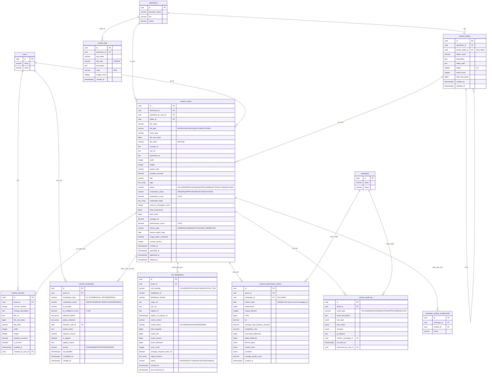

# Database ERD - Module Quản lý Nội dung

## Sơ đồ Quan hệ Thực thể



## Quan hệ giữa các Bảng

### Quan hệ Cốt lõi

1. **content_assets → advertisers** (Nhiều-một)
   - Mỗi tài sản nội dung thuộc về một nhà quảng cáo
   - Một nhà quảng cáo có thể có nhiều tài sản nội dung
   - Ràng buộc: `ON DELETE RESTRICT` (không thể xóa nhà quảng cáo có nội dung)

2. **content_assets → content_folders** (Nhiều-một)
   - Mỗi tài sản nội dung có thể thuộc về một thư mục
   - Một thư mục có thể chứa nhiều tài sản
   - Ràng buộc: `ON DELETE SET NULL` (nếu thư mục bị xóa, tài sản trở thành chưa phân loại)

3. **content_folders → content_folders** (Tự tham chiếu, Một-nhiều)
   - Thư mục có thể được lồng trong thư mục
   - Độ sâu tối đa 5 cấp được thực thi bởi ràng buộc
   - Ràng buộc: `ON DELETE CASCADE` (xóa thư mục sẽ xóa thư mục con)

4. **content_assets → content_versions** (Một-nhiều)
   - Mỗi tài sản nội dung có thể có nhiều phiên bản
   - Lịch sử phiên bản theo dõi tất cả thay đổi
   - Ràng buộc: `UNIQUE(asset_id, version_number)` đảm bảo không có phiên bản trùng lặp
   - Cascade delete: Xóa tài sản sẽ xóa tất cả phiên bản

5. **content_assets → content_moderation** (Một-nhiều)
   - Mỗi tài sản nội dung có thể có nhiều bản ghi kiểm duyệt (quét AI, xem xét thủ công, khiếu nại)
   - Audit trail đầy đủ của tất cả hoạt động kiểm duyệt
   - Cascade delete: Xóa tài sản sẽ xóa lịch sử kiểm duyệt

6. **content_assets → cdn_distributions** (Một-nhiều)
   - Mỗi tài sản nội dung có thể được phân phối qua nhiều nhà cung cấp CDN
   - Theo dõi hiệu suất phân phối và bộ nhớ đệm
   - Ràng buộc: `UNIQUE(asset_id, cdn_provider)` ngăn trùng lặp mỗi nhà cung cấp
   - Cascade delete: Xóa tài sản sẽ xóa bản ghi CDN

7. **content_assets → content_performance_history** (Một-nhiều)
   - Số liệu hiệu suất tổng hợp hàng ngày mỗi tài sản
   - Có thể được chia nhỏ theo chiến dịch
   - Ràng buộc: `UNIQUE(asset_id, campaign_id, metrics_date)` đảm bảo một bản ghi mỗi ngày
   - Cascade delete: Xóa tài sản sẽ xóa lịch sử hiệu suất

8. **content_assets → content_audit_log** (Một-nhiều)
   - Audit trail đầy đủ của tất cả hoạt động
   - Theo dõi ai đã làm gì và khi nào
   - Cascade delete: Xóa tài sản sẽ xóa audit log

9. **content_assets → campaign_content_assignments** (Một-nhiều)
   - Liên kết nội dung với chiến dịch
   - Được định nghĩa trong schema chiến dịch
   - Ràng buộc: `ON DELETE RESTRICT` (không thể xóa nội dung đang dùng trong chiến dịch hoạt động)

### Ràng buộc Khóa ngoại

| Table | Foreign Key | References | On Delete |
|-------|-------------|------------|-----------|
| content_assets | advertiser_id | advertisers(id) | RESTRICT |
| content_assets | uploaded_by_user_id | users(id) | SET NULL |
| content_assets | folder_id | content_folders(id) | SET NULL |
| content_assets | moderated_by_user_id | users(id) | SET NULL |
| content_assets | created_by | users(id) | SET NULL |
| content_assets | updated_by | users(id) | SET NULL |
| content_folders | advertiser_id | advertisers(id) | CASCADE |
| content_folders | parent_folder_id | content_folders(id) | CASCADE |
| content_folders | created_by | users(id) | SET NULL |
| content_versions | asset_id | content_assets(id) | CASCADE |
| content_versions | created_by_user_id | users(id) | SET NULL |
| content_moderation | asset_id | content_assets(id) | CASCADE |
| content_moderation | reviewer_user_id | users(id) | SET NULL |
| cdn_distributions | asset_id | content_assets(id) | CASCADE |
| content_tags | advertiser_id | advertisers(id) | CASCADE |
| content_performance_history | asset_id | content_assets(id) | CASCADE |
| content_performance_history | campaign_id | campaigns(id) | SET NULL |
| content_audit_log | asset_id | content_assets(id) | CASCADE |
| content_audit_log | performed_by_user_id | users(id) | SET NULL |
| content_audit_log | referrer_campaign_id | campaigns(id) | SET NULL |

## Chỉ mục

### content_assets
- `idx_content_assets_advertiser_id` - Truy vấn nội dung theo nhà quảng cáo
- `idx_content_assets_status` - Lọc theo trạng thái (APPROVED, PENDING, v.v.)
- `idx_content_assets_file_type` - Lọc theo loại nội dung (IMAGE, VIDEO, v.v.)
- `idx_content_assets_moderation_status` - Lọc theo trạng thái kiểm duyệt
- `idx_content_assets_created_at` - Sắp xếp theo ngày tải lên
- `idx_content_assets_folder_id` - Truy vấn nội dung trong thư mục
- `idx_content_assets_tags` - Chỉ mục GIN cho tìm kiếm tag
- `idx_content_assets_advertiser_status` - Kết hợp cho truy vấn cụ thể nhà quảng cáo
- `idx_content_assets_license_expiry` - Tìm giấy phép sắp hết hạn (chỉ mục bộ phận)
- `idx_content_assets_performance` - Sắp xếp theo điểm hiệu suất
- `idx_content_assets_file_hash` - Phát hiện trùng lặp
- `idx_content_assets_deleted_at` - Hỗ trợ soft delete (chỉ mục bộ phận)

### content_folders
- `idx_content_folders_advertiser_id` - Truy vấn thư mục theo nhà quảng cáo
- `idx_content_folders_parent_id` - Điều hướng phân cấp thư mục
- `idx_content_folders_path` - Tìm kiếm đường dẫn đầy đủ

### content_versions
- `idx_content_versions_asset_id` - Tối ưu hóa join
- `idx_content_versions_current` - Tìm phiên bản hiện tại (chỉ mục bộ phận)
- `idx_content_versions_created_at` - Sắp xếp theo ngày phiên bản

### content_moderation
- `idx_content_moderation_asset_id` - Tối ưu hóa join
- `idx_content_moderation_type` - Lọc theo loại kiểm duyệt
- `idx_content_moderation_result` - Lọc theo kết quả
- `idx_content_moderation_pending` - Hàng đợi kiểm duyệt (chỉ mục bộ phận với độ ưu tiên)
- `idx_content_moderation_reviewer` - Theo dõi hoạt động người xem xét
- `idx_content_moderation_sla` - Theo dõi SLA (chỉ mục bộ phận)
- `idx_content_moderation_created_at` - Truy vấn dựa trên thời gian

### cdn_distributions
- `idx_cdn_distributions_asset_id` - Tối ưu hóa join
- `idx_cdn_distributions_provider` - Lọc theo nhà cung cấp CDN
- `idx_cdn_distributions_status` - Lọc theo trạng thái phân phối
- `idx_cdn_distributions_cache_status` - Quản lý bộ nhớ đệm
- `idx_cdn_distributions_signed_url_expiry` - Tìm signed URL sắp hết hạn (chỉ mục bộ phận)

### content_tags
- `idx_content_tags_advertiser_id` - Truy vấn tag theo nhà quảng cáo
- `idx_content_tags_usage_count` - Sắp xếp theo mức độ phổ biến
- `idx_content_tags_name` - Tìm kiếm tên tag

### content_performance_history
- `idx_content_performance_asset_id` - Tối ưu hóa join
- `idx_content_performance_campaign_id` - Số liệu cụ thể chiến dịch
- `idx_content_performance_date` - Truy vấn chuỗi thời gian
- `idx_content_performance_asset_date` - Kết hợp cho timeline tài sản
- `idx_content_performance_ctr` - Sắp xếp theo engagement

### content_audit_log
- `idx_content_audit_log_asset_id` - Truy vấn audit trail
- `idx_content_audit_log_event_type` - Lọc theo loại sự kiện
- `idx_content_audit_log_occurred_at` - Truy vấn dựa trên thời gian
- `idx_content_audit_log_user_id` - Theo dõi hoạt động người dùng
- `idx_content_audit_log_asset_event` - Kết hợp cho timeline tài sản

## Kiểu Dữ liệu

### Các Kiểu Dữ liệu Chính

- **uuid**: Khóa chính và khóa ngoại (định danh duy nhất 128-bit)
- **varchar(n)**: Chuỗi độ dài biến đổi với độ dài tối đa
- **text**: Văn bản độ dài không giới hạn
- **bigint**: Giá trị số nguyên lớn (cho kích thước tệp, bộ đếm)
- **integer**: Giá trị số nguyên chuẩn
- **decimal(p,s)**: Số chính xác với precision và scale
- **boolean**: Cờ true/false
- **timestamptz**: Timestamp có múi giờ
- **date**: Chỉ ngày (không có thành phần thời gian)
- **text[]**: Mảng giá trị text
- **jsonb**: Binary JSON (lưu trữ và đánh chỉ mục hiệu quả)
- **inet**: Lưu trữ địa chỉ IP

### Biểu diễn Kích thước Tệp

Kích thước tệp sử dụng **BIGINT**:
- Phạm vi: -9,223,372,036,854,775,808 đến 9,223,372,036,854,775,807 bytes
- Tệp tối đa được hỗ trợ: ~9 exabyte (vượt xa yêu cầu kinh doanh 500 MB)
- Cho phép tổng hợp mà không tràn số

### Biểu diễn Điểm số

Tất cả điểm số sử dụng **DECIMAL(5, 2)**:
- Phạm vi: 0.00 đến 100.00
- Điểm kiểm duyệt AI (0-100, với 100 = an toàn)
- Điểm hiệu suất (0-100, tính toán có trọng số)
- Điểm chất lượng (0-100)

### Kiểu Mảng

Mảng được sử dụng cho các trường đa giá trị:
- **tags**: `TEXT[]` - Tag do người dùng định nghĩa
- **moderation_flags**: `TEXT[]` - Vi phạm chính sách
- **detected_labels**: `TEXT[]` - Kết quả phát hiện AI
- **edge_locations**: `TEXT[]` - Vị trí edge CDN
- **top_cities**: `TEXT[]` - Phân chia địa lý

### Kiểu JSONB

Dùng cho schema linh hoạt:
- **device_types**: Phân chia hiệu suất theo thiết bị
  ```json
  {"TABLET": 500, "TV": 300, "KIOSK": 200}
  ```
- **screen_sizes**: Phân chia độ phân giải màn hình
  ```json
  {"1920x1080": 800, "3840x2160": 200}
  ```
- **countries**: Phân phối địa lý
  ```json
  {"US": 700, "CA": 200, "UK": 100}
  ```
- **old_value/new_value**: Ảnh chụp trạng thái audit log
- **changes**: Theo dõi thay đổi cấp trường

## Cardinality (Số lượng)

### Một-một (1:1)
Không có trong module này (tất cả quan hệ là một-nhiều hoặc nhiều-nhiều qua bảng junction)

### Một-nhiều (1:N)
- advertisers → content_assets (một nhà quảng cáo, nhiều tài sản)
- advertisers → content_folders (một nhà quảng cáo, nhiều thư mục)
- advertisers → content_tags (một nhà quảng cáo, nhiều tag)
- content_folders → content_folders (thư mục lồng nhau, độ sâu tối đa 5)
- content_folders → content_assets (một thư mục, nhiều tài sản)
- content_assets → content_versions (một tài sản, nhiều phiên bản)
- content_assets → content_moderation (một tài sản, nhiều bản ghi kiểm duyệt)
- content_assets → cdn_distributions (một tài sản, nhiều nhà cung cấp CDN)
- content_assets → content_performance_history (một tài sản, nhiều số liệu hàng ngày)
- content_assets → content_audit_log (một tài sản, nhiều sự kiện audit)

### Nhiều-nhiều (M:N)
- content_assets ↔ campaigns (via campaign_content_assignments)
  - Một tài sản nội dung có thể được dùng trong nhiều chiến dịch
  - Một chiến dịch có thể dùng nhiều tài sản nội dung
- content_assets ↔ tags (via trường mảng tags)
  - Một tài sản có thể có nhiều tag
  - Một tag có thể được áp dụng cho nhiều tài sản

## Quy tắc Nghiệp vụ Được thực thi

### Vòng đời Nội dung
```
UPLOADED → PROCESSING → PENDING_APPROVAL → APPROVED → ACTIVE → ARCHIVED
                ↓              ↓
        PROCESSING_FAILED   REJECTED
```

Chuyển đổi trạng thái được thực thi bởi logic ứng dụng và ràng buộc cơ sở dữ liệu.

### Quy trình Kiểm duyệt

**Chấm điểm Kiểm duyệt AI**:
- Điểm 90-100: Tự động phê duyệt (moderation_status = 'APPROVED')
- Điểm 70-89: Đánh dấu để xem xét thủ công (moderation_status = 'FLAGGED')
- Điểm < 70: Tự động từ chối (moderation_status = 'REJECTED')

**Hàng đợi Xem xét Thủ công**:
- Độ ưu tiên: ENTERPRISE > URGENT > STANDARD
- Theo dõi SLA: trường sla_deadline với chỉ mục
- View: `v_moderation_queue` cung cấp hàng đợi đã lọc

### Hạn ngạch Lưu trữ theo Tier

Được thực thi ở lớp ứng dụng (không phải ràng buộc cơ sở dữ liệu):
- FREE: 1 GB tổng, tối đa 100 tài sản
- BASIC: 10 GB tổng, tối đa 500 tài sản
- PREMIUM: 50 GB tổng, tối đa 2000 tài sản
- ENTERPRISE: 500+ GB, tài sản không giới hạn

View `v_content_storage_summary` cung cấp số liệu sử dụng.

### Giới hạn Kích thước Tệp

Kích thước tệp tối đa theo loại (được thực thi ở lớp ứng dụng):
- Hình ảnh: 10 MB
- Video: 500 MB
- Âm thanh: 50 MB
- Tài liệu (PDF): 20 MB
- HTML5: 50 MB (nén), 100 MB (giải nén)

### Quản lý Giấy phép

**Theo dõi Hết hạn**:
- Trường `license_expiry_date` cho nội dung LICENSED
- View `v_expiring_licenses` hiển thị nội dung hết hạn trong 30 ngày
- Chỉ mục trên ngày hết hạn cho truy vấn hiệu quả

**Quy trình Hết hạn**:
- Cảnh báo 30 ngày trước khi hết hạn
- Cảnh báo 7 ngày trước khi hết hạn
- Khi hết hạn: status = 'EXPIRED', tạm dừng chiến dịch

### Khử trùng lặp

**Phát hiện Dựa trên Hash**:
- `file_hash` lưu trữ hash SHA-256
- Ràng buộc duy nhất: `(advertiser_id, file_hash)`
- Ngăn tải lên trùng lặp bởi cùng nhà quảng cáo
- Tiết kiệm chi phí lưu trữ

### Kiểm soát Phiên bản

**Quản lý Phiên bản**:
- Trường `current_version` trên content_assets
- Bảng `content_versions` lưu trữ tất cả phiên bản
- Ràng buộc: `UNIQUE(asset_id, version_number)`
- Cờ `is_current` đánh dấu phiên bản hoạt động

**Giới hạn Phiên bản**:
- Tier tiêu chuẩn: 10 phiên bản mỗi tài sản
- Enterprise: Phiên bản không giới hạn
- Được thực thi ở lớp ứng dụng

### Chấm điểm Hiệu suất

**Điểm Tính toán (0-100)**:
```
performance_score = (
  impression_volume_score × 0.30 +
  ctr_score × 0.30 +
  campaign_usage_score × 0.20 +
  recency_score × 0.20
)
```

Hàm: `calculate_content_performance_score()`

View: `v_top_performing_content` (score >= 80)

### Soft Delete

**Quy trình Xóa**:
1. Đặt `deleted_at = CURRENT_TIMESTAMP`
2. Ẩn khỏi view người dùng
3. Giữ lại trong 30 ngày (thời gian khôi phục)
4. Xóa vĩnh viễn sau 30 ngày

**Bảo vệ Chiến dịch Hoạt động**:
- Không thể xóa vĩnh viễn nội dung đang dùng trong chiến dịch hoạt động
- Cảnh báo hiển thị cho người dùng
- Chiến dịch tiếp tục sử dụng nội dung đã xóa (URL vẫn truy cập được)

## Ước tính Kích thước Cơ sở dữ liệu

### Mỗi Tài sản Nội dung
- Bảng content_assets: ~1.5 KB mỗi dòng (với metadata)
- content_versions: ~500 bytes mỗi phiên bản (trung bình 5 phiên bản = 2.5 KB)
- content_moderation: ~800 bytes mỗi bản ghi kiểm duyệt (trung bình 2 mỗi tài sản = 1.6 KB)
- cdn_distributions: ~600 bytes mỗi nhà cung cấp CDN (trung bình 1 mỗi tài sản = 600 bytes)
- content_audit_log: ~400 bytes mỗi sự kiện (trung bình 5 sự kiện = 2 KB)
- **Tổng phụ**: ~8.2 KB mỗi tài sản (chỉ metadata, không bao gồm lưu trữ tệp)

### Mỗi Tài sản Mỗi Ngày (Hoạt động)
- content_performance_history: ~1 KB mỗi ngày mỗi chiến dịch (trung bình 2 chiến dịch = 2 KB)
- Sự kiện audit bổ sung: ~400 bytes mỗi sự kiện (trung bình 2/ngày = 800 bytes)
- **Tổng phụ**: ~2.8 KB mỗi tài sản hoạt động mỗi ngày

### Dung lượng Dự kiến (1 năm, 100,000 tài sản hoạt động)

**Lưu trữ Metadata**:
- Dữ liệu tài sản cốt lõi: 100,000 × 8.2 KB = **820 MB**
- Hiệu suất hàng ngày (365 ngày): 100,000 × 365 × 2 KB = **73 GB**
- Thư mục và tag: ~**10 MB**
- **Tổng Metadata (1 năm)**: ~**74 GB** (chưa nén)

**Lưu trữ Tệp** (riêng biệt với cơ sở dữ liệu):
Giả sử kích thước tệp trung bình 5 MB mỗi tài sản:
- 100,000 tài sản × 5 MB = **500 GB**
- 5 phiên bản mỗi tài sản: 500 GB × 5 = **2.5 TB**
- Tổng lưu trữ tệp: ~**3 TB** (với phiên bản)

**Băng thông CDN** (hàng tháng):
Giả sử tệp trung bình 10 KB, 1M impression mỗi tài sản mỗi tháng:
- 100,000 tài sản × 1M impression × 10 KB = **1 PB/tháng**
- Thực tế khác nhau đáng kể theo loại nội dung và sử dụng

Với nén PostgreSQL, TOAST, và chiến lược lưu trữ, dung lượng cơ sở dữ liệu thực tế sẽ là 50-70% kích thước chưa nén.

### Chiến lược Tối ưu hóa Lưu trữ

1. **Nén TOAST**: Các trường text lớn tự động nén
2. **Nén JSONB**: Binary JSON hiệu quả hơn text JSON
3. **Chỉ mục Bộ phận**: Chỉ mục chỉ trên tập con liên quan (mệnh đề WHERE)
4. **Lưu trữ**: Chuyển dữ liệu hiệu suất cũ sang bảng lưu trữ (>365 ngày)
5. **Phân vùng**: Phân vùng performance_history theo ngày (tháng/quý)
6. **Giảm tải CDN**: Lưu trữ tệp thực tế trong S3/GCS, không phải cơ sở dữ liệu

## Trigger và Tự động hóa

### Trigger Tự động

1. **update_content_updated_at()**
   - Cập nhật timestamp `updated_at` mỗi khi thay đổi dòng
   - Áp dụng cho: content_assets, content_folders, cdn_distributions

2. **update_folder_statistics()**
   - Tính toán lại asset_count và total_size_bytes của thư mục
   - Kích hoạt khi: INSERT, UPDATE, DELETE trên content_assets

3. **validate_folder_depth()**
   - Đảm bảo lồng thư mục không vượt quá 5 cấp
   - Tính toán và đặt độ sâu thư mục tự động
   - Ném ngoại lệ nếu vượt quá độ sâu tối đa

4. **log_content_audit_event()**
   - Tự động ghi tất cả hoạt động nội dung vào audit log
   - Nắm bắt giá trị cũ và mới dưới dạng JSONB
   - Kích hoạt khi: INSERT, UPDATE, DELETE trên content_assets

### Tác vụ Định kỳ (Lớp Ứng dụng)

1. **Tính toán Điểm Hiệu suất**
   - Chạy: Hàng ngày lúc nửa đêm
   - Cập nhật: content_assets.performance_score
   - Sử dụng: hàm calculate_content_performance_score()

2. **Cảnh báo Hết hạn Giấy phép**
   - Chạy: Hàng ngày
   - Truy vấn: view v_expiring_licenses
   - Hành động: Gửi thông báo email

3. **Tự động Lưu trữ Nội dung Không sử dụng**
   - Chạy: Hàng tháng
   - Tiêu chí: Không được dùng trong 365 ngày
   - Hành động: Đặt status = 'ARCHIVED'

4. **Xóa Nội dung Đã Soft-Delete**
   - Chạy: Hàng ngày
   - Tiêu chí: deleted_at > 30 ngày trước
   - Hành động: Xóa vĩnh viễn

5. **Tổng hợp Số liệu Hiệu suất**
   - Chạy: Mỗi giờ
   - Nguồn: Log impression thời gian thực
   - Đích: content_performance_history

## View và Báo cáo

### View Có sẵn

1. **v_active_content**
   - Hiển thị tất cả nội dung đã phê duyệt, chưa xóa
   - Bao gồm số liệu hiệu suất và trạng thái giấy phép
   - Dùng bởi: UI thư viện nội dung

2. **v_moderation_queue**
   - Hiển thị mục kiểm duyệt đang chờ
   - Ưu tiên theo tier và SLA
   - Bao gồm cờ quá hạn/khẩn cấp
   - Dùng bởi: Dashboard kiểm duyệt

3. **v_content_storage_summary**
   - Sử dụng lưu trữ tổng hợp theo nhà quảng cáo
   - Phân chia theo loại nội dung
   - Số lượng trạng thái (đã phê duyệt, chờ, từ chối)
   - Dùng bởi: Báo cáo admin, thực thi hạn ngạch

4. **v_top_performing_content**
   - Nội dung với performance_score >= 80
   - Sắp xếp theo điểm và impression
   - Dùng bởi: Đề xuất nội dung

5. **v_expiring_licenses**
   - Nội dung với giấy phép hết hạn trong 30 ngày
   - Cấp độ khẩn cấp: EXPIRED, CRITICAL, WARNING
   - Dùng bởi: Cảnh báo tự động, dashboard nhà quảng cáo

### Truy vấn Phổ biến

Xem tệp SQL để biết các truy vấn mẫu bao gồm:
- Hàng đợi kiểm duyệt với độ ưu tiên
- Sử dụng lưu trữ của nhà quảng cáo
- Nội dung hiệu suất cao
- Hiệu suất nội dung theo thời gian
- Audit trail nội dung
- Phát hiện nội dung trùng lặp

---

*Cập nhật lần cuối: 2026-01-23*
