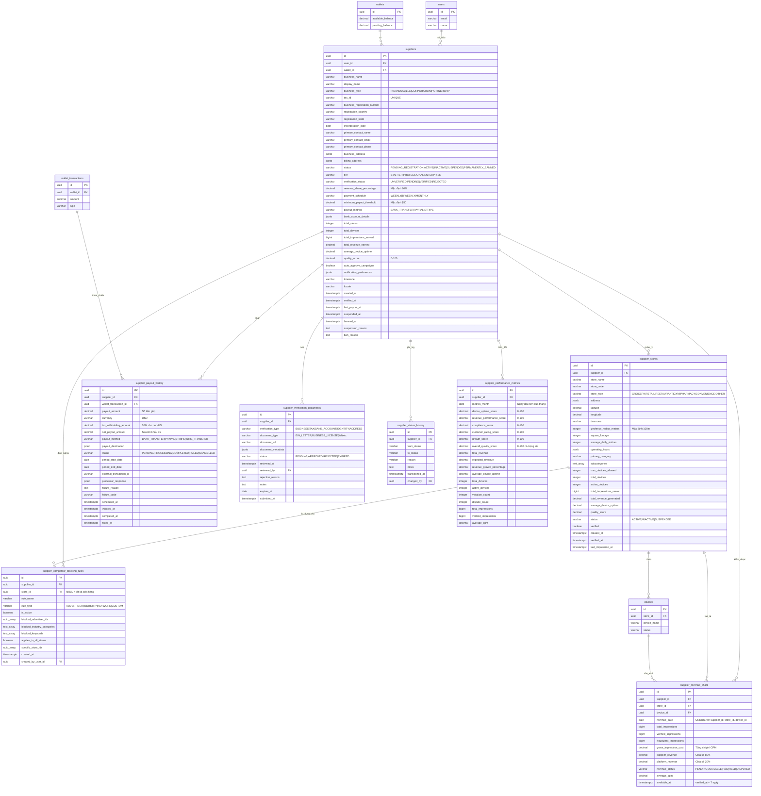

# Database ERD - Module Quản lý Nhà cung cấp

## Sơ đồ Quan hệ Thực thể



## Quan hệ giữa các Bảng

### Quan hệ Cốt lõi

1. **suppliers → users** (Nhiều-một)
   - Mỗi nhà cung cấp thuộc về một tài khoản người dùng
   - Một người dùng có thể sở hữu một tài khoản nhà cung cấp (tài khoản doanh nghiệp)
   - Ràng buộc: `ON DELETE RESTRICT` (không thể xóa người dùng có nhà cung cấp hoạt động)

2. **suppliers → wallets** (Một-một)
   - Mỗi nhà cung cấp có chính xác một ví cho doanh thu
   - Ví được tạo tự động khi nhà cung cấp trở thành ACTIVE
   - Ràng buộc: `ON DELETE RESTRICT` (không thể xóa ví có nhà cung cấp)

3. **suppliers → supplier_stores** (Một-nhiều)
   - Mỗi nhà cung cấp có thể quản lý nhiều vị trí cửa hàng
   - Mỗi cửa hàng thuộc về một nhà cung cấp
   - Ràng buộc: `UNIQUE(supplier_id, store_name)`
   - Cascade delete: Xóa nhà cung cấp sẽ xóa tất cả cửa hàng

4. **supplier_stores → devices** (Một-nhiều)
   - Mỗi cửa hàng có thể chứa nhiều thiết bị
   - Mỗi thiết bị thuộc về một cửa hàng
   - Số lượng thiết bị được thực thi bởi `max_devices_allowed` (dựa trên diện tích và tier)

5. **suppliers → supplier_revenue_share** (Một-nhiều)
   - Mỗi nhà cung cấp có bản ghi doanh thu hàng ngày
   - Theo dõi chia sẻ 80/20 giữa nhà cung cấp và nền tảng
   - Ràng buộc: `UNIQUE(supplier_id, revenue_date, store_id, device_id)`
   - Cascade delete: Xóa nhà cung cấp sẽ xóa lịch sử doanh thu

6. **suppliers → supplier_payout_history** (Một-nhiều)
   - Audit trail đầy đủ của tất cả các khoản thanh toán
   - Tham chiếu wallet_transactions để theo dõi thanh toán
   - Ràng buộc: `ON DELETE RESTRICT` (bảo toàn lịch sử thanh toán)

7. **suppliers → supplier_competitor_blocking_rules** (Một-nhiều)
   - Nhà cung cấp có thể định nghĩa nhiều quy tắc chặn
   - Quy tắc có thể áp dụng cho tất cả cửa hàng hoặc cửa hàng cụ thể
   - Cascade delete: Xóa nhà cung cấp sẽ xóa quy tắc chặn

8. **suppliers → supplier_verification_documents** (Một-nhiều)
   - Theo dõi tất cả tài liệu xác thực đã nộp
   - Tài liệu có thể hết hạn và yêu cầu gia hạn
   - Cascade delete: Xóa nhà cung cấp sẽ xóa tài liệu

9. **suppliers → supplier_performance_metrics** (Một-nhiều)
   - Điểm hiệu suất tổng hợp hàng tháng
   - Ràng buộc: `UNIQUE(supplier_id, metrics_month)`
   - Cascade delete: Xóa nhà cung cấp sẽ xóa số liệu

### Ràng buộc Khóa ngoại

| Table | Foreign Key | References | On Delete |
|-------|-------------|------------|-----------|
| suppliers | user_id | users(id) | RESTRICT |
| suppliers | wallet_id | wallets(id) | RESTRICT |
| supplier_stores | supplier_id | suppliers(id) | CASCADE |
| supplier_revenue_share | supplier_id | suppliers(id) | CASCADE |
| supplier_revenue_share | store_id | supplier_stores(id) | SET NULL |
| supplier_revenue_share | device_id | devices(id) | SET NULL |
| supplier_payout_history | supplier_id | suppliers(id) | RESTRICT |
| supplier_payout_history | wallet_transaction_id | wallet_transactions(id) | SET NULL |
| supplier_competitor_blocking_rules | supplier_id | suppliers(id) | CASCADE |
| supplier_competitor_blocking_rules | store_id | supplier_stores(id) | CASCADE |
| supplier_verification_documents | supplier_id | suppliers(id) | CASCADE |
| supplier_verification_documents | reviewed_by | users(id) | SET NULL |
| supplier_status_history | supplier_id | suppliers(id) | CASCADE |
| supplier_status_history | changed_by | users(id) | SET NULL |
| supplier_performance_metrics | supplier_id | suppliers(id) | CASCADE |

## Chỉ mục

### suppliers
- `idx_suppliers_user_id` - Truy vấn nhà cung cấp theo người dùng
- `idx_suppliers_status` - Lọc theo trạng thái (ACTIVE, SUSPENDED, v.v.)
- `idx_suppliers_tier` - Lọc theo tier (STARTER, PROFESSIONAL, ENTERPRISE)
- `idx_suppliers_verification_status` - Tìm xác thực đang chờ
- `idx_suppliers_created_at` - Sắp xếp theo ngày đăng ký
- `idx_suppliers_quality_score` - Tìm người thực hiện tốt nhất/kém nhất
- `idx_suppliers_status_tier` - Kết hợp cho truy vấn cụ thể tier
- `idx_suppliers_tax_id` - Tra cứu theo tax ID (ràng buộc UNIQUE)

### supplier_stores
- `idx_supplier_stores_supplier_id` - Tối ưu hóa join
- `idx_supplier_stores_status` - Lọc cửa hàng hoạt động
- `idx_supplier_stores_verified` - Tìm cửa hàng chưa xác thực
- `idx_supplier_stores_location` - Truy vấn không gian địa lý (lat/lng)
- `idx_supplier_stores_supplier_status` - Kết hợp cho truy vấn nhà cung cấp
- `idx_supplier_stores_store_type` - Lọc theo loại cửa hàng

### supplier_revenue_share
- `idx_revenue_share_supplier_id` - Tối ưu hóa join
- `idx_revenue_share_date` - Truy vấn chuỗi thời gian
- `idx_revenue_share_supplier_date` - Kết hợp cho báo cáo
- `idx_revenue_share_status` - Lọc theo trạng thái doanh thu
- `idx_revenue_share_available_at` - Tìm doanh thu sẵn sàng chuyển sang available
- `idx_revenue_share_store_id` - Truy vấn doanh thu cụ thể cửa hàng
- `idx_revenue_share_device_id` - Truy vấn doanh thu cụ thể thiết bị

### supplier_payout_history
- `idx_payout_history_supplier_id` - Lịch sử thanh toán mỗi nhà cung cấp
- `idx_payout_history_status` - Lọc theo trạng thái thanh toán
- `idx_payout_history_scheduled_at` - Tìm thanh toán sắp tới
- `idx_payout_history_completed_at` - Sắp xếp theo ngày hoàn thành
- `idx_payout_history_supplier_date` - Kết hợp cho timeline
- `idx_payout_history_period` - Truy vấn theo kỳ thanh toán

### supplier_competitor_blocking_rules
- `idx_blocking_rules_supplier_id` - Quy tắc mỗi nhà cung cấp
- `idx_blocking_rules_store_id` - Quy tắc cụ thể cửa hàng
- `idx_blocking_rules_active` - Chỉ mục bộ phận chỉ cho quy tắc hoạt động
- `idx_blocking_rules_type` - Lọc theo loại quy tắc
- `idx_blocking_rules_supplier_active` - Kết hợp cho truy vấn quy tắc hoạt động

### supplier_verification_documents
- `idx_verification_docs_supplier_id` - Tài liệu mỗi nhà cung cấp
- `idx_verification_docs_status` - Lọc theo trạng thái xác thực
- `idx_verification_docs_type` - Lọc theo loại tài liệu
- `idx_verification_docs_expires_at` - Tìm tài liệu sắp hết hạn
- `idx_verification_docs_supplier_status` - Kết hợp cho xem xét đang chờ

### supplier_status_history
- `idx_supplier_status_history_supplier_id` - Thay đổi trạng thái mỗi nhà cung cấp
- `idx_supplier_status_history_transitioned_at` - Truy vấn dựa trên thời gian
- `idx_supplier_status_history_to_status` - Lọc theo trạng thái đích
- `idx_supplier_status_history_supplier_date` - Kết hợp cho timeline

### supplier_performance_metrics
- `idx_performance_metrics_supplier_id` - Số liệu mỗi nhà cung cấp
- `idx_performance_metrics_month` - Truy vấn chuỗi thời gian
- `idx_performance_metrics_quality_score` - Tìm người thực hiện tốt nhất/kém nhất
- `idx_performance_metrics_supplier_month` - Kết hợp cho báo cáo

## Kiểu Dữ liệu

### Các Kiểu Dữ liệu Chính

- **uuid**: Khóa chính và khóa ngoại (định danh duy nhất 128-bit)
- **varchar(n)**: Chuỗi độ dài biến đổi với độ dài tối đa
- **text**: Văn bản độ dài không giới hạn (cho ghi chú, lý do, mô tả)
- **decimal(p,s)**: Số chính xác với precision và scale
- **bigint**: Giá trị số nguyên lớn (cho bộ đếm impression)
- **integer**: Giá trị số nguyên chuẩn (cho số lượng, số liệu)
- **boolean**: Cờ true/false
- **timestamptz**: Timestamp có múi giờ (tất cả ngày/giờ sử dụng kiểu này)
- **date**: Chỉ ngày (không có thành phần thời gian)
- **text[]**: Mảng giá trị text (cho danh mục, từ khóa)
- **uuid[]**: Mảng giá trị UUID (cho ID nhà quảng cáo bị chặn)
- **jsonb**: Binary JSON (lưu trữ và đánh chỉ mục hiệu quả)

### Biểu diễn Tiền tệ

Tất cả giá trị tiền tệ sử dụng **DECIMAL(12, 2)**:
- 12 chữ số tổng
- 2 chữ số thập phân
- Phạm vi: -9,999,999,999.99 đến 9,999,999,999.99
- Đủ cho theo dõi doanh thu lên đến $10 tỷ

Các trường cụ thể:
- **payout_amount**: DECIMAL(12, 2) - Số tiền thanh toán gộp
- **supplier_revenue**: DECIMAL(12, 2) - Chia sẻ 80% chi phí impression
- **platform_revenue**: DECIMAL(12, 2) - Chia sẻ 20% chi phí impression
- **minimum_payout_threshold**: DECIMAL(10, 2) - Mặc định $50.00

### Biểu diễn Phần trăm

- **revenue_share_percentage**: DECIMAL(5, 2) - Phạm vi 0-100 (ví dụ: 80.00)
- **quality_score**: DECIMAL(5, 2) - Phạm vi 0-100
- **average_device_uptime**: DECIMAL(5, 2) - Phần trăm 0-100

### Kiểu Mảng

Mảng được sử dụng cho các trường đa giá trị:
- **blocked_advertiser_ids**: `UUID[]` - Danh sách ID nhà quảng cáo bị chặn
- **blocked_industry_categories**: `TEXT[]` - Danh mục ngành bị chặn
- **blocked_keywords**: `TEXT[]` - Từ khóa để chặn (không phân biệt chữ hoa chữ thường)
- **specific_store_ids**: `UUID[]` - Cửa hàng nơi quy tắc áp dụng
- **subcategories**: `TEXT[]` - Danh mục phụ cửa hàng cho targeting

### Kiểu JSONB

Dùng cho schema linh hoạt và dữ liệu có cấu trúc:

**business_address / billing_address**:
```json
{
  "line1": "123 Main Street",
  "line2": "Suite 100",
  "city": "Seattle",
  "state": "WA",
  "postal_code": "98101",
  "country": "US",
  "latitude": 47.6062,
  "longitude": -122.3321
}
```

**operating_hours**:
```json
[
  {
    "day_of_week": 0,
    "open_time": "09:00",
    "close_time": "21:00",
    "is_closed": false
  },
  {
    "day_of_week": 6,
    "open_time": "10:00",
    "close_time": "18:00",
    "is_closed": false
  }
]
```

**notification_preferences**:
```json
{
  "email_enabled": true,
  "sms_enabled": false,
  "push_enabled": true,
  "notify_on_payout": true,
  "notify_on_device_offline": true,
  "notify_on_campaign_approval_request": false,
  "notify_on_revenue_milestone": true
}
```

**bank_account_details** (mã hóa trong production):
```json
{
  "account_type": "checking",
  "routing_number": "XXXXXXX",
  "account_number": "XXXXX1234",
  "bank_name": "Chase Bank",
  "account_holder_name": "Business Name LLC"
}
```

## Cardinality (Số lượng)

### Một-một (1:1)
- suppliers ↔ wallets (một ví mỗi nhà cung cấp)
- suppliers ↔ users (một tài khoản nhà cung cấp mỗi người dùng)

### Một-nhiều (1:N)
- suppliers → supplier_stores (một nhà cung cấp, nhiều cửa hàng)
- supplier_stores → devices (một cửa hàng, nhiều thiết bị)
- suppliers → supplier_revenue_share (một nhà cung cấp, nhiều bản ghi doanh thu hàng ngày)
- suppliers → supplier_payout_history (một nhà cung cấp, nhiều thanh toán)
- suppliers → supplier_competitor_blocking_rules (một nhà cung cấp, nhiều quy tắc)
- suppliers → supplier_verification_documents (một nhà cung cấp, nhiều tài liệu)
- suppliers → supplier_status_history (một nhà cung cấp, nhiều thay đổi trạng thái)
- suppliers → supplier_performance_metrics (một nhà cung cấp, nhiều số liệu hàng tháng)

### Nhiều-nhiều (M:N)
- Không có trực tiếp - tất cả quan hệ được chuẩn hóa thông qua bảng junction

## Quy tắc Nghiệp vụ Được thực thi bởi Schema

### Chia sẻ Doanh thu (80/20)

```sql
CONSTRAINT supplier_revenue_share_split_check CHECK (
    ABS(gross_impression_cost - (supplier_revenue + platform_revenue)) < 0.01
)
```

Điều này đảm bảo:
- `supplier_revenue` = `gross_impression_cost` × 0.80
- `platform_revenue` = `gross_impression_cost` × 0.20
- Tổng luôn bằng chi phí gộp (trong vòng 1 cent cho làm tròn)

### Xác thực Số tiền Thanh toán

```sql
CONSTRAINT payout_history_amount_check CHECK (
    payout_amount = tax_withholding_amount + net_payout_amount
)
```

Điều này đảm bảo:
- Thanh toán gộp = Khấu trừ thuế + Thanh toán ròng
- Theo dõi chính xác khấu trừ thuế (30% cho nhà cung cấp non-US)

### Giới hạn Thiết bị mỗi Cửa hàng

```sql
CONSTRAINT supplier_stores_device_limit CHECK (
    total_devices <= max_devices_allowed
)
```

Thiết bị tối đa được tính toán dựa trên diện tích:
- < 1,000 sq ft: 1 thiết bị
- 1,000-2,999 sq ft: 2 thiết bị
- 3,000-4,999 sq ft: 3 thiết bị
- 5,000-9,999 sq ft: 5 thiết bị
- ≥ 10,000 sq ft: 10 thiết bị

### Ngưỡng Thanh toán Tối thiểu

Mặc định: $50.00 (có thể cấu hình mỗi nhà cung cấp)
- Giảm phí giao dịch cho số tiền nhỏ
- Cân bằng dòng tiền nhà cung cấp với hiệu quả nền tảng

### Thời gian Giữ Doanh thu

7 ngày giữa xác thực impression và doanh thu available:
- `available_at` = `verified_at` + 7 ngày
- Cho phép tranh chấp và chargeback
- Tác vụ tự động chuyển `PENDING` → `AVAILABLE` sau thời gian giữ

## Ước tính Kích thước Cơ sở dữ liệu

### Mỗi Nhà cung cấp
- Bảng suppliers: ~2 KB mỗi dòng
- supplier_stores: ~1.5 KB mỗi cửa hàng (trung bình 3 cửa hàng = 4.5 KB)
- supplier_competitor_blocking_rules: ~800 bytes mỗi quy tắc (trung bình 3 quy tắc = 2.4 KB)
- supplier_verification_documents: ~1 KB mỗi tài liệu (trung bình 4 tài liệu = 4 KB)
- **Tổng phụ**: ~13 KB mỗi nhà cung cấp

### Mỗi Nhà cung cấp Mỗi Ngày (Hoạt động)
- supplier_revenue_share: ~400 bytes mỗi ngày mỗi thiết bị (trung bình 5 thiết bị = 2 KB)
- **Tổng phụ**: ~2 KB mỗi nhà cung cấp hoạt động mỗi ngày

### Mỗi Nhà cung cấp Mỗi Tháng
- supplier_payout_history: ~600 bytes mỗi thanh toán (4 thanh toán hàng tuần = 2.4 KB)
- supplier_performance_metrics: ~500 bytes mỗi tháng
- supplier_status_history: ~200 bytes mỗi thay đổi trạng thái (trung bình 1 mỗi tháng = 200 bytes)
- **Tổng phụ**: ~3.1 KB mỗi nhà cung cấp mỗi tháng

### Dung lượng Dự kiến (1 năm, 1,000 nhà cung cấp hoạt động)

**Dữ liệu nhà cung cấp cốt lõi**:
- 1,000 × 13 KB = **13 MB**

**Bản ghi doanh thu hàng ngày** (365 ngày):
- 1,000 × 365 × 2 KB = **730 MB**

**Bản ghi hàng tháng** (12 tháng):
- 1,000 × 12 × 3.1 KB = **37 MB**

**Tổng (1 năm)**: ~**780 MB** (chưa nén)

### Ước tính Mở rộng

| Nhà cung cấp | Thiết bị | Dữ liệu Doanh thu Hàng ngày | Dung lượng Hàng năm |
|-----------|---------|-------------------|----------------|
| 1,000 | 5,000 | 730 MB/năm | ~780 MB |
| 10,000 | 50,000 | 7.3 GB/năm | ~7.8 GB |
| 100,000 | 500,000 | 73 GB/năm | ~78 GB |

Với nén PostgreSQL, phân vùng, và chiến lược lưu trữ:
- Dữ liệu hoạt động (90 ngày gần nhất): ~20% tổng
- Dữ liệu lịch sử đã nén: Giảm ~40%
- Dung lượng thực tế: ~50-60% ước tính chưa nén

### Chiến lược Tối ưu hóa Dung lượng

1. **Phân vùng Bảng**
   - Phân vùng `supplier_revenue_share` theo tháng (phân vùng range trên `revenue_date`)
   - Phân vùng `supplier_payout_history` theo năm
   - Cho phép lưu trữ hiệu quả và hiệu suất truy vấn

2. **Lưu trữ Dữ liệu Lịch sử**
   - Lưu trữ dữ liệu doanh thu > 2 năm vào cold storage
   - Giữ số liệu tổng hợp trong `supplier_performance_metrics`
   - Giảm kích thước cơ sở dữ liệu hoạt động 70-80%

3. **Quản lý Chỉ mục**
   - Chỉ mục bộ phận chỉ trên bản ghi hoạt động (ví dụ: `WHERE status = 'ACTIVE'`)
   - Xóa chỉ mục trên phân vùng đã lưu trữ
   - Giảm overhead chỉ mục 40-50%

4. **Nén JSONB**
   - PostgreSQL tự động nén trường JSONB
   - Dữ liệu địa chỉ và cài đặt nén ~60%
   - Metadata tài liệu nén ~50%

## Số liệu Nghiệp vụ Chính Được theo dõi

### Cấp Nhà cung cấp
- **Tổng Doanh thu Kiếm được**: Doanh thu nhà cung cấp trọn đời (chia sẻ 80%)
- **Điểm Chất lượng**: Điểm có trọng số 0-100 (uptime, doanh thu, tuân thủ, đánh giá, tăng trưởng)
- **Uptime Thiết bị Trung bình**: Phần trăm trên tất cả thiết bị
- **Tổng Impression Phục vụ**: Số lượng impression trọn đời
- **Lịch Thanh toán**: WEEKLY, BIWEEKLY, hoặc MONTHLY
- **Chia sẻ Doanh thu**: 80% (tiêu chuẩn) hoặc 85% (tier Platinum)

### Cấp Cửa hàng
- **Doanh thu mỗi Cửa hàng**: Doanh thu hàng ngày/tháng theo vị trí cửa hàng
- **Sử dụng Thiết bị**: Thiết bị hoạt động vs. tối đa cho phép
- **Điểm Chất lượng Cửa hàng**: Hiệu suất cụ thể cho cửa hàng
- **Lưu lượng Khách**: Trung bình khách hàng hàng ngày (ước tính)

### Cấp Thiết bị
- **Doanh thu mỗi Thiết bị**: Thu nhập thiết bị riêng lẻ
- **Uptime Thiết bị**: Phần trăm online và hoạt động
- **Impression mỗi Thiết bị**: Số lượng impression hàng ngày

### Số liệu Thanh toán
- **Tần suất Thanh toán**: Lịch hàng tuần/hai tuần/tháng
- **Ngưỡng Tối thiểu**: $50 mặc định (có thể cấu hình)
- **Khấu trừ Thuế**: 30% cho nhà cung cấp non-US (trừ khi có hiệp ước)
- **Tỷ lệ Thành công Thanh toán**: Mục tiêu 100% tỷ lệ thành công

## Cân nhắc Hiệu suất

### Tối ưu hóa Truy vấn

**Truy vấn Hot** (chạy thường xuyên):
1. Nhà cung cấp hoạt động với số dư ví
2. Nhà cung cấp đủ điều kiện thanh toán
3. Doanh thu theo nhà cung cấp cho phạm vi ngày
4. Người thực hiện tốt nhất/kém nhất theo điểm chất lượng
5. Cửa hàng cần xác thực thiết bị

**Chỉ mục Được thiết kế Cho**:
- Tra cứu nhà cung cấp nhanh theo trạng thái/tier
- Truy vấn doanh thu chuỗi thời gian
- Truy vấn không gian địa lý cửa hàng (lat/lng)
- Khớp quy tắc chặn hoạt động
- Đủ điều kiện thanh toán đang chờ

### Chiến lược Caching

**Cache ở Lớp Ứng dụng**:
- Trạng thái và tier nhà cung cấp (TTL: 5 phút)
- Quy tắc chặn hoạt động (TTL: 1 phút)
- Điểm chất lượng (TTL: 1 giờ)
- Lịch thanh toán (TTL: 1 ngày)

**Materialized View** (làm mới mỗi giờ):
- `v_active_suppliers` - Nhà cung cấp hoạt động với số liệu hiện tại
- `v_supplier_revenue_summary` - Tổng hợp doanh thu toàn diện
- `v_suppliers_pending_payout` - Đủ điều kiện thanh toán

### Bảo trì Cơ sở dữ liệu

**Tác vụ Hàng ngày**:
- Chuyển doanh thu từ PENDING → AVAILABLE (sau thời gian giữ 7 ngày)
- Cập nhật điểm chất lượng nhà cung cấp
- Kiểm tra tài liệu xác thực sắp hết hạn

**Tác vụ Hàng tuần**:
- Xử lý thanh toán định kỳ (lịch WEEKLY)
- Tính toán số liệu hiệu suất hàng tuần
- Lưu trữ bản ghi lịch sử trạng thái cũ

**Tác vụ Hàng tháng**:
- Tạo số liệu hiệu suất nhà cung cấp
- Xử lý thanh toán hàng tháng
- Tạo báo cáo thuế (nếu cần)
- Quản lý phân vùng (tạo phân vùng tháng tiếp theo)

---

*Cập nhật lần cuối: 2026-01-23*
